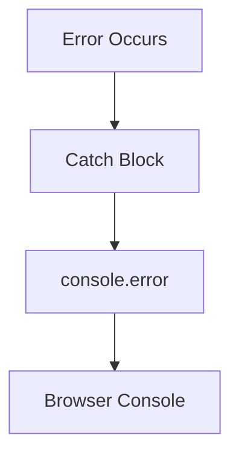
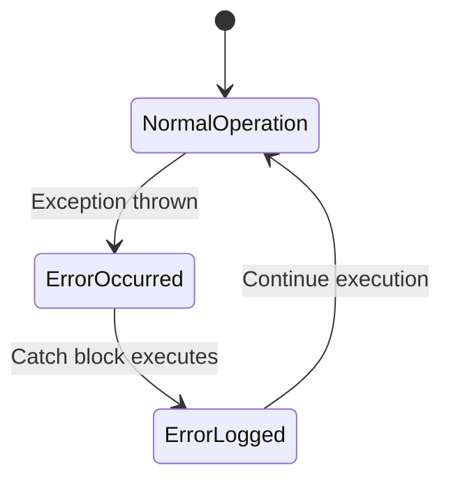

# Data Model: Error Handling Compliance Fix

## Entities

### ErrorLogEntry (Implicit)
- **Source**: Catch block location
- **Type**: Error object
- **Context**: Descriptive message
- **Destination**: Browser console (console.error)

## Relationships



## Validation Rules

1. **FR-001**: All catch blocks must contain error logging
2. **FR-002**: Error context messages must be descriptive
3. **FR-003**: No user-visible changes to application behavior
4. **FR-004**: All existing tests must continue to pass

## State Transitions

### Error Handling State Machine



### State Descriptions

1. **NormalOperation**: Application running normally
2. **ErrorOccurred**: Exception thrown in try block
3. **ErrorLogged**: Error logged to console, execution continues
4. **NormalOperation**: Application resumes normal operation

## Implementation Requirements

### Error Context Messages

| File | Line | Context Message |
|------|------|-----------------|
| packages/excalidraw/components/App.tsx | 875 | "Failed to parse postMessage data" |
| packages/excalidraw/clipboard.ts | 551 | "Failed to parse clipboard data" |
| excaliraw-app/CustomStats.tsx | 69 | "Failed to copy version to clipboard" |
| packages/element/src/elementLink.ts | 101 | "Failed to parse URL" |
| packages/common/src/utils.ts | 1302 | "Failed to parse localStorage data" |

### Error Handling Pattern

```typescript
try {
  // Operation that may throw
} catch (error) {
  console.error('Context description:', error);
}
```

## Compliance Requirements

- **Constitution**: "Do not swallow errors silently"
- **Testing**: All existing tests must pass
- **Performance**: No measurable impact
- **Security**: No sensitive data exposure
