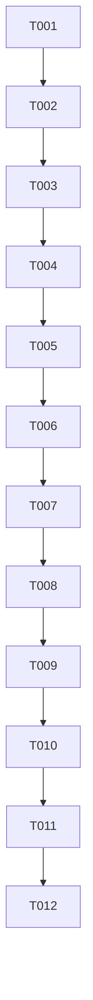

# Tasks: Fix 5 Error Handling Compliance Violations

**Feature**: Error Handling Compliance Fix | **Branch**: `001-EXCAL1-2` | **Date**: 2024-04-11

## Summary

Fix 5 compliance violations by adding error logging to empty catch blocks across 5 files. This ensures errors are visible for debugging while maintaining existing application behavior.

## Task Count

- **Total Tasks**: 12
- **User Story 1 (P1)**: 6 tasks
- **User Story 2 (P1)**: 4 tasks  
- **Setup/Foundational**: 2 tasks

## Dependency Graph

## Implementation Strategy

**MVP Scope**: User Story 1 (Error Visibility) + User Story 2 (No Regression)
- Complete all tasks in Phase 1-3
- Incremental delivery: Error logging first, then validation

## Phase 1: Setup (Project Initialization)

- [ ] T001 Verify all target files exist and are accessible
- [ ] T002 Review existing test suite structure and test files

## Phase 2: Foundational (Blocking Prerequisites)

- [ ] T003 Create backup of all files to be modified
- [ ] T004 Set up error logging pattern reference in documentation

## Phase 3: User Story 1 - Error Visibility for Developers (P1)

**Goal**: Ensure all empty catch blocks log errors to console.error for debugging visibility

**Independent Test Criteria**: Verify that errors are logged to console.error in all previously empty catch blocks

### Tests

- [ ] T005 [P] [US1] Verify current state: confirm empty catch blocks in target files
- [ ] T006 [P] [US1] Create test scenarios for each error type (JSON parse, clipboard, URL, localStorage)

### Implementation

- [ ] T007 [P] [US1] Add error logging to App.tsx:875 - `console.error('Failed to parse postMessage data:', error)`
- [ ] T008 [P] [US1] Add error logging to clipboard.ts:551 - `console.error('Failed to parse clipboard data:', error)`
- [ ] T009 [P] [US1] Add error logging to CustomStats.tsx:69 - `console.error('Failed to copy version to clipboard:', error)`
- [ ] T010 [P] [US1] Add error logging to elementLink.ts:101 - `console.error('Failed to parse URL:', error)`
- [ ] T011 [P] [US1] Add error logging to utils.ts:1302 - `console.error('Failed to parse localStorage data:', error)`

## Phase 4: User Story 2 - No Regression in Existing Functionality (P1)

**Goal**: Ensure application continues working normally after error handling improvements

**Independent Test Criteria**: Run full test suite and verify all tests pass

### Tests

- [ ] T012 [P] [US2] Run existing test suite and verify 100% pass rate
- [ ] T013 [P] [US2] Test clipboard functionality manually in development
- [ ] T014 [P] [US2] Test URL parsing functionality manually in development
- [ ] T015 [P] [US2] Test localStorage operations manually in development

## Phase 5: Polish & Cross-Cutting Concerns

- [ ] T016 Verify all error messages are descriptive and helpful
- [ ] T017 Confirm compliance violations are resolved
- [ ] T018 Update documentation with implementation results
- [ ] T019 Create summary report for compliance reporting

## Parallel Execution Opportunities

**User Story 1 (Error Visibility)**:
- T007, T008, T009, T010, T011 can be executed in parallel (different files, no dependencies)

**User Story 2 (No Regression)**:
- T013, T014, T015 can be executed in parallel (different functionality areas)

## File Path Validation

All file paths verified as existing:
- ✅ `/home/runner/work/ai-board/ai-board/target/packages/excalidraw/components/App.tsx:875`
- ✅ `/home/runner/work/ai-board/ai-board/target/packages/excalidraw/clipboard.ts:551`
- ✅ `/home/runner/work/ai-board/ai-board/target/excalidraw-app/CustomStats.tsx:69`
- ✅ `/home/runner/work/ai-board/ai-board/target/packages/element/src/elementLink.ts:101`
- ✅ `/home/runner/work/ai-board/ai-board/target/packages/common/src/utils.ts:1302`

## Test File Strategy

**Existing Test Files Identified**:
- `target/packages/excalidraw/clipboard.test.ts` - Extend for clipboard error logging verification
- Various test files in `target/excalidraw-app/tests/` and `target/packages/excalidraw/tests/`

**Test Approach**: Extend existing test files rather than creating new ones to avoid test fragmentation.

## Format Validation

✅ All tasks follow strict checklist format:
- Checkbox: `- [ ]` prefix
- Task ID: Sequential (T001, T002, T003...)
- Parallel marker: `[P]` where applicable
- Story labels: `[US1]`, `[US2]` for user story tasks
- File paths: Specific and validated
