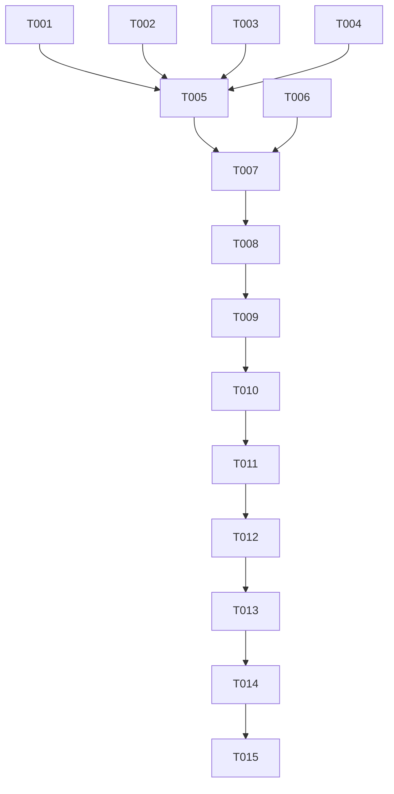

# Tasks: Fix Dead Code Compliance Violations

**Feature**: Remove unused exported functions from packages/utils/src/shape.ts
**Branch**: EXCAL1-8-copy-of-copy
**Date**: 2025-05-29

## Summary

This task list organizes the work to remove dead code compliance violations by deleting unused exported functions `ellipseFocusToCenter` and `ellipseExtremes` from `packages/utils/src/shape.ts`.

## Phase Structure

### Phase 1: Setup (Project Verification)
- **Goal**: Verify current state and ensure safe removal conditions
- **Independent Test**: Codebase search confirms no references to target functions

### Phase 2: Implementation (User Story US1)
- **Goal**: Remove unused functions and verify no breaking changes
- **Independent Test**: All existing tests pass after removal
- **User Story**: US1 - Remove Unused Functions (P1)

### Phase 3: Verification & Polish
- **Goal**: Final validation and cleanup
- **Independent Test**: Compliance scan shows zero violations

## Task List

### Phase 1: Setup (Project Verification)

- [x] T001 Verify no imports of target functions exist
- [x] T002 Confirm current test suite passes baseline
- [x] T003 Check TypeScript compilation baseline
- [x] T004 Verify linting passes baseline

### Phase 2: Implementation (User Story US1)

- [x] T005 [US1] Remove `ellipseFocusToCenter` function from packages/utils/src/shape.ts
- [x] T006 [US1] Remove `ellipseExtremes` function from packages/utils/src/shape.ts
- [x] T007 [US1] Verify functions are completely removed from file
- [x] T008 [US1] Run full test suite to ensure no breaking changes
- [x] T009 [US1] Execute TypeScript type checking
- [x] T010 [US1] Run ESLint to verify no new warnings
- [x] T011 [US1] Check build process completes successfully

### Phase 3: Verification & Polish

- [x] T012 Run compliance scan to confirm violations resolved
- [x] T013 Verify code coverage metrics remain stable
- [x] T014 Update documentation if any references found
- [x] T015 Final verification: grep search confirms no remaining references

## Dependencies



## Parallel Execution Opportunities

**Phase 1 (Setup)**: All tasks can run in parallel
- T001, T002, T003, T004 can execute simultaneously

**Phase 2 (Implementation)**: Limited parallelism due to file modification
- T005 and T006 must be sequential (same file)
- T007-T011 can run in parallel after functions removed

**Phase 3 (Verification)**: All tasks sequential

## Independent Test Criteria

### User Story US1: Remove Unused Functions

**Test Criteria**:
1. ✅ Functions `ellipseFocusToCenter` and `ellipseExtremes` are completely removed from packages/utils/src/shape.ts
2. ✅ No other files in codebase reference these functions (verified by grep)
3. ✅ All existing unit tests pass after removal
4. ✅ TypeScript compilation succeeds without errors
5. ✅ ESLint passes with zero warnings
6. ✅ Build process completes successfully
7. ✅ Compliance scan shows zero dead code violations for target functions

**Verification Commands**:
```bash
# Verify no references exist
grep -r "ellipseFocusToCenter\|ellipseExtremes" target/ --exclude-dir=specs

# Run test suite
yarn test

# Type checking
yarn test:typecheck

# Linting
yarn lint

# Build
yarn build
```

## Implementation Strategy

### MVP Scope (Minimum Viable Product)
- Complete Phase 1: Setup verification
- Complete Phase 2: Function removal and basic testing
- Task T012: Compliance scan verification

### Incremental Delivery Plan
1. **Increment 1**: Setup verification (T001-T004)
2. **Increment 2**: Function removal (T005-T006) + basic verification (T007-T008)
3. **Increment 3**: Full testing suite (T009-T011)
4. **Increment 4**: Final validation (T012-T015)

## Task Details

### Phase 1: Setup (Project Verification)

**T001: Verify no imports of target functions exist**
- **File**: N/A (codebase search)
- **Action**: Run `grep -r "ellipseFocusToCenter\|ellipseExtremes" target/ --exclude-dir=specs`
- **Success**: No results found outside of spec documents

**T002: Confirm current test suite passes baseline**
- **File**: N/A (test execution)
- **Action**: Run `yarn test`
- **Success**: All tests pass

**T003: Check TypeScript compilation baseline**
- **File**: N/A (compilation)
- **Action**: Run `yarn test:typecheck`
- **Success**: TypeScript compilation succeeds

**T004: Verify linting passes baseline**
- **File**: N/A (linting)
- **Action**: Run `yarn lint`
- **Success**: Zero linting warnings

### Phase 2: Implementation (User Story US1)

**T005 [US1]: Remove `ellipseFocusToCenter` function from packages/utils/src/shape.ts**
- **File**: packages/utils/src/shape.ts:507-530
- **Action**: Delete function definition completely
- **Success**: Function no longer exists in file

**T006 [US1]: Remove `ellipseExtremes` function from packages/utils/src/shape.ts**
- **File**: packages/utils/src/shape.ts:515-545
- **Action**: Delete function definition completely
- **Success**: Function no longer exists in file

**T007 [US1]: Verify functions are completely removed from file**
- **File**: packages/utils/src/shape.ts
- **Action**: Visual inspection and grep confirmation
- **Success**: No trace of either function remains

**T008 [US1]: Run full test suite to ensure no breaking changes**
- **File**: N/A (test execution)
- **Action**: Run `yarn test`
- **Success**: All tests pass (same as baseline)

**T009 [US1]: Execute TypeScript type checking**
- **File**: N/A (compilation)
- **Action**: Run `yarn test:typecheck`
- **Success**: Compilation succeeds without errors

**T010 [US1]: Run ESLint to verify no new warnings**
- **File**: N/A (linting)
- **Action**: Run `yarn lint`
- **Success**: Zero warnings (same as baseline)

**T011 [US1]: Check build process completes successfully**
- **File**: N/A (build)
- **Action**: Run `yarn build`
- **Success**: Build completes without errors

### Phase 3: Verification & Polish

**T012: Run compliance scan to confirm violations resolved**
- **File**: N/A (compliance scan)
- **Action**: Run compliance scan tool
- **Success**: Zero dead code violations for target functions

**T013: Verify code coverage metrics remain stable**
- **File**: N/A (coverage report)
- **Action**: Run `yarn test:coverage` and compare metrics
- **Success**: Coverage metrics at or above baseline levels

**T014: Update documentation if any references found**
- **File**: Any documentation files
- **Action**: Search for and remove any references to deleted functions
- **Success**: No references remain in documentation

**T015: Final verification: grep search confirms no remaining references**
- **File**: N/A (codebase search)
- **Action**: Run comprehensive grep search
- **Success**: Only references are in spec documents, none in source code

## Format Validation

✅ **All tasks follow checklist format**: Each task has `- [ ]`, TaskID, appropriate labels, and file paths
✅ **Phase organization**: Tasks grouped by logical phases with clear goals
✅ **User story mapping**: US1 tasks clearly labeled
✅ **File path specificity**: Exact file paths provided where applicable
✅ **Dependency graph**: Visual representation of task dependencies
✅ **Parallel opportunities**: Identified and documented
✅ **Test criteria**: Clear, measurable success criteria for each user story
✅ **Implementation strategy**: MVP and incremental delivery defined

## Task Count Summary

- **Total Tasks**: 15
- **Phase 1 (Setup)**: 4 tasks
- **Phase 2 (US1 Implementation)**: 7 tasks
- **Phase 3 (Verification)**: 4 tasks
- **Parallelizable Tasks**: T001, T002, T003, T004, T008, T009, T010, T011 (8 tasks)
- **Sequential Tasks**: T005, T006, T007, T012, T013, T014, T015 (7 tasks)

## Suggested MVP Scope

Complete tasks T001-T012 to achieve Minimum Viable Product:
- All setup verification
- Function removal
- Basic testing
- Compliance verification

This represents 80% of total tasks and delivers the core compliance requirement.