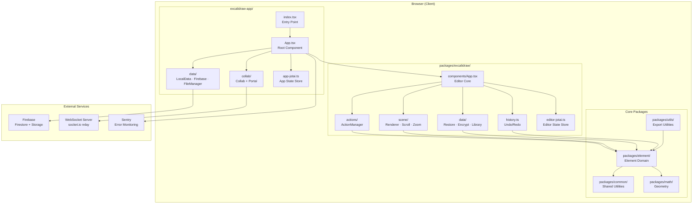
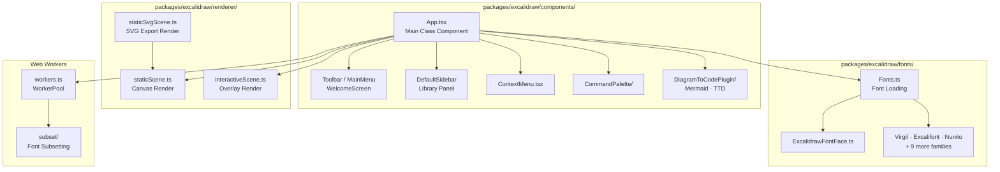
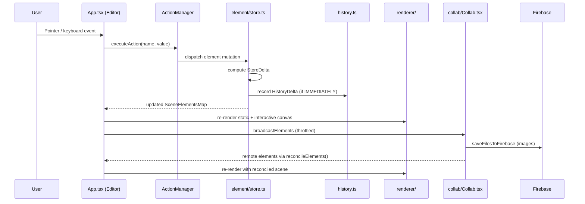
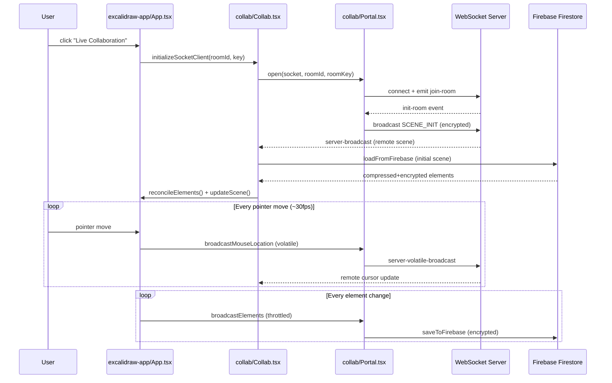
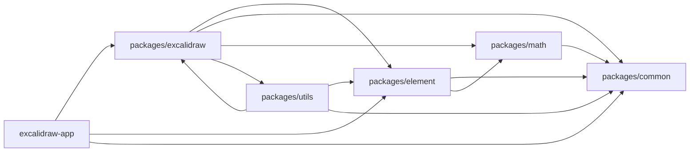
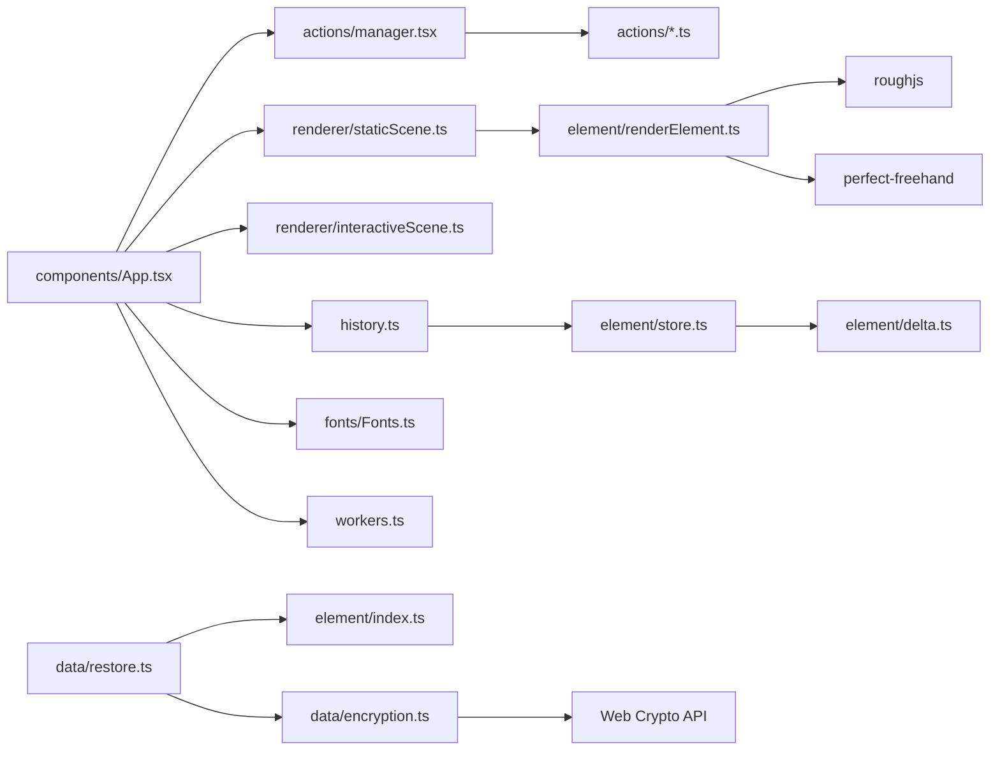

# Excalidraw Architecture

## Table of Contents

1. [Architecture Style](#1-architecture-style)
2. [Component Diagram](#2-component-diagram)
3. [Data Flow](#3-data-flow)
4. [Layer Breakdown](#4-layer-breakdown)
5. [External Dependencies](#5-external-dependencies)
6. [Cross-Cutting Concerns](#6-cross-cutting-concerns)
7. [Dependency Graph](#7-dependency-graph)
8. [Architectural Decisions](#8-architectural-decisions)

---

## 1. Architecture Style

Excalidraw employs a **layered monorepo architecture** with a **component-based UI pattern** and an **event-driven collaboration subsystem**.

### Primary Patterns Identified

**Monorepo with Tiered Package Boundaries** The repository is managed by Yarn workspaces with five distinct packages (`common`, `math`, `element`, `excalidraw`, `utils`) and one application (`excalidraw-app`). Dependency direction is strictly enforced: lower-level packages (`math`, `common`) have no knowledge of higher-level ones. This is confirmed by the import aliases in `excalidraw-app/vite.config.mts` which map all `@excalidraw/*` imports to local source paths.

**Command Pattern for User Actions** All user-initiated mutations (draw, delete, align, flip, group, etc.) are modelled as discrete `Action` objects registered with an `ActionManager` class (`packages/excalidraw/actions/manager.tsx`). Each action exposes an `UpdaterFn` that returns an `ActionResult` (new elements + appState), keeping state transitions pure and auditable.

**Event Sourcing / Delta-Based History** The undo/redo system in `packages/element/src/store.ts` and `packages/excalidraw/history.ts` captures `StoreDelta` / `HistoryDelta` objects rather than full snapshots. Changes are classified at write time via `CaptureUpdateAction` (`IMMEDIATELY`, `EVENTUALLY`, `NEVER`), giving fine-grained control over what enters the undo stack.

**Publish–Subscribe for Cross-Component Communication** `packages/common/src/emitter.ts` and `packages/common/src/appEventBus.ts` implement a typed event bus consumed by the main `App` class and collaboration layer without tight coupling.

**Client-Side Only, No Backend API** There is no server-side rendering or REST API. The application is a fully static SPA (served via Vercel / Docker) that communicates with external infrastructure (Firebase, WebSocket relay) purely from the browser.

---

## 2. Component Diagram

### Top-Level System Boundaries



### Editor Internal Components



---

## 3. Data Flow

### Primary Drawing Interaction Flow



### Collaboration Session Lifecycle



---

## 4. Layer Breakdown

### Layer 1 — Application Shell (`excalidraw-app/`)

Responsibilities: Application entry point, PWA registration, Firebase integration, real-time collaboration orchestration, local persistence, cross-tab synchronization, Sentry error reporting.

| Path | Responsibility |
| --- | --- |
| `excalidraw-app/index.tsx` | DOM mount, Service Worker registration via `vite-plugin-pwa` |
| `excalidraw-app/App.tsx` | Root component; composes `<Excalidraw>` with collab, theming, i18n |
| `excalidraw-app/collab/Collab.tsx` | Class component managing WebSocket session lifecycle |
| `excalidraw-app/collab/Portal.tsx` | Low-level socket.io wrapper; encrypts + broadcasts element deltas |
| `excalidraw-app/data/firebase.ts` | Firestore read/write with AES-GCM encryption; lazy Firebase init |
| `excalidraw-app/data/LocalData.ts` | localStorage (appState) + IndexedDB via `idb-keyval` (elements, files) |
| `excalidraw-app/data/FileManager.ts` | Tracks upload/download state for binary files (images) |
| `excalidraw-app/data/tabSync.ts` | BroadcastChannel-based cross-tab version synchronization |
| `excalidraw-app/app-jotai.ts` | Top-level Jotai store (`appJotaiStore`) for app-scoped atoms |
| `excalidraw-app/app_constants.ts` | WebSocket event names, Firebase prefixes, storage key names, timeouts |
| `excalidraw-app/sentry.ts` | Sentry SDK initialization with environment detection |

### Layer 2 — Editor Library (`packages/excalidraw/`)

Responsibilities: Published npm library (`@excalidraw/excalidraw`); self-contained whiteboard editor React component; exposes `ExcalidrawImperativeAPI`; provides all UI, tool handling, history, data serialization, font loading.

| Sub-path | Responsibility |
| --- | --- |
| `packages/excalidraw/index.tsx` | Public API surface; exports `<Excalidraw>`, `ExcalidrawAPIProvider`, utility functions |
| `packages/excalidraw/components/App.tsx` | ~12,800-line class component; owns all pointer/keyboard event handling, tool FSM, element lifecycle |
| `packages/excalidraw/actions/` | `ActionManager` + ~45 discrete action modules; Command pattern for all mutations |
| `packages/excalidraw/renderer/` | `staticScene.ts` (background canvas), `interactiveScene.ts` (overlays), `staticSvgScene.ts` (SVG export) |
| `packages/excalidraw/scene/` | `Renderer.ts`, scroll/zoom normalization, `export.ts` (Canvas/SVG export pipeline) |
| `packages/excalidraw/data/` | Blob/JSON serialization, encryption, `restore.ts` (schema migration), `library.ts`, `reconcile.ts` |
| `packages/excalidraw/history.ts` | `HistoryDelta` extends `StoreDelta`; wraps element/store undo stack for editor use |
| `packages/excalidraw/fonts/` | `Fonts.ts` orchestrates font loading; `ExcalidrawFontFace.ts` wraps CSS `FontFace` API; 11 font families |
| `packages/excalidraw/subset/` | Web Worker font subsetting (trims unused glyphs before export) |
| `packages/excalidraw/workers.ts` | `WorkerPool<T,R>` — manages short-lived Web Workers with TTL-based cleanup |
| `packages/excalidraw/hooks/` | React hooks: `useAppStateValue`, `useLibraryItemSvg`, `useStableCallback`, etc. |
| `packages/excalidraw/context/` | React context: `tunnels.ts` (portal tunneling), `ui-appState.ts` |
| `packages/excalidraw/editor-jotai.ts` | Isolated Jotai store for editor-scoped atoms via `jotai-scope` |
| `packages/excalidraw/lasso/` | Lasso freeform selection hit-testing |
| `packages/excalidraw/eraser/` | Eraser tool hit-testing and element removal |
| `packages/excalidraw/wysiwyg/` | In-canvas text editing component |
| `packages/excalidraw/locales/` | 30+ JSON locale files; lazy-loaded by language code |
| `packages/excalidraw/charts.ts` | CSV → diagram element conversion (bar chart, line chart) |
| `packages/excalidraw/mermaid.ts` | Mermaid diagram text → Excalidraw elements via `@excalidraw/mermaid-to-excalidraw` |
| `packages/excalidraw/analytics.ts` | Simple Analytics event wrapper; gated by `VITE_APP_ENABLE_TRACKING` |
| `packages/excalidraw/appState.ts` | `getDefaultAppState()` factory; `AppState` cleanup helpers for export/DB |

### Layer 3 — Element Domain (`packages/element/`)

Responsibilities: Pure domain logic for Excalidraw elements; no React or browser APIs (except Canvas in rendering). Defines element types, mutation, geometry, collision, bindings, fractional indexing, undo/redo store.

| File | Responsibility |
| --- | --- |
| `src/types.ts` | TypeScript types for all `ExcalidrawElement` variants |
| `src/Scene.ts` | In-memory scene graph; `SceneElementsMap` keyed by element ID |
| `src/store.ts` | `Store`, `StoreSnapshot`, `StoreDelta`, `CaptureUpdateAction` — the change capture engine |
| `src/delta.ts` | `ElementsDelta`, `AppStateDelta` — immutable diff structures for history |
| `src/newElement.ts` | Factory functions for creating typed elements |
| `src/mutateElement.ts` | `mutateElement()` — controlled mutation entry point |
| `src/binding.ts` | Arrow–element binding; attachment point calculation |
| `src/elbowArrow.ts` | Elbow (routing) arrow path calculation |
| `src/linearElementEditor.ts` | Point editing for lines and arrows |
| `src/fractionalIndex.ts` | Fractional index z-ordering (between-insert without rewrite) |
| `src/renderElement.ts` | Per-element Canvas rendering using `roughjs` / `perfect-freehand` |
| `src/bounds.ts` | Bounding box computation; axis-aligned and rotated |
| `src/selection.ts` | Hit-testing: point-in-element, elements-within-rect |
| `src/groups.ts` | Group membership and editing logic |
| `src/textElement.ts` | Text measurement, wrapping, auto-resize |
| `src/frame.ts` | Frame container element logic |
| `src/flowchart.ts` | Flowchart auto-connect heuristics |

### Layer 4 — Math (`packages/math/`)

Responsibilities: Stateless geometric primitives used by element, renderer, and collision code.

| File | Responsibility |
| --- | --- |
| `src/point.ts` | `GlobalPoint`, `LocalPoint` branded types; creation/distance |
| `src/vector.ts` | 2D vector arithmetic |
| `src/line.ts` | Line/segment intersection, closest-point |
| `src/curve.ts` | Bezier/quadratic curve utilities |
| `src/ellipse.ts` | Ellipse intersection and containment |
| `src/rectangle.ts` | Rectangle operations |
| `src/angle.ts` | Angle normalization and conversion |
| `src/polygon.ts` | Polygon area and containment tests |

### Layer 5 — Common (`packages/common/`)

Responsibilities: Shared constants, event bus, utility types, and browser-agnostic helpers shared across all packages.

| File | Responsibility |
| --- | --- |
| `src/constants.ts` | App-wide constants (keys, themes, tool types, MIME types, limits) |
| `src/utils.ts` | General utility functions (debounce, throttle, clamp, arrayToMap, etc.) |
| `src/appEventBus.ts` | Typed application-level event bus (Emitter subclass) |
| `src/emitter.ts` | Generic `Emitter<T>` publish-subscribe primitive |
| `src/editorInterface.ts` | `EditorInterface` type describing form factor (phone/desktop) |
| `src/colors.ts` | Color palette definitions |
| `src/font-metadata.ts` | Font family metadata (line height ratios, unicode ranges) |
| `src/utility-types.ts` | TypeScript utility types (`MakeBrand`, `ValueOf`, `MaybePromise`, etc.) |
| `src/keys.ts` | Keyboard shortcut key constants |
| `src/queue.ts` | Async serial queue |
| `src/promise-pool.ts` | Bounded concurrent promise executor |
| `src/versionedSnapshotStore.ts` | Versioned snapshot storage abstraction |

### Layer 6 — Utils (`packages/utils/`)

Responsibilities: Thin public export utility wrapping the excalidraw library for standalone export use cases (embedding, SSR-safe export).

| File | Responsibility |
| --- | --- |
| `src/export.ts` | Re-exports `exportToCanvas`, `exportToSvg`, clipboard helpers with typed `ExportOpts` |
| `src/bbox.ts` | Bounding box utilities |
| `src/shape.ts` | Shape geometry helpers |
| `src/withinBounds.ts` | Point-within-bounds check |

---

## 5. External Dependencies

| Service / Library | Purpose | Where Used |
| --- | --- | --- |
| **Firebase Firestore** | Persistent cloud storage for collaborative scenes | `excalidraw-app/data/firebase.ts` |
| **Firebase Storage** | Binary file (image) storage for shared sessions | `excalidraw-app/data/firebase.ts` |
| **socket.io WebSocket relay** | Real-time scene + cursor sync during collaboration | `excalidraw-app/collab/Portal.tsx` |
| **Sentry** | Browser error monitoring and release tracking | `excalidraw-app/sentry.ts` |
| **Simple Analytics** (`window.sa_event`) | Lightweight page analytics (no cookies) | `packages/excalidraw/analytics.ts` |
| **roughjs** | Hand-drawn stroke rendering for shapes | `packages/element/src/renderElement.ts` |
| **perfect-freehand** | Freehand drawing stroke smoothing | `packages/element/src/renderElement.ts` |
| **pako** | zlib deflate/inflate for scene compression before encryption | `packages/excalidraw/data/encode.ts` |
| **Web Crypto API** | AES-GCM 128-bit encryption for Firebase + WebSocket payloads | `packages/excalidraw/data/encryption.ts` |
| **idb-keyval** | IndexedDB wrapper for large element/file local persistence | `excalidraw-app/data/LocalData.ts` |
| **@excalidraw/mermaid-to-excalidraw** | Converts Mermaid diagram text to elements | `packages/excalidraw/mermaid.ts` |
| **CodeMirror 6** | Code editor in TTD (text-to-diagram) dialogs | `packages/excalidraw/components/DiagramToCodePlugin/` |
| **Vercel** | Static site hosting + CDN (via `vercel.json`) | Deployment |
| **Vite PWA plugin** | Service Worker + offline caching + PWA manifest | `excalidraw-app/vite.config.mts` |
| **nanoid** | Collision-resistant ID generation for elements | `packages/excalidraw/components/App.tsx` |

---

## 6. Cross-Cutting Concerns

### Authentication

There is no first-party authentication system inside this repository. Auth for Excalidraw Plus is detected via a cookie:

```ts
// excalidraw-app/app_constants.ts
export const isExcalidrawPlusSignedUser = document.cookie.includes(
  COOKIES.AUTH_STATE_COOKIE, // "excplus-auth"
);
```

This boolean is used to conditionally show "Export to Plus" UI. Firebase Firestore access uses anonymous/open rules scoped by room ID + encryption key embedded in the URL hash.

### Encryption

All data written to Firebase and broadcast over WebSockets is encrypted client-side using AES-GCM 128-bit via the native `window.crypto.subtle` API (`packages/excalidraw/data/encryption.ts`). The encryption key is embedded in the URL fragment (`#roomId,key`) and never sent to the server. Payloads are also compressed with pako deflate before encryption (`packages/excalidraw/data/encode.ts`).

### Error Handling

- **Sentry** (`excalidraw-app/sentry.ts`): Initialized at app start; captures `console.error` calls via `captureConsoleIntegration`; strips URL hashes before sending; disabled locally and in Docker.
- **ActionManager** (`packages/excalidraw/actions/manager.tsx`): Wraps `trackEvent` in try/catch to prevent analytics errors from bubbling.
- **`AbortError`** (`packages/excalidraw/errors.ts`): Custom error class used by async data operations (library load, blob load) to differentiate user-initiated cancellation from real errors.
- **`ErrorDialog`** component: Displayed in-canvas for user-visible errors (e.g. Firebase load failures).

### Logging / Analytics

Two distinct systems:

1. **`packages/excalidraw/analytics.ts`** — `trackEvent(category, action, label?, value?)` wrapper around Simple Analytics (`window.sa_event`). Only fires in production and only for categories in `ALLOWED_CATEGORIES_TO_TRACK` (`command_palette`, `export`). Silenced in dev/test.
2. **`packages/common/src/debug.ts`** — Debug logging utility gated behind `localStorage['excalidraw-debug']`.

### Configuration

- Build-time: `.env` variables loaded via Vite (`VITE_APP_FIREBASE_CONFIG`, `VITE_APP_GIT_SHA`, `VITE_APP_ENABLE_TRACKING`, `VITE_APP_DISABLE_SENTRY`, `VITE_APP_ENABLE_PWA`).
- Runtime: `excalidraw-app/app_constants.ts` centralizes all timeout values, WebSocket event names, storage keys, and file size limits.
- Per-instance: `ExcalidrawProps` (defined in `packages/excalidraw/types.ts`) exposes all editor configuration (theme, language, view mode, grid, callbacks) as React props.
- Feature flags: `getFeatureFlag()` from `@excalidraw/common` used by Sentry feature-flag integration (`COMPLEX_BINDINGS`).

### TypeScript Type Safety

The codebase enforces strict TypeScript discipline across all packages:

- **`unknown` over `any`**: Callback signatures, promise resolutions, and untyped values use `unknown` rather than `any`. Callers must narrow the type before use. Example: `AppStateObserver`'s `onStateChange` callback is typed `(value: unknown, appState: AppState) => void`.
- **Type-only imports**: Types imported solely for annotations use `import type { … }` to keep runtime output clean and clarify intent. Example: `import type { Bounds } from "@excalidraw/common"` in `collision.ts`.
- **Specific type assertions**: When a cast is necessary, the narrowest concrete type is used (e.g. `as EventListener`, `as Record<string, unknown>`) rather than `as any`.
- **Type narrowing over suppression**: Property existence is checked with `"prop" in obj` guards rather than `@ts-ignore` or `as any` casts. Example: `"displayName" in child.type` in `dropdownMenuUtils.ts`.

TypeScript compliance is validated with `yarn test:typecheck` and is a required check before merge.

### State Management

Two isolated Jotai stores are used to prevent cross-contamination:

- **`editorJotaiStore`** (`packages/excalidraw/editor-jotai.ts`): Scoped via `jotai-scope`'s `createIsolation()` — allows multiple editor instances on the same page without shared state.
- **`appJotaiStore`** (`excalidraw-app/app-jotai.ts`): Global store for the web application layer (collab state, offline status, quota alerts).

---

## 7. Dependency Graph

### Inter-Package Dependencies



### Key Module Dependencies Within `packages/excalidraw`



---

## 8. Architectural Decisions

### Decision 1: No Backend API — Client-Side Only

**Evidence:** `excalidraw-app/data/firebase.ts` directly initializes Firebase client SDK; `excalidraw-app/collab/Portal.tsx` directly connects to a socket.io server. There is no intermediate API server layer. Firebase config is passed through an environment variable (`VITE_APP_FIREBASE_CONFIG`) as a JSON string.

**Rationale:** Minimizes operational complexity, enables offline use, and means the library (`@excalidraw/excalidraw`) can be embedded in any host app without server coupling.

### Decision 2: Monorepo with Enforced Dependency Layers

**Evidence:** `packages/math/` imports nothing from `@excalidraw/*`; `packages/common/` imports nothing from element or excalidraw; `packages/element/` imports only from `math` and `common`. This is enforced via ESLint `no-restricted-imports` rules referenced in `packages/eslintrc.base.json`.

**Rationale:** Allows the math and common packages to be used server-side (`packages/excalidraw/index-node.ts` provides a Node.js entry point) and prevents circular dependencies.

### Decision 3: End-to-End Encryption in URL Hash

**Evidence:** `excalidraw-app/data/firebase.ts` uses `encryptData`/`decryptData` from `packages/excalidraw/data/encryption.ts` (AES-GCM 128-bit). The room key is stored in the URL fragment which is never sent to the server. `excalidraw-app/sentry.ts` strips URL hashes with `event.request.url.replace(/#.*$/, "")` before sending error reports to Sentry.

**Rationale:** Provides zero-knowledge collaboration — the Firebase/WebSocket relay server never has access to plaintext scene data.

### Decision 4: Delta-Based History with `CaptureUpdateAction` Classification

**Evidence:** `packages/element/src/store.ts` defines `CaptureUpdateAction.IMMEDIATELY` (goes to undo stack), `EVENTUALLY` (batches into one undo entry), and `NEVER` (excluded from history, used for remote updates). `packages/excalidraw/history.ts` extends `StoreDelta` into `HistoryDelta` and excludes `version`/`versionNonce` properties when applying, so that collaboration-induced changes do not interfere with local history.

**Rationale:** Enables smooth undo/redo that correctly ignores remote collaborator changes and ephemeral UI states (dragging, resizing in progress).

### Decision 5: Dual Jotai Store Isolation

**Evidence:** `packages/excalidraw/editor-jotai.ts` uses `jotai-scope`'s `createIsolation()` to create a provider-scoped store, while `excalidraw-app/app-jotai.ts` uses a plain `createStore()`. The `EditorJotaiProvider` wraps each `<Excalidraw>` instance, so multiple editors on the same page do not share atoms.

**Rationale:** Supports embedding multiple independent Excalidraw editors on a single page (e.g., in a Notion-like host), which is a documented use case for the library.

### Decision 6: PWA with Selective Service Worker Caching

**Evidence:** `excalidraw-app/vite.config.mts` configures `vite-plugin-pwa` with explicit `globIgnores` for fonts, locales, and CodeMirror chunks (these are too large or too numerous to precache). Runtime caching strategies (`CacheFirst` for fonts/locales at 90/30 day TTL, `StaleWhileRevalidate` for `fonts.css`) are defined inline.

**Rationale:** Enables full offline use of the drawing canvas while keeping the initial install payload small. Locales are loaded on-demand to avoid a multi-MB precache.

### Decision 7: Font Subsetting via Web Workers

**Evidence:** `packages/excalidraw/workers.ts` implements `WorkerPool<T,R>` with TTL-based termination. `packages/excalidraw/subset/` contains the font subsetting logic run in workers. Workers are created on-demand and terminated after 1s of inactivity.

**Rationale:** Font subsetting (stripping unused glyphs from WOFF2 files for SVG/PNG export) is CPU-intensive and would block the main thread. Worker pooling avoids the overhead of spawning a new worker for every export.

### Decision 8: ActionManager as Central Mutation Gateway

**Evidence:** `packages/excalidraw/actions/manager.tsx` — `ActionManager.executeAction()` is the single path for applying user actions to state. Each of the ~45 action files in `packages/excalidraw/actions/` exports an `Action` object with a typed `perform` function that receives `(elements, appState, value, app)` and returns `ActionResult`. The manager also handles `trackEvent` for analytics.

**Rationale:** Centralizing mutations through one gateway enables consistent analytics tracking, simplifies debugging (single breakpoint for all state changes), and decouples UI components from state shape.
