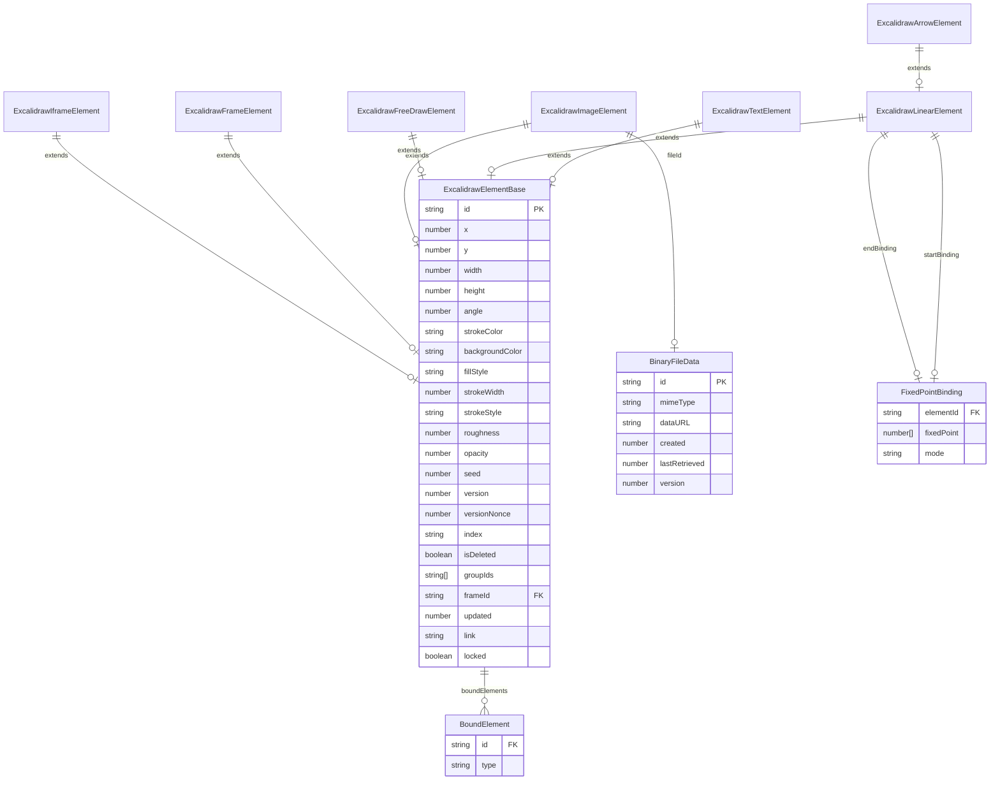
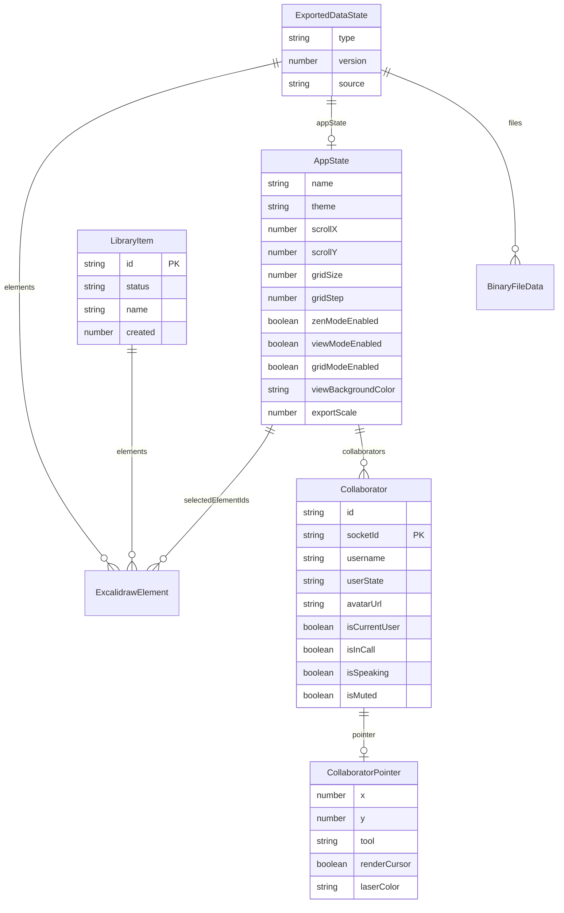
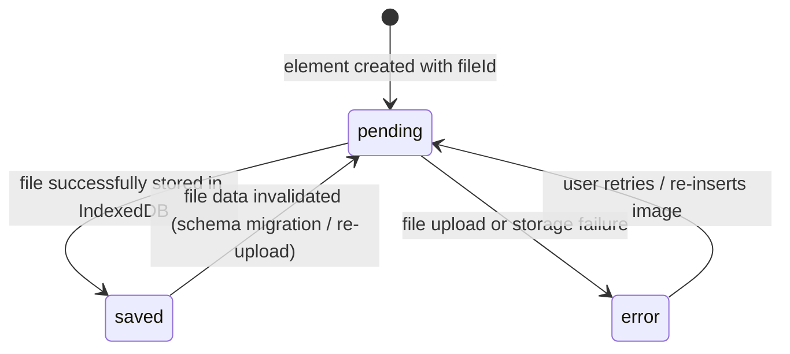
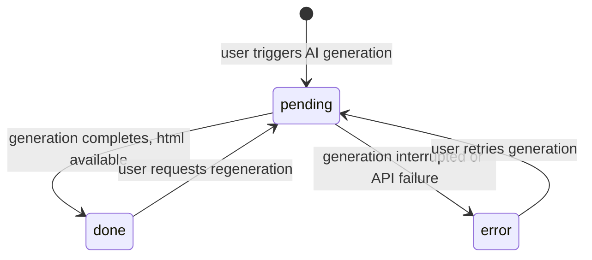
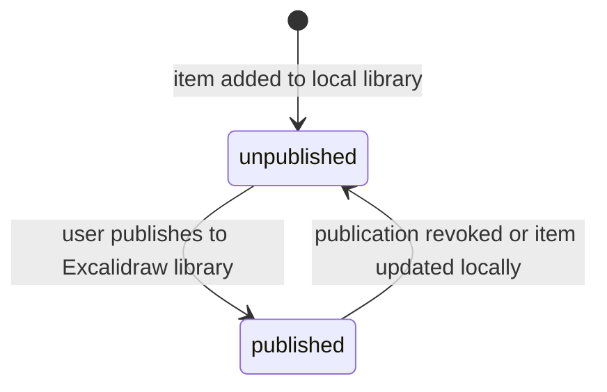
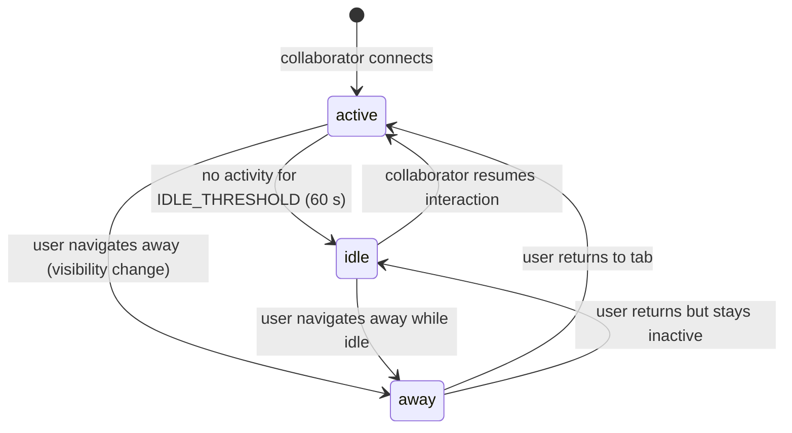
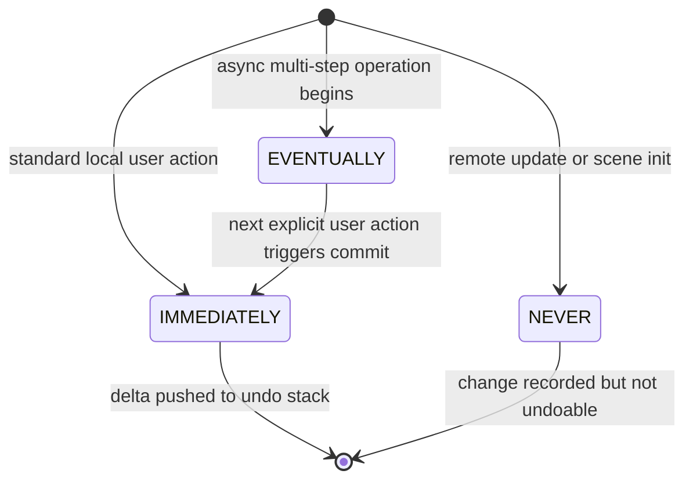

# Excalidraw Data Model Specification

## Table of Contents

1. [Data Layer Overview](#1-data-layer-overview)
2. [Entity-Relationship Diagrams](#2-entity-relationship-diagrams)
   - [2.1 Core Element Hierarchy](#21-core-element-hierarchy)
   - [2.2 Application State and Collaboration](#22-application-state-and-collaboration)
3. [Entity Catalog](#3-entity-catalog)
   - [3.1 ExcalidrawElementBase](#31-excalidrawelementbase)
   - [3.2 ExcalidrawRectangleElement](#32-excalidrawrectangleelement)
   - [3.3 ExcalidrawDiamondElement](#33-excalidrawdiamondelement)
   - [3.4 ExcalidrawEllipseElement](#34-excalidrawellipseelement)
   - [3.5 ExcalidrawTextElement](#35-excalidrawtextelement)
   - [3.6 ExcalidrawLinearElement](#36-excalidrawlinearelement)
   - [3.7 ExcalidrawArrowElement](#37-excalidrawarrowelement)
   - [3.8 ExcalidrawElbowArrowElement](#38-excalidrawelbowarrowelement)
   - [3.9 ExcalidrawLineElement](#39-excalidrawlineelement)
   - [3.10 ExcalidrawFreeDrawElement](#310-excalidrawfreedrawelement)
   - [3.11 ExcalidrawImageElement](#311-excalidrawimagelement)
   - [3.12 ExcalidrawFrameElement](#312-excalidrawframeelement)
   - [3.13 ExcalidrawMagicFrameElement](#313-excalidrawmagicframeelement)
   - [3.14 ExcalidrawIframeElement](#314-excalidrawiframeelement)
   - [3.15 ExcalidrawEmbeddableElement](#315-excalidrawembeddableelement)
   - [3.16 BinaryFileData](#316-binaryfiledata)
   - [3.17 LibraryItem](#317-libraryitem)
   - [3.18 Collaborator](#318-collaborator)
   - [3.19 AppState](#319-appstate)
   - [3.20 ExportedDataState / ImportedDataState](#320-exporteddatastate--importeddatastate)
4. [Enums and Constants](#4-enums-and-constants)
5. [State Machines](#5-state-machines)
   - [5.1 ExcalidrawImageElement Status](#51-excalidrawimagelement-status)
   - [5.2 MagicGenerationData Status](#52-magicgenerationdata-status)
   - [5.3 LibraryItem Status](#53-libraryitem-status)
   - [5.4 Collaborator UserIdleState](#54-collaborator-useridlestate)
   - [5.5 CaptureUpdateAction](#55-captureupdateaction)
6. [Migration History](#6-migration-history)
7. [Data Integrity Rules](#7-data-integrity-rules)

---

## 1. Data Layer Overview

### Schema Definition Mechanism

Excalidraw has no database ORM or relational database. The entire data schema is expressed as **TypeScript type definitions**. The canonical schema files are:

| File | Purpose |
|---|---|
| `packages/element/src/types.ts` | All element types and related primitives |
| `packages/excalidraw/types.ts` | Application state, collaborator, binary files, library items |
| `packages/excalidraw/data/types.ts` | Import/export envelope types |
| `packages/common/src/constants.ts` | Enums, constants, and default values |
| `packages/math/src/types.ts` | Geometric primitive types used by elements |

### Client-Side Storage

There are **three persistence layers** used by the application (in `excalidraw-app/`):

| Storage | Library | Key(s) | What Is Stored |
|---|---|---|---|
| **localStorage** | Browser built-in | `excalidraw` | Serialized array of non-deleted `ExcalidrawElement[]` (JSON) |
| **localStorage** | Browser built-in | `excalidraw-state` | Serialized `AppState` subset (JSON) |
| **localStorage** | Browser built-in | `excalidraw-collab` | Collaborator username (JSON) |
| **localStorage** | Browser built-in | `excalidraw-theme` | UI theme preference |
| **IndexedDB** (`idb-keyval`) | `idb-keyval` | `files-db` / `files-store` | `BinaryFileData` objects keyed by `FileId` |
| **IndexedDB** (`idb-keyval`) | `idb-keyval` | `excalidraw-library-db` / store | `LibraryPersistedData` (library items) |
| **IndexedDB** (`idb-keyval`) | `idb-keyval` | `excalidraw-ttd-chats-db` / store | Text-to-diagram chat history |

File data (images) that has not been retrieved for more than 24 hours and is not referenced by any element on the canvas is garbage-collected from IndexedDB on the next load.

### Serialization Format

All persisted data is JSON. The serialized scene (`.excalidraw` file) is wrapped in `ExportedDataState` with `type: "excalidraw"` and `version: 2`. Library files use `type: "excalidrawlib"` and `version: 2`.

---

## 2. Entity-Relationship Diagrams

### 2.1 Core Element Hierarchy

### 2.2 Application State and Collaboration

---

## 3. Entity Catalog

### 3.1 ExcalidrawElementBase

The abstract base type `_ExcalidrawElementBase` (not directly instantiable) is the parent of every canvas element. All fields are `Readonly`.

**Source:** `packages/element/src/types.ts`

| Field | Type | Nullable | Description |
|---|---|---|---|
| `id` | `string` | No | Unique element identifier |
| `x` | `number` | No | Horizontal canvas position |
| `y` | `number` | No | Vertical canvas position |
| `width` | `number` | No | Bounding-box width in scene units |
| `height` | `number` | No | Bounding-box height in scene units |
| `angle` | `Radians` (number) | No | Rotation angle in radians |
| `strokeColor` | `string` | No | CSS color string for the stroke |
| `backgroundColor` | `string` | No | CSS color string for the fill background |
| `fillStyle` | `FillStyle` | No | Fill pattern: `hachure`, `cross-hatch`, `solid`, `zigzag` |
| `strokeWidth` | `number` | No | Stroke thickness in pixels |
| `strokeStyle` | `StrokeStyle` | No | Stroke dash pattern: `solid`, `dashed`, `dotted` |
| `roughness` | `number` | No | Roughjs sketch roughness (0 = smooth, 2 = cartoonist) |
| `opacity` | `number` | No | Opacity 0-100 |
| `seed` | `number` | No | RNG seed for deterministic rough rendering |
| `version` | `number` | No | Monotonically incrementing change counter; used for collaboration reconciliation |
| `versionNonce` | `number` | No | Random nonce regenerated on each change; tie-breaks equal versions |
| `index` | `FractionalIndex \| null` | Yes | Fractional index string for element ordering in multiplayer scenarios |
| `isDeleted` | `boolean` | No | Soft-delete flag; deleted elements are kept for collaboration reconciliation |
| `groupIds` | `readonly GroupId[]` | No | Ordered list of group IDs the element belongs to (deepest first) |
| `frameId` | `string \| null` | Yes | ID of the containing frame element |
| `boundElements` | `readonly BoundElement[] \| null` | Yes | List of arrow/text elements bound to this element |
| `updated` | `number` | No | Epoch timestamp (ms) of last update |
| `link` | `string \| null` | Yes | Hyperlink URL attached to the element |
| `locked` | `boolean` | No | Whether the element is locked against user editing |
| `customData` | `Record<string, any>` (optional) | Yes | Open-ended extension data for host applications |
| `roundness` | `null \| { type: RoundnessType; value?: number }` | Yes | Corner roundness algorithm and optional pixel value |

**Relationships:**
- Parent of every concrete element type.
- References `BoundElement[]` for bound arrow/text connections.
- References `GroupId[]` to associate the element with one or more groups.
- References `frameId` pointing to an `ExcalidrawFrameElement` or `ExcalidrawMagicFrameElement`.

---

### 3.2 ExcalidrawRectangleElement

**Source:** `packages/element/src/types.ts`

Extends `_ExcalidrawElementBase` with no additional fields.

| Field | Type | Description |
|---|---|---|
| `type` | `"rectangle"` | Discriminant literal |

---

### 3.3 ExcalidrawDiamondElement

**Source:** `packages/element/src/types.ts`

Extends `_ExcalidrawElementBase` with no additional fields.

| Field | Type | Description |
|---|---|---|
| `type` | `"diamond"` | Discriminant literal |

---

### 3.4 ExcalidrawEllipseElement

**Source:** `packages/element/src/types.ts`

Extends `_ExcalidrawElementBase` with no additional fields.

| Field | Type | Description |
|---|---|---|
| `type` | `"ellipse"` | Discriminant literal |

---

### 3.5 ExcalidrawTextElement

**Source:** `packages/element/src/types.ts`

Extends `_ExcalidrawElementBase`. All additional fields are `Readonly`.

| Field | Type | Nullable | Description |
|---|---|---|---|
| `type` | `"text"` | No | Discriminant literal |
| `fontSize` | `number` | No | Font size in pixels |
| `fontFamily` | `FontFamilyValues` | No | Numeric font family identifier |
| `text` | `string` | No | Rendered (wrapped) text content |
| `originalText` | `string` | No | Raw user-entered text before wrapping |
| `textAlign` | `TextAlign` | No | Horizontal alignment: `left`, `center`, `right` |
| `verticalAlign` | `VerticalAlign` | No | Vertical alignment: `top`, `middle`, `bottom` |
| `containerId` | `ExcalidrawGenericElement["id"] \| null` | Yes | ID of the shape containing this text label |
| `autoResize` | `boolean` | No | `true` = width follows text; `false` = text wraps to fixed width |
| `lineHeight` | `number` (unitless) | No | Unitless W3C line-height multiplier |

**Relationships:**
- Optional one-to-one relationship with a container element via `containerId`.

---

### 3.6 ExcalidrawLinearElement

**Source:** `packages/element/src/types.ts`

Base for both lines and arrows. Extends `_ExcalidrawElementBase`. All additional fields are `Readonly`.

| Field | Type | Nullable | Description |
|---|---|---|---|
| `type` | `"line" \| "arrow"` | No | Discriminant literal |
| `points` | `readonly LocalPoint[]` | No | Array of element-local 2D points defining the path |
| `startBinding` | `FixedPointBinding \| null` | Yes | Binding info for the start endpoint |
| `endBinding` | `FixedPointBinding \| null` | Yes | Binding info for the end endpoint |
| `startArrowhead` | `Arrowhead \| null` | Yes | Arrowhead shape at the start of the element |
| `endArrowhead` | `Arrowhead \| null` | Yes | Arrowhead shape at the end of the element |

**FixedPointBinding** sub-object:

| Field | Type | Description |
|---|---|---|
| `elementId` | `string` | ID of the bound target element |
| `fixedPoint` | `[number, number]` | Normalized (0.0-1.0) point on the target element |
| `mode` | `BindMode` | `"inside"`, `"orbit"`, or `"skip"` |

---

### 3.7 ExcalidrawArrowElement

**Source:** `packages/element/src/types.ts`

Extends `ExcalidrawLinearElement`.

| Field | Type | Nullable | Description |
|---|---|---|---|
| `type` | `"arrow"` | No | Discriminant literal |
| `elbowed` | `boolean` | No | Whether the arrow uses elbow (orthogonal) routing |

---

### 3.8 ExcalidrawElbowArrowElement

**Source:** `packages/element/src/types.ts`

Merges `ExcalidrawArrowElement` with additional elbow-specific routing state.

| Field | Type | Nullable | Description |
|---|---|---|---|
| `elbowed` | `true` | No | Always `true` for elbow arrows |
| `fixedSegments` | `readonly FixedSegment[] \| null` | Yes | User-pinned path segments |
| `startBinding` | `FixedPointBinding \| null` | Yes | Overrides base binding |
| `endBinding` | `FixedPointBinding \| null` | Yes | Overrides base binding |
| `startIsSpecial` | `boolean \| null` | Yes | Whether 3rd point is used as 2nd to hide first segment |
| `endIsSpecial` | `boolean \| null` | Yes | Whether 3rd-from-last point is used as 2nd-from-last |

**FixedSegment** sub-object:

| Field | Type | Description |
|---|---|---|
| `start` | `LocalPoint` | Segment start point |
| `end` | `LocalPoint` | Segment end point |
| `index` | `number` | Index of the segment in the points array |

---

### 3.9 ExcalidrawLineElement

**Source:** `packages/element/src/types.ts`

Extends `ExcalidrawLinearElement`.

| Field | Type | Nullable | Description |
|---|---|---|---|
| `type` | `"line"` | No | Discriminant literal |
| `polygon` | `boolean` | No | Whether the line forms a closed polygon |

---

### 3.10 ExcalidrawFreeDrawElement

**Source:** `packages/element/src/types.ts`

Extends `_ExcalidrawElementBase`. All additional fields are `Readonly`.

| Field | Type | Nullable | Description |
|---|---|---|---|
| `type` | `"freedraw"` | No | Discriminant literal |
| `points` | `readonly LocalPoint[]` | No | Array of captured stylus/pointer points |
| `pressures` | `readonly number[]` | No | Per-point pressure values (0.0-1.0) |
| `simulatePressure` | `boolean` | No | If `true`, pressure is simulated from velocity |

---

### 3.11 ExcalidrawImageElement

**Source:** `packages/element/src/types.ts`

Extends `_ExcalidrawElementBase`. All additional fields are `Readonly`.

| Field | Type | Nullable | Description |
|---|---|---|---|
| `type` | `"image"` | No | Discriminant literal |
| `fileId` | `FileId \| null` | Yes | Reference to `BinaryFileData.id` in the files store |
| `status` | `"pending" \| "saved" \| "error"` | No | Persistence status of the referenced file |
| `scale` | `[number, number]` | No | X and Y scale factors; used for flipping (-1 to 1 range each) |
| `crop` | `ImageCrop \| null` | Yes | Crop region applied to the image |

**ImageCrop** sub-object:

| Field | Type | Description |
|---|---|---|
| `x` | `number` | Crop origin X in image pixels |
| `y` | `number` | Crop origin Y in image pixels |
| `width` | `number` | Crop width in image pixels |
| `height` | `number` | Crop height in image pixels |
| `naturalWidth` | `number` | Original image width in pixels |
| `naturalHeight` | `number` | Original image height in pixels |

**Relationships:**
- References `BinaryFileData` via `fileId`.

---

### 3.12 ExcalidrawFrameElement

**Source:** `packages/element/src/types.ts`

Extends `_ExcalidrawElementBase`.

| Field | Type | Nullable | Description |
|---|---|---|---|
| `type` | `"frame"` | No | Discriminant literal |
| `name` | `string \| null` | Yes | Optional display label for the frame |

**Relationships:**
- Other elements reference this frame via their `frameId` field.

---

### 3.13 ExcalidrawMagicFrameElement

**Source:** `packages/element/src/types.ts`

Extends `_ExcalidrawElementBase`.

| Field | Type | Nullable | Description |
|---|---|---|---|
| `type` | `"magicframe"` | No | Discriminant literal |
| `name` | `string \| null` | Yes | Optional display label |

---

### 3.14 ExcalidrawIframeElement

**Source:** `packages/element/src/types.ts`

Extends `_ExcalidrawElementBase`. All additional fields are `Readonly`.

| Field | Type | Nullable | Description |
|---|---|---|---|
| `type` | `"iframe"` | No | Discriminant literal |
| `customData` | `{ generationData?: MagicGenerationData }` (optional) | Yes | AI generation state for magic iframe content |

**MagicGenerationData** (discriminated union):

| Status | Additional Fields | Description |
|---|---|---|
| `"pending"` | -- | Generation is in progress |
| `"done"` | `html: string` | Generated HTML content is available |
| `"error"` | `message?: string; code: string` | Generation failed |

---

### 3.15 ExcalidrawEmbeddableElement

**Source:** `packages/element/src/types.ts`

Extends `_ExcalidrawElementBase`.

| Field | Type | Description |
|---|---|---|
| `type` | `"embeddable"` | Discriminant literal |

---

### 3.16 BinaryFileData

**Source:** `packages/excalidraw/types.ts`

Stored in IndexedDB under the `files-db` / `files-store`, keyed by `FileId`.

| Field | Type | Nullable | Description |
|---|---|---|---|
| `id` | `FileId` (branded `string`) | No | Primary key; matches `ExcalidrawImageElement.fileId` |
| `mimeType` | `ValueOf<typeof IMAGE_MIME_TYPES> \| "application/octet-stream"` | No | MIME type of the binary content |
| `dataURL` | `DataURL` (branded `string`) | No | Base-64 data URL of the file contents |
| `created` | `number` | No | Epoch timestamp (ms) when the file was created |
| `lastRetrieved` | `number` (optional) | Yes | Epoch timestamp (ms) of last canvas load; used for garbage collection |
| `version` | `number` (optional) | Yes | Schema version of this file record |

**Garbage Collection Rule:** Files not referenced by any element AND not retrieved within 24 hours are deleted on next app load.

---

### 3.17 LibraryItem

**Source:** `packages/excalidraw/types.ts`, `packages/excalidraw/data/library.ts`

Persisted in IndexedDB under `excalidraw-library-db` as `LibraryPersistedData = { libraryItems: LibraryItems }`.

| Field | Type | Nullable | Description |
|---|---|---|---|
| `id` | `string` | No | Unique library item identifier |
| `status` | `"published" \| "unpublished"` | No | Whether the item has been published to the Excalidraw library |
| `elements` | `readonly NonDeleted<ExcalidrawElement>[]` | No | Array of elements that compose this library item |
| `created` | `number` | No | Epoch timestamp (ms) of creation |
| `name` | `string` (optional) | Yes | Human-readable item name |
| `error` | `string` (optional) | Yes | Error message if the item failed to load |

**Relationships:**
- Contains one or more `ExcalidrawElement` instances as a reusable snippet.

---

### 3.18 Collaborator

**Source:** `packages/excalidraw/types.ts`

Held in memory in `AppState.collaborators` as `Map<SocketId, Collaborator>`. Not persisted locally.

| Field | Type | Nullable | Description |
|---|---|---|---|
| `id` | `string` (optional) | Yes | Stable user ID; used to deduplicate avatars |
| `socketId` | `SocketId` (branded `string`) | Yes | WebSocket connection ID |
| `username` | `string \| null` (optional) | Yes | Display name |
| `userState` | `UserIdleState` (optional) | Yes | Activity state: `active`, `away`, `idle` |
| `color` | `{ background: string; stroke: string }` (optional) | Yes | Cursor and selection color |
| `avatarUrl` | `string` (optional) | Yes | URL of avatar image; defaults to initials |
| `isCurrentUser` | `boolean` (optional) | Yes | Whether this entry represents the local user |
| `isInCall` | `boolean` (optional) | Yes | Voice call presence |
| `isSpeaking` | `boolean` (optional) | Yes | Currently speaking in call |
| `isMuted` | `boolean` (optional) | Yes | Microphone muted in call |
| `button` | `"up" \| "down"` (optional) | Yes | Last pointer button state |
| `selectedElementIds` | `AppState["selectedElementIds"]` (optional) | Yes | Elements selected by this collaborator |
| `pointer` | `CollaboratorPointer` (optional) | Yes | Current cursor position and tool |

**CollaboratorPointer** sub-object:

| Field | Type | Description |
|---|---|---|
| `x` | `number` | Canvas X position |
| `y` | `number` | Canvas Y position |
| `tool` | `"pointer" \| "laser"` | Active pointer tool |
| `renderCursor` | `boolean` (optional) | Whether to render cursor + username |
| `laserColor` | `string` (optional) | Override color for laser trail |

---

### 3.19 AppState

**Source:** `packages/excalidraw/types.ts`

The top-level runtime state object for the editor. A filtered subset is persisted to localStorage under key `excalidraw-state`.

Selected key fields:

| Field | Type | Description |
|---|---|---|
| `name` | `string \| null` | Scene/file name |
| `theme` | `Theme` | `"light"` or `"dark"` |
| `scrollX` | `number` | Horizontal scroll offset |
| `scrollY` | `number` | Vertical scroll offset |
| `zoom` | `Zoom` | `{ value: NormalizedZoomValue }` (0.1-30) |
| `viewBackgroundColor` | `string` | Canvas background color |
| `gridSize` | `number` | Grid cell size in pixels (default 20) |
| `gridStep` | `number` | Sub-grid step count (default 5) |
| `gridModeEnabled` | `boolean` | Whether grid snapping is active |
| `zenModeEnabled` | `boolean` | Zen mode hides UI chrome |
| `viewModeEnabled` | `boolean` | Read-only view mode |
| `activeTool` | `ActiveTool & { locked; fromSelection; lastActiveTool }` | Currently selected drawing tool |
| `selectedElementIds` | `Readonly<{ [id: string]: true }>` | Set of selected element IDs |
| `selectedGroupIds` | `{ [groupId: string]: boolean }` | Top-most selected groups |
| `editingGroupId` | `GroupId \| null` | Group being drilled into |
| `collaborators` | `Map<SocketId, Collaborator>` | Connected collaborators |
| `currentItemStrokeColor` | `string` | Default stroke color for new elements |
| `currentItemBackgroundColor` | `string` | Default background color for new elements |
| `currentItemFillStyle` | `FillStyle` | Default fill style for new elements |
| `currentItemStrokeWidth` | `number` | Default stroke width for new elements |
| `currentItemStrokeStyle` | `StrokeStyle` | Default stroke style for new elements |
| `currentItemRoughness` | `number` | Default roughness for new elements |
| `currentItemOpacity` | `number` | Default opacity for new elements |
| `currentItemFontFamily` | `FontFamilyValues` | Default font family for text |
| `currentItemFontSize` | `number` | Default font size for text |
| `currentItemTextAlign` | `TextAlign` | Default text alignment |
| `currentItemStartArrowhead` | `Arrowhead \| null` | Default start arrowhead |
| `currentItemEndArrowhead` | `Arrowhead \| null` | Default end arrowhead |
| `currentItemArrowType` | `"sharp" \| "round" \| "elbow"` | Default arrow routing type |
| `isCropping` | `boolean` | Whether image crop mode is active |
| `croppingElementId` | `string \| null` | ID of the image being cropped |
| `userToFollow` | `UserToFollow \| null` | Collaborator being followed |
| `followedBy` | `Set<SocketId>` | Collaborators following the current user |
| `lockedMultiSelections` | `{ [groupId: string]: true }` | Temporary group IDs for locked multi-selections |
| `bindMode` | `BindMode` | Global arrow bind mode: `inside`, `orbit`, `skip` |
| `searchMatches` | `{ focusedId; matches: SearchMatch[] } \| null` | Text search results |

---

### 3.20 ExportedDataState / ImportedDataState

**Source:** `packages/excalidraw/data/types.ts`

**ExportedDataState** -- the envelope written to `.excalidraw` JSON files:

| Field | Type | Description |
|---|---|---|
| `type` | `string` | Always `"excalidraw"` |
| `version` | `number` | Schema version (currently `2`) |
| `source` | `string` | Origin URL of the exporting application |
| `elements` | `readonly ExcalidrawElement[]` | All canvas elements |
| `appState` | `Partial<AppState>` | Cleaned app state (ephemeral fields stripped) |
| `files` | `BinaryFiles \| undefined` | Map of `FileId` to `BinaryFileData` |

**ImportedDataState** -- the envelope read on scene load (all fields optional for partial loads):

| Field | Type | Description |
|---|---|---|
| `type` | `string` (optional) | File type hint |
| `version` | `number` (optional) | Schema version |
| `source` | `string` (optional) | Origin |
| `elements` | `readonly ExcalidrawElement[] \| null` (optional) | Elements to restore |
| `appState` | `Partial<AppState>` (optional) | App state to restore |
| `scrollToContent` | `boolean` (optional) | Whether to scroll to fit elements on load |
| `libraryItems` | `LibraryItems_anyVersion` (optional) | Library items to import |
| `files` | `BinaryFiles` (optional) | Binary file data |

---

## 4. Enums and Constants

### FillStyle

**Source:** `packages/element/src/types.ts`

| Value | Description |
|---|---|
| `"hachure"` | Diagonal hatching pattern |
| `"cross-hatch"` | Cross-hatch pattern |
| `"solid"` | Solid flat fill |
| `"zigzag"` | Zigzag line pattern |

---

### StrokeStyle

**Source:** `packages/element/src/types.ts`

| Value | Description |
|---|---|
| `"solid"` | Continuous stroke |
| `"dashed"` | Dashed stroke |
| `"dotted"` | Dotted stroke |

---

### StrokeRoundness

**Source:** `packages/element/src/types.ts`

| Value | Description |
|---|---|
| `"round"` | Rounded line joins |
| `"sharp"` | Sharp/mitered line joins |

---

### ROUNDNESS (RoundnessType)

**Source:** `packages/common/src/constants.ts`

| Constant | Value | Description |
|---|---|---|
| `ROUNDNESS.LEGACY` | `1` | Legacy proportional rounding for rectangles |
| `ROUNDNESS.PROPORTIONAL_RADIUS` | `2` | Proportional radius; used for linear elements and diamonds |
| `ROUNDNESS.ADAPTIVE_RADIUS` | `3` | Fixed pixel radius (default for rectangles) |

---

### ROUGHNESS

**Source:** `packages/common/src/constants.ts`

| Constant | Value | Description |
|---|---|---|
| `ROUGHNESS.architect` | `0` | Clean, precise lines |
| `ROUGHNESS.artist` | `1` | Default; moderate sketch feel |
| `ROUGHNESS.cartoonist` | `2` | Loose, hand-drawn appearance |

---

### STROKE_WIDTH

**Source:** `packages/common/src/constants.ts`

| Constant | Value (px) | Description |
|---|---|---|
| `STROKE_WIDTH.thin` | `1` | Thin stroke |
| `STROKE_WIDTH.bold` | `2` | Bold stroke (default) |
| `STROKE_WIDTH.extraBold` | `4` | Extra bold stroke |

---

### FONT_FAMILY

**Source:** `packages/common/src/constants.ts`

| Name | Value | Notes |
|---|---|---|
| `Virgil` | `1` | Excalidraw's hand-drawn font |
| `Helvetica` | `2` | System sans-serif |
| `Cascadia` | `3` | Monospace code font |
| `Excalifont` | `5` | Default; improved hand-drawn (CJK fallback: Xiaolai) |
| `Nunito` | `6` | Rounded sans-serif |
| `Lilita One` | `7` | Display font |
| `Comic Shanns` | `8` | Comic-style monospace |
| `Liberation Sans` | `9` | Metric-compatible sans-serif |
| `Assistant` | `10` | Latin/Hebrew sans-serif |

Value `4` is intentionally unused (reserved/legacy).

---

### TEXT_ALIGN

**Source:** `packages/common/src/constants.ts`

| Constant | Value |
|---|---|
| `TEXT_ALIGN.LEFT` | `"left"` |
| `TEXT_ALIGN.CENTER` | `"center"` |
| `TEXT_ALIGN.RIGHT` | `"right"` |

---

### VERTICAL_ALIGN

**Source:** `packages/common/src/constants.ts`

| Constant | Value |
|---|---|
| `VERTICAL_ALIGN.TOP` | `"top"` |
| `VERTICAL_ALIGN.MIDDLE` | `"middle"` |
| `VERTICAL_ALIGN.BOTTOM` | `"bottom"` |

---

### THEME

**Source:** `packages/common/src/constants.ts`

| Constant | Value |
|---|---|
| `THEME.LIGHT` | `"light"` |
| `THEME.DARK` | `"dark"` |

---

### UserIdleState

**Source:** `packages/common/src/constants.ts`

| Enum Member | Value | Description |
|---|---|---|
| `UserIdleState.ACTIVE` | `"active"` | User is actively interacting |
| `UserIdleState.AWAY` | `"away"` | User stepped away |
| `UserIdleState.IDLE` | `"idle"` | User has been inactive for `IDLE_THRESHOLD` (60 s) |

---

### Arrowhead

**Source:** `packages/element/src/types.ts`

| Value | Description |
|---|---|
| `"arrow"` | Standard open arrow |
| `"bar"` | Perpendicular bar |
| `"circle"` | Filled circle |
| `"circle_outline"` | Open circle |
| `"triangle"` | Filled triangle |
| `"triangle_outline"` | Open triangle |
| `"diamond"` | Filled diamond |
| `"diamond_outline"` | Open diamond |
| `"cardinality_one"` | ER notation: exactly one |
| `"cardinality_many"` | ER notation: many |
| `"cardinality_one_or_many"` | ER notation: one or many |
| `"cardinality_exactly_one"` | ER notation: exactly one (strict) |
| `"cardinality_zero_or_one"` | ER notation: zero or one |
| `"cardinality_zero_or_many"` | ER notation: zero or many |

Legacy values (deprecated): `"dot"`, `"crowfoot_one"`, `"crowfoot_many"`, `"crowfoot_one_or_many"`.

---

### BindMode

**Source:** `packages/element/src/types.ts`

| Value | Description |
|---|---|
| `"inside"` | Arrow endpoint moves inside the target shape |
| `"orbit"` | Arrow endpoint orbits the outside of the target shape |
| `"skip"` | Arrow does not bind to the target shape |

---

### CaptureUpdateAction

**Source:** `packages/element/src/store.ts`

| Constant | Value | Description |
|---|---|---|
| `IMMEDIATELY` | `"IMMEDIATELY"` | Snapshot delta is pushed to undo stack immediately |
| `NEVER` | `"NEVER"` | Change is never recorded in undo history |
| `EVENTUALLY` | `"EVENTUALLY"` | Change is deferred until the next `IMMEDIATELY` commit |

---

### TOOL_TYPE / ToolType

**Source:** `packages/common/src/constants.ts`, `packages/excalidraw/types.ts`

All available tool modes: `selection`, `lasso`, `rectangle`, `diamond`, `ellipse`, `arrow`, `line`, `freedraw`, `text`, `image`, `eraser`, `hand`, `frame`, `magicframe`, `embeddable`, `laser`.

---

### STORAGE_KEYS

**Source:** `excalidraw-app/app_constants.ts`

| Key | Storage | Purpose |
|---|---|---|
| `LOCAL_STORAGE_ELEMENTS` (`"excalidraw"`) | localStorage | Serialized elements array |
| `LOCAL_STORAGE_APP_STATE` (`"excalidraw-state"`) | localStorage | Serialized app state |
| `LOCAL_STORAGE_COLLAB` (`"excalidraw-collab"`) | localStorage | Collaborator username |
| `LOCAL_STORAGE_THEME` (`"excalidraw-theme"`) | localStorage | UI theme |
| `IDB_LIBRARY` (`"excalidraw-library"`) | IndexedDB | Library items |
| `IDB_TTD_CHATS` (`"excalidraw-ttd-chats"`) | IndexedDB | Text-to-diagram chat history |
| `VERSION_DATA_STATE` (`"version-dataState"`) | localStorage | Tab-sync version for elements/state |
| `VERSION_FILES` (`"version-files"`) | localStorage | Tab-sync version for binary files |

---

### VERSIONS

**Source:** `packages/common/src/constants.ts`

| Constant | Value | Meaning |
|---|---|---|
| `VERSIONS.excalidraw` | `2` | Current `.excalidraw` file format version |
| `VERSIONS.excalidrawLibrary` | `2` | Current `.excalidrawlib` file format version |

---

### IMAGE_MIME_TYPES

**Source:** `packages/common/src/constants.ts`

Supported image formats: `image/svg+xml`, `image/png`, `image/jpeg`, `image/gif`, `image/webp`, `image/bmp`, `image/x-icon`, `image/avif`, `image/jfif`.

Maximum file size: **4 MiB** (`MAX_ALLOWED_FILE_BYTES`).

---

## 5. State Machines

### 5.1 ExcalidrawImageElement Status

Controls whether the referenced file has been successfully saved to storage.

---

### 5.2 MagicGenerationData Status

Controls the lifecycle of AI-generated iframe content.

---

### 5.3 LibraryItem Status

Controls the publication state of a library item.

---

### 5.4 Collaborator UserIdleState

Controls the activity badge shown on collaborator avatars.

---

### 5.5 CaptureUpdateAction

Controls how scene changes flow into the undo/redo history.

---

## 6. Migration History

No database migration files exist in this repository. There is no ORM or SQL migration toolchain.

Schema evolution is handled through the following mechanisms:

1. **Version field on serialized files** -- `ExportedDataState.version` is currently `2`. The `VERSIONS` constant in `packages/common/src/constants.ts` tracks both scene and library format versions.

2. **`restore*` functions** -- `packages/excalidraw/data/restore.ts` (and related) contain code to upgrade persisted data from older formats on load. These functions normalize missing or renamed fields.

3. **`LegacyAppState` type** -- `packages/excalidraw/data/types.ts` explicitly documents deprecated `AppState` keys with their migration targets (e.g., `isSidebarDocked` to `defaultSidebarDockedPreference`, deprecated since June 2023).

4. **Library migration** -- `LibraryLocalStorageMigrationAdapter` in `excalidraw-app/data/LocalData.ts` performs a one-time migration of library data from localStorage (`excalidraw-library`) to IndexedDB, after which the localStorage key is cleared.

5. **`BinaryFileData.version`** -- An optional `version` field on file records allows detecting when a `dataURL` needs to be regenerated due to a schema update.

No automated migration runner exists; migrations are applied inline during `restore()` calls on load.

---

## 7. Data Integrity Rules

### Element Identity and Ordering

- Every element **must** have a globally unique `id` (UUID/random string). Duplicate IDs result in the last-write-wins behavior during collaboration reconciliation.
- `version` must be a positive integer, incremented on every mutation. `versionNonce` is re-randomized on every mutation.
- `index` (fractional index) must always be kept in sync with the element's position in the `SceneElementsMap` array order. The functions `syncMovedIndices` and `syncInvalidIndices` enforce this invariant. Null indices are valid only for elements not yet inserted into a scene.

### Soft Deletion

- Elements are never hard-deleted from a live scene. `isDeleted: true` marks them for exclusion from rendering. Deleted elements are retained for collaboration reconciliation and are purged after `DELETED_ELEMENT_TIMEOUT` (24 hours) in the collab room.

### Binding Integrity

- An `ExcalidrawLinearElement` may bind its start/end to any `ExcalidrawBindableElement`. When binding is established, the target element's `boundElements` array is updated to include a `BoundElement` reference back to the arrow. These two references must be kept in sync; the `updateBoundElements` function manages this invariance.
- A text element's `containerId` must reference an existing, non-deleted container element. If the container is deleted, the bound text element should also be deleted.

### Image File References

- `ExcalidrawImageElement.fileId` references a `BinaryFileData` entry in the IndexedDB files store. An element with `fileId !== null` and `status === "pending"` is awaiting file upload/load. The canvas treats such elements as placeholders.
- Maximum image file size is **4 MiB** (`MAX_ALLOWED_FILE_BYTES = 4 * 1024 * 1024`).
- Supported MIME types are restricted to the `IMAGE_MIME_TYPES` set; other types are stored as `application/octet-stream`.

### Group Integrity

- `groupIds` is ordered from deepest (innermost) group to shallowest (outermost) group. Code that processes groups depends on this order.
- A `frameId` on an element must reference an existing `ExcalidrawFrameElement` or `ExcalidrawMagicFrameElement`; orphaned `frameId` values are silently ignored during rendering.

### Text Element Constraints

- `ExcalidrawTextElement.text` is the rendered (possibly wrapped) content; `originalText` is the canonical source. These may differ when `autoResize: false`.
- `lineHeight` is a unitless multiplier; the pixel line height is `lineHeight * fontSize`.
- `containerId` is only valid when the text is bound to a container shape. Free-standing text elements have `containerId: null`.

### Collaboration Reconciliation

- During multiplayer sync, elements are reconciled by comparing `version` and `versionNonce`. Higher `version` wins; if versions are equal, `versionNonce` is used for determinism.
- `ObservedAppState` captures only the subset of `AppState` properties that are meaningful to remote peers (`name`, `viewBackgroundColor`, `editingGroupId`, `selectedElementIds`, `selectedGroupIds`, `selectedLinearElement`, `croppingElementId`, `lockedMultiSelections`, `activeLockedId`).

### Export / Import Validation

- Exported scenes must include `type: "excalidraw"` and `version: 2`. The `source` field records the originating URL for provenance.
- Library exports must include `type: "excalidrawlib"` and `version: 2`.
- On import, unrecognized or missing fields are filled with defaults from `getDefaultAppState()` and the `restore*` family of functions.

### Storage Limits

- localStorage is subject to browser quota (typically 5-10 MB). A `QuotaExceededError` is caught and surfaced via `localStorageQuotaExceededAtom`.
- IndexedDB file entries not referenced in the current scene AND not retrieved within 24 hours are eligible for deletion by `LocalFileManager.clearObsoleteFiles`.

### Zoom

- `zoom.value` is a `NormalizedZoomValue` constrained to the range **[0.1, 30]** (constants `MIN_ZOOM` and `MAX_ZOOM`).
