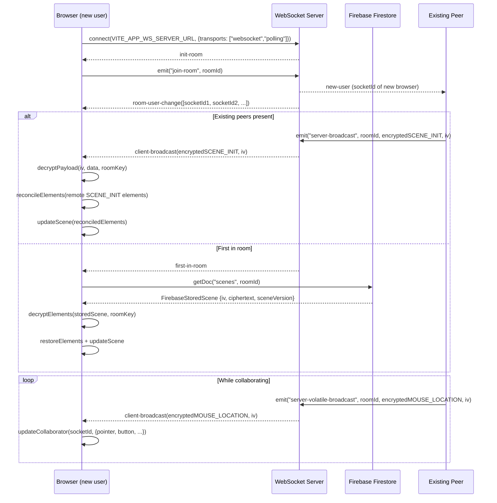
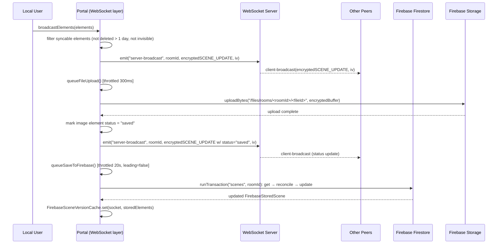
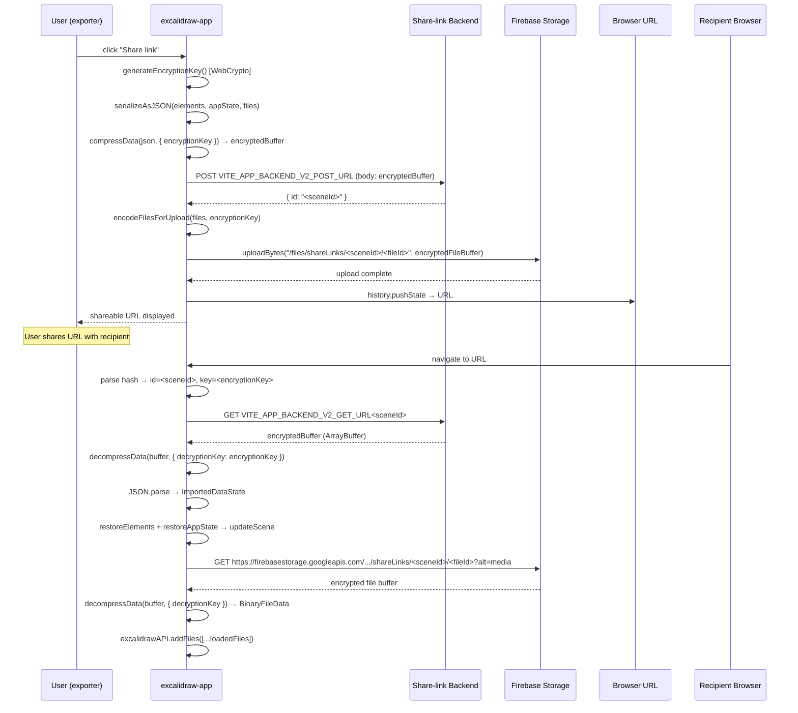

# Excalidraw API & Communication Interface Specification

## Table of Contents

1. [API Overview](#1-api-overview)
2. [Endpoint Catalog](#2-endpoint-catalog)
   - [2.1 WebSocket Events (Socket.IO Collaboration)](#21-websocket-events-socketio-collaboration)
   - [2.2 Firebase Firestore Operations](#22-firebase-firestore-operations)
   - [2.3 Firebase Storage Operations](#23-firebase-storage-operations)
   - [2.4 HTTP Endpoints](#24-http-endpoints)
   - [2.5 Public npm Package API (`@excalidraw/excalidraw`)](#25-public-npm-package-api-excalidrawexcalidraw)
3. [Authentication & Authorization](#3-authentication--authorization)
4. [Error Handling](#4-error-handling)
5. [Request / Response Schemas](#5-request--response-schemas)
6. [API Flow Diagrams](#6-api-flow-diagrams)

---

## 1. API Overview

Excalidraw is a client-side React drawing application with **no traditional server-side REST or GraphQL API**. All communication is either peer-to-peer (via a relay server) or directly against third-party cloud services. The four communication layers are:

| Layer | Technology | Purpose |
| --- | --- | --- |
| Real-time collaboration | Socket.IO (WebSocket / long-polling) | Broadcast scene changes and cursor state between collaborators in the same room |
| Scene persistence | Firebase Firestore | Store and retrieve the encrypted scene document for a collab room |
| File/image persistence | Firebase Cloud Storage + direct HTTP GET | Upload and download binary image files referenced by scene elements |
| Shareable links & AI | Custom backend HTTP REST endpoints | Publish snapshots for share-link URLs; AI diagram generation |

**Encryption model.** All scene data and files are AES-GCM encrypted client-side before leaving the browser. The encryption key is embedded only in the URL fragment (`#room=<id>,<key>` or `#json=<id>,<key>`) and is never transmitted to any server.

**Environment variables** (set at build time via Vite):

| Variable                       | Description                            |
| ------------------------------ | -------------------------------------- |
| `VITE_APP_WS_SERVER_URL`       | WebSocket relay server base URL        |
| `VITE_APP_BACKEND_V2_GET_URL`  | Share-link scene GET endpoint base URL |
| `VITE_APP_BACKEND_V2_POST_URL` | Share-link scene POST endpoint URL     |
| `VITE_APP_AI_BACKEND`          | AI service base URL                    |
| `VITE_APP_FIREBASE_CONFIG`     | JSON blob with Firebase project config |

---

## 2. Endpoint Catalog

### 2.1 WebSocket Events (Socket.IO Collaboration)

Socket.IO is connected to `VITE_APP_WS_SERVER_URL` with transports `["websocket", "polling"]`.

> Source: `excalidraw-app/collab/Portal.tsx`, `excalidraw-app/collab/Collab.tsx`, `excalidraw-app/app_constants.ts`

#### Events emitted by the client

| Event name | Constant | Direction | Volatile | Description |
| --- | --- | --- | --- | --- |
| `join-room` | — | client → server | No | Joins the specified room after `init-room` is received. Payload: `roomId: string` |
| `server-broadcast` | `WS_EVENTS.SERVER` | client → server | No | Sends an encrypted scene update (INIT or UPDATE) to all room members. Payload: `(roomId, encryptedBuffer, iv)` |
| `server-volatile-broadcast` | `WS_EVENTS.SERVER_VOLATILE` | client → server | Yes | Sends a volatile (best-effort) encrypted message for cursor/idle state. Payload: `(roomId, encryptedBuffer, iv)` |
| `user-follow` | `WS_EVENTS.USER_FOLLOW_CHANGE` | client → server | No | Notifies the server that the local user wants to follow (or unfollow) another user. Payload: `OnUserFollowedPayload` |

#### Events received by the client

| Event name | Constant | Direction | Description |
| --- | --- | --- | --- |
| `init-room` | — | server → client | Server acknowledges the socket connection; client responds with `join-room` |
| `new-user` | — | server → client | A new peer has joined the room; client broadcasts the full scene (`SCENE_INIT`) to them |
| `room-user-change` | — | server → client | Room membership has changed. Payload: `SocketId[]` (current member list) |
| `first-in-room` | — | server → client | Client is the first person in the room; triggers a Firebase scene load |
| `client-broadcast` | — | server → client | Relayed encrypted message from another room member. Payload: `(encryptedData: ArrayBuffer, iv: Uint8Array)` |
| `user-follow-room-change` | `WS_EVENTS.USER_FOLLOW_ROOM_CHANGE` | server → client | Server notifies the leader that someone is now following them. Payload: `SocketId[]` |
| `connect_error` | — | socket.io built-in | Connection failure; triggers a fallback Firebase scene load |

#### Encrypted payload subtypes (inside `client-broadcast`)

After decrypting a `client-broadcast` message, the inner JSON contains a `type` field from `WS_SUBTYPES`:

| Subtype enum value | String value | Description |
| --- | --- | --- |
| `WS_SUBTYPES.INIT` | `"SCENE_INIT"` | Full scene snapshot sent to a new peer. Contains all current elements |
| `WS_SUBTYPES.UPDATE` | `"SCENE_UPDATE"` | Incremental or full scene update. Contains changed/new elements |
| `WS_SUBTYPES.MOUSE_LOCATION` | `"MOUSE_LOCATION"` | Real-time cursor/pointer position update from a collaborator |
| `WS_SUBTYPES.IDLE_STATUS` | `"IDLE_STATUS"` | User idle/active/away status change |
| `WS_SUBTYPES.USER_VISIBLE_SCENE_BOUNDS` | `"USER_VISIBLE_SCENE_BOUNDS"` | Viewport bounds broadcast when a user is being followed |
| `WS_SUBTYPES.INVALID_RESPONSE` | `"INVALID_RESPONSE"` | Sentinel type returned on decryption failure (client-side only) |

---

### 2.2 Firebase Firestore Operations

Firestore is accessed via the Firebase JavaScript SDK (`firebase/firestore`).

> Source: `excalidraw-app/data/firebase.ts`

#### Collection: `scenes`

Document ID is the **room ID** (a random 10-byte hex string generated by `generateRoomId()`).

| Operation | SDK call | When triggered | Description |
| --- | --- | --- | --- |
| **Read scene** | `getDoc(doc(firestore, "scenes", roomId))` | On `first-in-room` socket event or socket `connect_error` fallback | Fetches the stored encrypted scene for an existing room |
| **Create scene** | `transaction.set(docRef, storedScene)` | First save inside `saveToFirebase()` when the document does not yet exist | Writes the initial encrypted scene |
| **Update scene** | `transaction.update(docRef, storedScene)` | Subsequent saves inside `saveToFirebase()` (on a throttled interval or before unload) | Reconciles and updates the encrypted scene with latest elements |

All read/write operations use Firestore **transactions** to prevent lost-update races between tabs or collaborators.

**Stored document schema** (`FirebaseStoredScene`):

```typescript
type FirebaseStoredScene = {
  sceneVersion: number; // result of getSceneVersion(elements)
  iv: Bytes; // AES-GCM IV (Firebase Bytes)
  ciphertext: Bytes; // AES-GCM ciphertext of JSON-serialised elements
};
```

---

### 2.3 Firebase Storage Operations

Firebase Cloud Storage is accessed via the Firebase JavaScript SDK (`firebase/storage`).

> Source: `excalidraw-app/data/firebase.ts`

#### Upload

| Operation | SDK call | Storage path | When triggered |
| --- | --- | --- | --- |
| Upload collab room file | `uploadBytes(ref(storage, path), buffer)` | `/files/rooms/<roomId>/<fileId>` | When a new image element is added while collaborating (`Portal.queueFileUpload`) |
| Upload share-link file | `uploadBytes(ref(storage, path), buffer)` | `/files/shareLinks/<sceneId>/<fileId>` | When exporting a shareable link via `exportToBackend()` |

Files are uploaded with `cacheControl: "public, max-age=31536000"` (1 year).

#### Download

Files are downloaded via **direct HTTP GET** (not the Firebase Storage SDK) to leverage the CDN and avoid SDK overhead:

```
GET https://firebasestorage.googleapis.com/v0/b/<storageBucket>/o/<encodedPrefix>%2F<fileId>?alt=media
```

| Path template | Usage context |
| --- | --- |
| `files/rooms/<roomId>/<fileId>` | Collaboration: load image files for a room |
| `files/shareLinks/<sceneId>/<fileId>` | Share link: load image files attached to a shared scene |

Files are compressed (`decompressData`) and encrypted (AES-GCM) before upload; they are decrypted on download using the room key or share-link key from the URL fragment.

---

### 2.4 HTTP Endpoints

These are outbound calls from the browser to external services.

> Source: `excalidraw-app/data/index.ts`, `excalidraw-app/components/AI.tsx`, `excalidraw-app/App.tsx`

#### Share-link Backend (`VITE_APP_BACKEND_V2_GET_URL` / `VITE_APP_BACKEND_V2_POST_URL`)

| Method | URL | Description |
| --- | --- | --- |
| `GET` | `${VITE_APP_BACKEND_V2_GET_URL}<id>` | Download an encrypted, compressed scene snapshot by its opaque ID (used when loading a `#json=<id>,<key>` URL) |
| `POST` | `${VITE_APP_BACKEND_V2_POST_URL}` | Upload a new encrypted, compressed scene snapshot. Returns `{ id: string }` on success or `{ error_class: "RequestTooLargeError" }` if the payload exceeds the server limit |

**POST request:**

- Body: raw binary (`ArrayBuffer`) — the output of `compressData()` which is a compressed, AES-GCM encrypted JSON blob
- Content-Type: not explicitly set (binary body)

**POST success response:**

```json
{ "id": "<opaque scene id>" }
```

**POST error response (payload too large):**

```json
{ "error_class": "RequestTooLargeError" }
```

#### External Scene URL (`#url=<encodedURL>`)

| Method | URL | Description |
| --- | --- | --- |
| `GET` | `decodeURIComponent(url)` (arbitrary URL from hash) | Load an `.excalidraw` JSON file from an external URL. The response blob is parsed with `loadFromBlob()` |

#### AI Backend (`VITE_APP_AI_BACKEND`)

| Method | URL | Content-Type | Description |
| --- | --- | --- | --- |
| `POST` | `${VITE_APP_AI_BACKEND}/v1/ai/diagram-to-code/generate` | `application/json` | Submit a frame screenshot + text labels; receive generated HTML code. Returns `{ html: string }` |
| `POST` | `${VITE_APP_AI_BACKEND}/v1/ai/text-to-diagram/chat-streaming` | `application/json` | Submit a chat message history; receive an SSE stream of Mermaid diagram chunks |

**Diagram-to-code request body:**

```json
{
  "texts": "<string>",
  "image": "<base64 data URL (JPEG)>",
  "theme": "light | dark"
}
```

**Diagram-to-code response body (200):**

```json
{ "html": "<string>" }
```

**Text-to-diagram request body:**

```json
{
  "messages": [{ "role": "user | assistant", "content": "<string>" }]
}
```

**Text-to-diagram response:** Server-Sent Events (`text/event-stream`). Each event is a JSON line prefixed with `data: `. The stream format is compatible with `StreamChunk` (see [Section 5](#5-request--response-schemas)).

**Rate-limit headers** read from AI responses:

| Header                  | Description                               |
| ----------------------- | ----------------------------------------- |
| `X-Ratelimit-Limit`     | Maximum requests per day                  |
| `X-Ratelimit-Remaining` | Remaining requests for the current period |

---

### 2.5 Public npm Package API (`@excalidraw/excalidraw`)

The library is published as `@excalidraw/excalidraw`. All exports below come from `packages/excalidraw/index.tsx`.

> Source: `packages/excalidraw/index.tsx`, `packages/excalidraw/types.ts`

#### React Components

| Export | Description |
| --- | --- |
| `<Excalidraw>` | Main drawing canvas component. Accepts `ExcalidrawProps` |
| `ExcalidrawAPIProvider` | Context provider allowing hooks to work outside `<Excalidraw>` |
| `<Sidebar>` | Embeddable sidebar panel |
| `<Button>` | UI button primitive |
| `<Footer>` | Canvas footer slot |
| `<MainMenu>` | Canvas main menu slot |
| `<WelcomeScreen>` | Onboarding welcome screen |
| `<LiveCollaborationTrigger>` | Trigger button for live collaboration |
| `<DefaultSidebar>` | Built-in sidebar (library panel) |
| `<Stats>` | Element statistics panel |
| `<TTDDialog>` | Text-to-diagram (AI) dialog |
| `<TTDDialogTrigger>` | Trigger for TTD dialog |
| `<DiagramToCodePlugin>` | Diagram-to-code frame plugin |
| `<CommandPalette>` | Command palette component |
| `<Ellipsify>` | Text truncation utility component |

#### Imperative API (`ExcalidrawImperativeAPI`)

Obtained via `props.onExcalidrawAPI` callback or `useExcalidrawAPI()` hook.

| Method / Property | Signature | Description |
| --- | --- | --- |
| `isDestroyed` | `boolean` | True if the editor has been unmounted |
| `updateScene` | `(sceneData: SceneData) => void` | Update elements, appState, and collaborators |
| `applyDeltas` | `(deltas) => void` | Apply incremental element deltas |
| `mutateElement` | `(element, updates) => void` | Mutate a single element in place |
| `updateLibrary` | `(opts) => void` | Update the library items |
| `resetScene` | `(opts?) => void` | Clear the canvas |
| `getSceneElements` | `() => readonly OrderedExcalidrawElement[]` | Returns non-deleted elements |
| `getSceneElementsIncludingDeleted` | `() => readonly OrderedExcalidrawElement[]` | Returns all elements including deleted |
| `getSceneElementsMapIncludingDeleted` | `() => Map<string, ExcalidrawElement>` | Map form of all elements |
| `getAppState` | `() => AppState` | Returns current app state snapshot |
| `getFiles` | `() => BinaryFiles` | Returns all binary files in the scene |
| `getName` | `() => string` | Returns the current file/scene name |
| `addFiles` | `(data: BinaryFileData[]) => void` | Add binary file data to the scene |
| `scrollToContent` | `(target?, opts?) => void` | Scroll/zoom to fit elements |
| `refresh` | `() => void` | Force re-render |
| `setToast` | `(opts) => void` | Display a toast notification |
| `setActiveTool` | `(tool) => void` | Programmatically set the active drawing tool |
| `setCursor` | `(cursor: string) => void` | Override the canvas cursor |
| `resetCursor` | `() => void` | Reset cursor to default |
| `toggleSidebar` | `(opts) => boolean` | Open or close a sidebar |
| `updateFrameRendering` | `(opts) => void` | Toggle frame rendering |
| `getEditorInterface` | `() => EditorInterface` | Get current editor form factor and mode |
| `registerAction` | `(action: Action) => void` | Register a custom action |
| `history.clear` | `() => void` | Clear undo/redo history |
| `id` | `string` | Unique editor instance ID |
| `onChange` | `(callback) => UnsubscribeCallback` | Subscribe to scene changes |
| `onIncrement` | `(callback) => UnsubscribeCallback` | Subscribe to element increment events |
| `onPointerDown` | `(callback) => UnsubscribeCallback` | Subscribe to pointer-down events |
| `onPointerUp` | `(callback) => UnsubscribeCallback` | Subscribe to pointer-up events |
| `onScrollChange` | `(callback) => UnsubscribeCallback` | Subscribe to scroll/zoom changes |
| `onUserFollow` | `(callback) => UnsubscribeCallback` | Subscribe to user-follow events |
| `onStateChange` | `(callback) => UnsubscribeCallback` | Subscribe to any app state change |
| `onEvent` | `(event, callback) => UnsubscribeCallback` | Subscribe to lifecycle events (`editor:mount`, `editor:initialize`, `editor:unmount`) |

#### Data / Utility Exports

| Export | Description |
| --- | --- |
| `exportToCanvas(opts)` | Render elements to an `HTMLCanvasElement` |
| `exportToBlob(opts)` | Render elements to a PNG/JPEG `Blob` |
| `exportToSvg(opts)` | Render elements to an `SVGElement` |
| `exportToClipboard(opts)` | Copy elements to clipboard |
| `serializeAsJSON(elements, appState, files, type)` | Serialize scene to `.excalidraw` JSON string |
| `serializeLibraryAsJSON(libraryItems)` | Serialize library to JSON string |
| `loadFromBlob(blob, localAppState, localElements)` | Parse a `.excalidraw` file blob |
| `loadSceneOrLibraryFromBlob(blob, ...)` | Auto-detect and load scene or library |
| `loadLibraryFromBlob(blob)` | Parse a `.excalidrawlib` blob |
| `restoreElements(elements, localElements, opts?)` | Restore/repair elements array |
| `restoreAppState(appState, localAppState)` | Restore/repair app state |
| `restoreLibraryItems(libraryItems, defaultStatus)` | Restore library items |
| `reconcileElements(localElements, remoteElements, appState)` | CRDT-style merge of element arrays |
| `convertToExcalidrawElements(elements)` | Convert simplified element definitions to full elements |
| `getSceneVersion(elements)` | Compute a version number for the current elements array |
| `getNonDeletedElements(elements)` | Filter out deleted elements |
| `getCommonBounds(elements)` | Bounding box of all provided elements |
| `getVisibleSceneBounds(appState)` | Current viewport bounds in scene coordinates |
| `zoomToFitBounds(opts)` | Compute zoom/scroll to fit given bounds |
| `elementsOverlappingBBox(opts)` | Spatial query for elements overlapping a bounding box |
| `isElementInsideBBox(element, bbox)` | True if element is inside bbox |
| `elementPartiallyOverlapsWithOrContainsBBox(element, bbox)` | Overlap/containment check |
| `parseLibraryTokensFromUrl()` | Extract library tokens from the current URL |
| `useHandleLibrary(opts)` | React hook: auto-load library from URL on mount |
| `getDataURL(blob)` | Convert a `Blob` to a `DataURL` |
| `mergeLibraryItems(source, target)` | Merge two library item arrays |
| `getLibraryItemsHash(items)` | Compute a hash for a library items array |
| `mutateElement(element, updates, informMutation?)` | Mutate element fields (low-level) |
| `newElementWith(element, updates)` | Return a new element with updated fields |
| `bumpVersion(element)` | Increment element version |
| `isLinearElement(element)` | Type guard for linear (arrow/line) elements |
| `isInvisiblySmallElement(element)` | True if element is effectively invisible |
| `getTextFromElements(elements)` | Concatenate text content from all text elements |
| `isElementLink(str)` | True if string is an element deep-link |
| `normalizeLink(link)` | Sanitize and normalize a URL |
| `TTDStreamFetch(options)` | Stream AI text-to-diagram SSE fetch (used internally by `<TTDDialog>`) |
| `setCustomTextMetricsProvider(provider)` | Override the text metrics implementation (e.g., for SSR) |
| `getFormFactor(width, height)` | Classify editor form factor from dimensions |
| `sceneCoordsToViewportCoords(coords, appState)` | Convert scene to viewport coordinates |
| `viewportCoordsToSceneCoords(coords, appState)` | Convert viewport to scene coordinates |

#### React Hooks

| Hook | Description |
| --- | --- |
| `useExcalidrawAPI()` | Returns the current `ExcalidrawImperativeAPI` instance |
| `useExcalidrawStateValue(prop \| props[] \| selector)` | Subscribe to specific `AppState` field(s) |
| `useOnExcalidrawStateChange(prop \| selector, callback)` | Fire callback on `AppState` changes |
| `useEditorInterface()` | Returns current `EditorInterface` (form factor, mode) |
| `useStylesPanelMode()` | Returns current styles panel display mode |
| `useI18n()` | Returns `{ t, langCode }` for translation |
| `useHandleLibrary(opts)` | Auto-load library from URL hash |

#### Constants

| Export                | Description                                |
| --------------------- | ------------------------------------------ |
| `FONT_FAMILY`         | Font family enum                           |
| `THEME`               | Theme enum (`"light"`, `"dark"`)           |
| `MIME_TYPES`          | MIME type constants                        |
| `ROUNDNESS`           | Roundness style enum                       |
| `DEFAULT_LASER_COLOR` | Default laser pointer color                |
| `UserIdleState`       | Idle state enum (`ACTIVE`, `IDLE`, `AWAY`) |
| `CaptureUpdateAction` | History capture behavior enum              |

---

## 3. Authentication & Authorization

Excalidraw uses a **zero-knowledge** encryption model. There is no traditional user authentication system for the core collaboration feature.

### Collaboration Room Access

1. **Room ID** — a random 10-byte (20 hex character) string, generated client-side by `generateRoomId()` using `window.crypto.getRandomValues`. It identifies the Firestore document and the Socket.IO room.
2. **Room Key** — a 22-character base64url string, generated client-side by `generateEncryptionKey()` using the WebCrypto API (AES-GCM 128-bit key). This key never leaves the browser except as a URL fragment.
3. **URL format** — `https://excalidraw.com/#room=<roomId>,<roomKey>`. Because it is in the fragment, the key is never sent to any server in HTTP requests.
4. **Access control** — anyone who possesses the URL can join the room. There is no server-side authentication gate; the Socket.IO server simply relays encrypted messages.

### Share Links

1. Scene data is encrypted before upload using a freshly generated `encryptionKey`.
2. The resulting URL has the form `https://excalidraw.com/#json=<id>,<encryptionKey>`.
3. The server stores only ciphertext; it cannot read the scene content.

### Excalidraw+ Authentication (excalidraw.com only)

The app reads `document.cookie` for `excplus-auth` (constant `COOKIES.AUTH_STATE_COOKIE`) to detect signed-in Excalidraw+ users. This cookie-based check is used to conditionally show premium UI, but it is not relevant to the open-source collaboration mechanism.

### AI Backend

AI endpoints (`/v1/ai/...`) enforce rate limits via `X-Ratelimit-Limit` / `X-Ratelimit-Remaining` response headers. The client reads these headers to display quota information; the rate-limit enforcement is entirely server-side. No auth token is sent.

---

## 4. Error Handling

### WebSocket / Collaboration

| Scenario | Handling |
| --- | --- |
| `connect_error` socket event | `fallbackInitializationHandler` fires: loads scene from Firebase instead of waiting for `SCENE_INIT` broadcast |
| `socketInitializationTimer` expiry (5 s) | Same fallback handler runs if no `SCENE_INIT` received within `INITIAL_SCENE_UPDATE_TIMEOUT` (5000 ms) |
| Decryption failure inside `client-broadcast` | `decryptPayload()` shows `window.alert(t("alerts.decryptFailed"))` and returns `{ type: WS_SUBTYPES.INVALID_RESPONSE }`, which is then silently dropped |
| Firebase save failure (Firestore transaction) | `saveCollabRoomToFirebase()` catches and calls `setErrorDialog()` with a localised message; if the error message matches `"is longer than.*?bytes"`, a size-exceeded variant is shown. A persistent error indicator is set via `setErrorIndicator()` |

### HTTP (Share-link backend)

| Scenario | Handling |
| --- | --- |
| Non-2xx on GET (import) | `window.alert(t("alerts.importBackendFailed"))`; returns `{}` |
| `error_class === "RequestTooLargeError"` on POST | Returns `{ url: null, errorMessage: t("alerts.couldNotCreateShareableLinkTooBig") }` |
| Other POST failure / network error | Returns `{ url: null, errorMessage: t("alerts.couldNotCreateShareableLink") }` |
| Legacy decryption failure | Falls back to `legacy_decodeFromBackend()` with a fixed IV |

### HTTP (AI backend)

| Scenario | Handling |
| --- | --- |
| `status === 429` (rate limit) | Returns `{ error: new RequestError({ message: "Rate limit exceeded", status: 429 }) }` |
| `statusCode === 429` in JSON body (diagram-to-code) | Returns an HTML error message with an Excalidraw+ upgrade link |
| Non-OK response | Throws a `RequestError` with the response body text |
| Missing `html` field in diagram-to-code response | Throws `"Generation failed (invalid response)"` |
| Abort signal fired | The `fetch()` call is cancelled; `AbortError` propagates naturally |

### Firebase Storage (file uploads)

Each file upload is attempted independently inside `Promise.all`. A failure on one file adds its ID to `erroredFiles` without blocking other uploads. The caller receives `{ savedFiles, erroredFiles }` and handles the error set.

### File Downloads

Each file download (HTTP GET from Firebase Storage CDN) is wrapped in `try/catch` inside `Promise.all`. Failures add the file ID to `erroredFiles`. When `FileManager.getFiles()` returns errored files, `updateStaleImageStatuses()` sets the corresponding image element status to `"error"` on the canvas.

### Local Storage

A `QuotaExceededError` during `localStorage.setItem` sets the `localStorageQuotaExceededAtom` Jotai atom, which the UI can read to show a warning.

---

## 5. Request / Response Schemas

### WebSocket Message Schemas

All WebSocket payloads are serialised to JSON, then AES-GCM encrypted. The following show the decrypted inner types.

```typescript
// Source: excalidraw-app/data/index.ts

export type SocketUpdateDataSource = {
  // Sent once to a new peer joining an existing room
  SCENE_INIT: {
    type: "SCENE_INIT";
    payload: {
      elements: readonly OrderedExcalidrawElement[];
    };
  };

  // Incremental or full scene update
  SCENE_UPDATE: {
    type: "SCENE_UPDATE";
    payload: {
      elements: readonly OrderedExcalidrawElement[];
    };
  };

  // Real-time cursor position
  MOUSE_LOCATION: {
    type: "MOUSE_LOCATION";
    payload: {
      socketId: SocketId; // string & { _brand: "SocketId" }
      pointer: { x: number; y: number; tool: "pointer" | "laser" };
      button: "down" | "up";
      selectedElementIds: AppState["selectedElementIds"];
      username: string;
    };
  };

  // Viewport bounds sent when being followed by another user
  USER_VISIBLE_SCENE_BOUNDS: {
    type: "USER_VISIBLE_SCENE_BOUNDS";
    payload: {
      socketId: SocketId;
      username: string;
      // [sceneX, sceneY, sceneX2, sceneY2]
      sceneBounds: readonly [number, number, number, number];
    };
  };

  // User activity state
  IDLE_STATUS: {
    type: "IDLE_STATUS";
    payload: {
      socketId: SocketId;
      userState: UserIdleState; // "active" | "idle" | "away"
      username: string;
    };
  };

  // Client-side sentinel for decryption failures
  INVALID_RESPONSE: {
    type: "INVALID_RESPONSE";
  };
};
```

### Firebase Firestore Document Schema

```typescript
// Source: excalidraw-app/data/firebase.ts

type FirebaseStoredScene = {
  sceneVersion: number; // getSceneVersion(elements) — used to detect stale writes
  iv: Bytes; // Firebase Bytes wrapping a Uint8Array (AES-GCM IV)
  ciphertext: Bytes; // Firebase Bytes wrapping AES-GCM ciphertext of
  // JSON.stringify(OrderedExcalidrawElement[])
};
```

### Binary File Schema

```typescript
// Source: packages/excalidraw/types.ts

type BinaryFileData = {
  mimeType: ValueOf<typeof IMAGE_MIME_TYPES> | typeof MIME_TYPES.binary;
  id: FileId; // string & { _brand: "FileId" }
  dataURL: DataURL; // string & { _brand: "DataURL" }
  created: number; // epoch ms
  lastRetrieved?: number;
  version?: number;
};

type BinaryFileMetadata = Omit<BinaryFileData, "dataURL">;

// Files are compressed + encrypted before upload:
// compressData(new TextEncoder().encode(fileData.dataURL), {
//   encryptionKey,
//   metadata: BinaryFileMetadata,
// })
```

### AI Backend Schemas

```typescript
// Source: packages/excalidraw/data/ai/types.ts

// POST /v1/ai/text-to-diagram/chat-streaming — request body
interface TTDRequest {
  messages: Array<{
    role: "user" | "assistant";
    content: string;
  }>;
}

// SSE stream chunk (each `data:` line)
type StreamChunk =
  | { type: "content"; delta: string }
  | {
      type: "done";
      finishReason: "stop" | "length" | "content_filter" | "tool_calls" | null;
    }
  | { type: "error"; error: { message: string; status?: number } };

// POST /v1/ai/diagram-to-code/generate — request body
interface DiagramToCodeRequest {
  texts: string; // concatenated text labels from frame children
  image: string; // base64 JPEG data URL of the exported frame
  theme: "light" | "dark";
}

// POST /v1/ai/diagram-to-code/generate — success response
interface DiagramToCodeResponse {
  html: string;
}
```

### Share-link Backend Schemas

```typescript
// Source: excalidraw-app/data/index.ts

// POST ${VITE_APP_BACKEND_V2_POST_URL} — success response
interface BackendPostSuccessResponse {
  id: string;
}

// POST — error response
interface BackendPostErrorResponse {
  error_class: "RequestTooLargeError";
}

// GET ${VITE_APP_BACKEND_V2_GET_URL}<id> — success response
// Body: raw ArrayBuffer (compressed + encrypted scene)
// Decoded with decompressData(buffer, { decryptionKey })
// which yields: { data: Uint8Array /* JSON bytes */, metadata: any }
// Then: ImportedDataState = JSON.parse(new TextDecoder().decode(data))
interface ImportedDataState {
  type?: string;
  version?: number;
  source?: string;
  elements?: readonly ExcalidrawElement[] | null;
  appState?: Partial<AppState> | null;
  scrollToContent?: boolean;
  libraryItems?: LibraryItems_anyVersion;
  files?: BinaryFiles;
}
```

### Collaborator Schema

```typescript
// Source: packages/excalidraw/types.ts

type Collaborator = Readonly<{
  pointer?: {
    x: number;
    y: number;
    tool: "pointer" | "laser";
    renderCursor?: boolean;
    laserColor?: string;
  };
  button?: "up" | "down";
  selectedElementIds?: AppState["selectedElementIds"];
  username?: string | null;
  userState?: UserIdleState;
  color?: { background: string; stroke: string };
  avatarUrl?: string;
  id?: string;
  socketId?: SocketId;
  isCurrentUser?: boolean;
  isInCall?: boolean;
  isSpeaking?: boolean;
  isMuted?: boolean;
}>;
```

---

## 6. API Flow Diagrams

### 6.1 Joining an Existing Collaboration Session



### 6.2 Saving / Syncing a Scene During Collaboration



### 6.3 Exporting and Loading a Shareable Link


