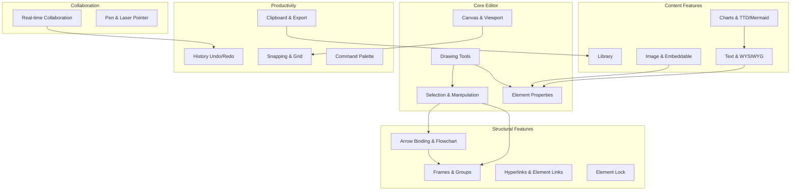
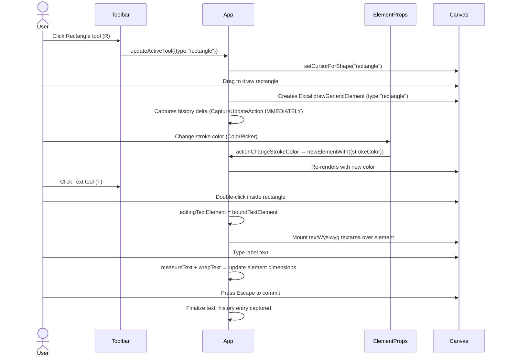
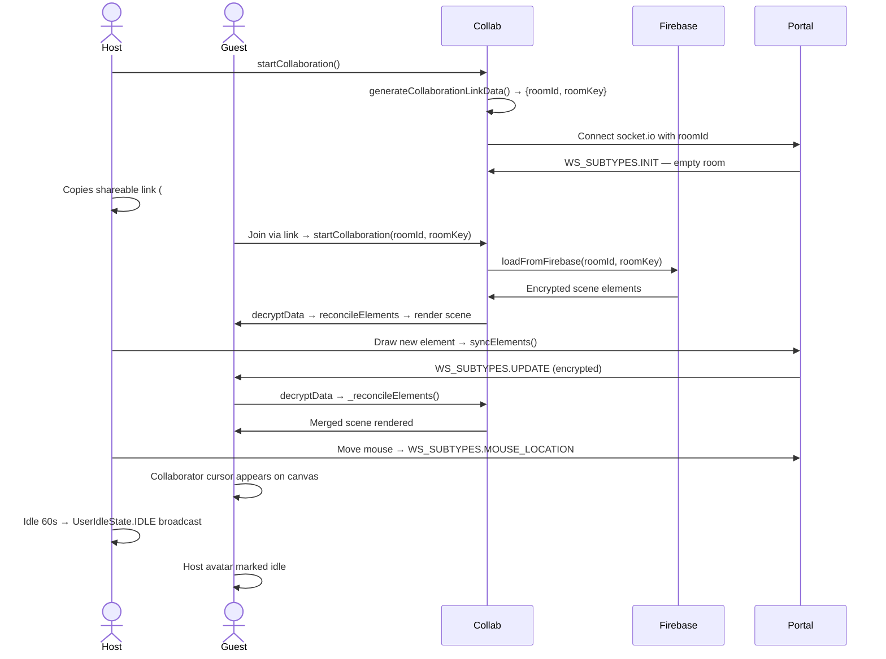
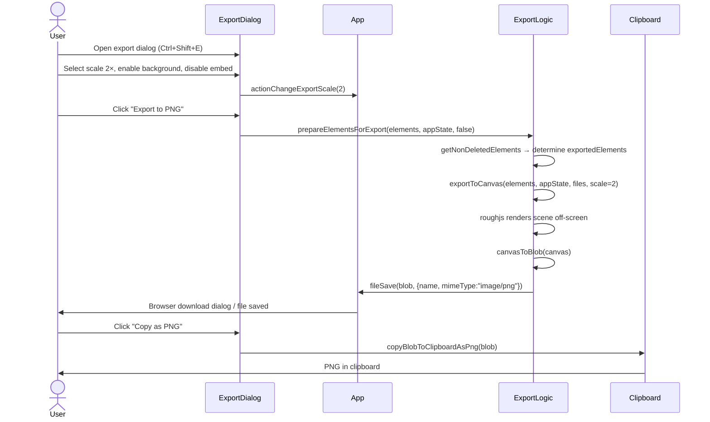
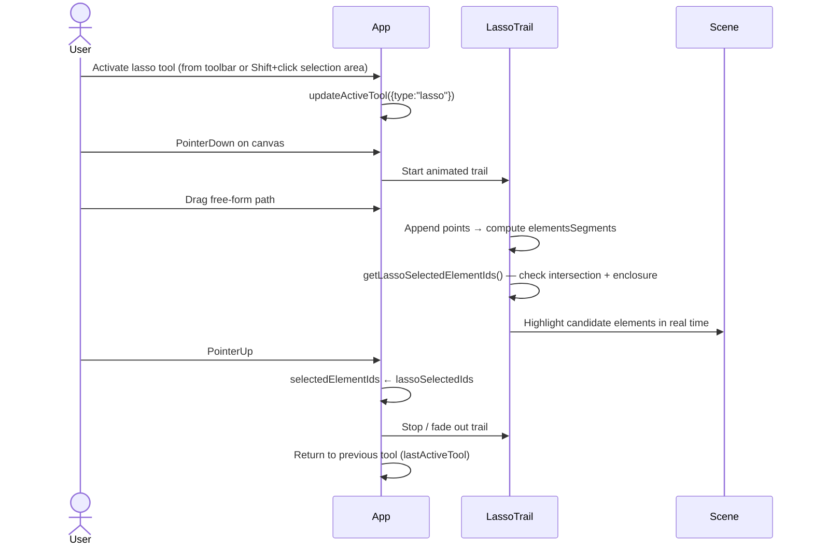
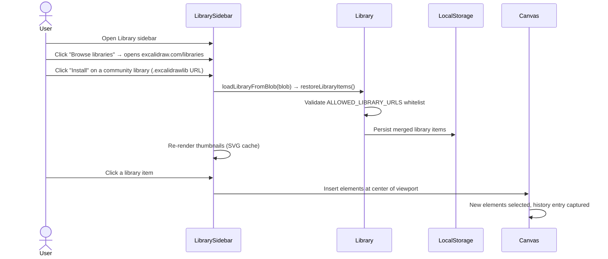
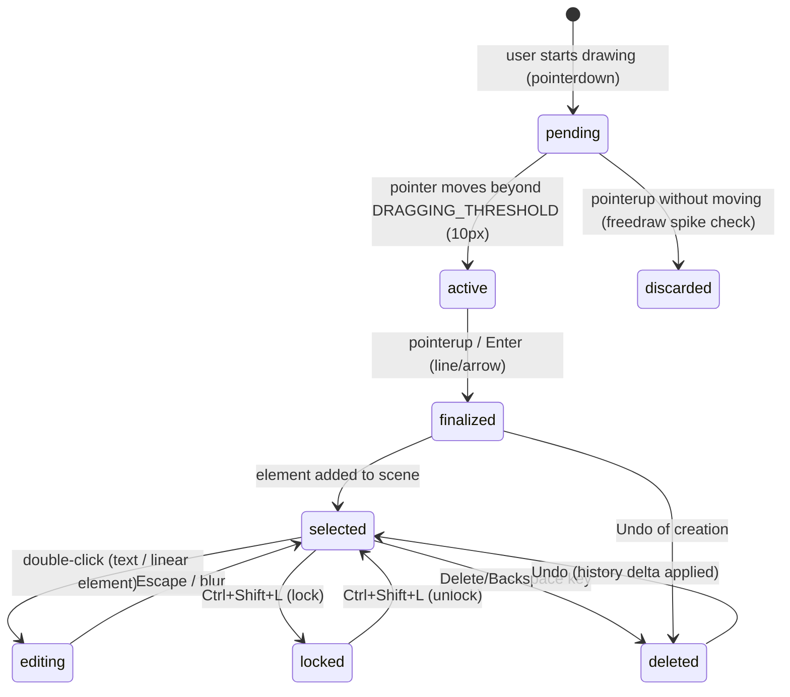
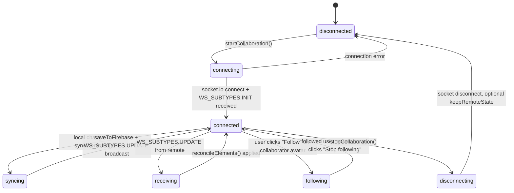
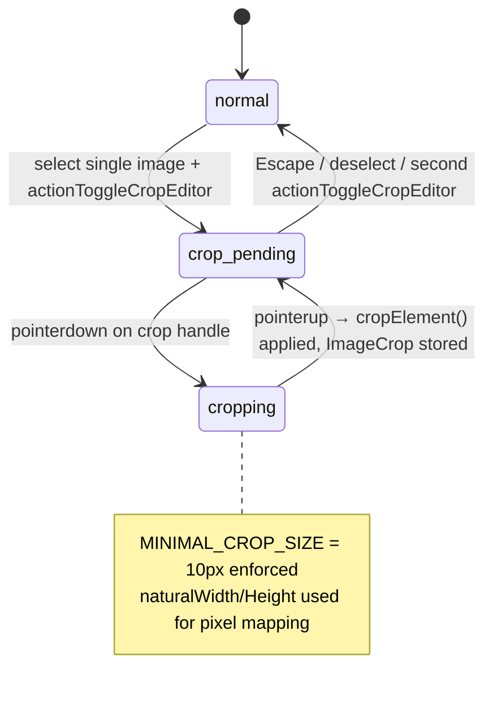

# Excalidraw Features Specification

## Table of Contents

1. [Feature Map](#1-feature-map)
2. [Feature Catalog](#2-feature-catalog)
   - 2.1 [Drawing Tools](#21-drawing-tools)
   - 2.2 [Element Properties & Styling](#22-element-properties--styling)
   - 2.3 [Selection & Manipulation](#23-selection--manipulation)
   - 2.4 [Canvas & Viewport](#24-canvas--viewport)
   - 2.5 [Text & WYSIWYG Editing](#25-text--wysiwyg-editing)
   - 2.6 [Frames & Groups](#26-frames--groups)
   - 2.7 [Arrow Binding & Flowchart](#27-arrow-binding--flowchart)
   - 2.8 [Image & Embeddable Support](#28-image--embeddable-support)
   - 2.9 [Clipboard, Import & Export](#29-clipboard-import--export)
   - 2.10 [Library](#210-library)
   - 2.11 [History (Undo/Redo)](#211-history-undoredo)
   - 2.12 [Real-time Collaboration](#212-real-time-collaboration)
   - 2.13 [Charts & Diagrams (TTD/Mermaid)](#213-charts--diagrams-ttdmermaid)
   - 2.14 [Snapping & Grid](#214-snapping--grid)
   - 2.15 [Fonts](#215-fonts)
   - 2.16 [Pen & Laser Pointer Modes](#216-pen--laser-pointer-modes)
   - 2.17 [Element Lock](#217-element-lock)
   - 2.18 [Hyperlinks & Element Links](#218-hyperlinks--element-links)
   - 2.19 [Stats Panel](#219-stats-panel)
   - 2.20 [Command Palette](#220-command-palette)
3. [User Journeys](#3-user-journeys)
4. [State Machines](#4-state-machines)
5. [Business Rules](#5-business-rules)

---

## 1. Feature Map



---

## 2. Feature Catalog

### 2.1 Drawing Tools

**Description:** The primary tool palette enabling users to create every element type supported by Excalidraw.

**User-facing behavior:**
- Toolbar buttons (or keyboard shortcuts) activate tools: Selection (`V`), Lasso, Rectangle (`R`), Diamond (`D`), Ellipse (`O`), Arrow (`A`), Line (`L`), Freedraw (`P`), Text (`T`), Image, Eraser, Hand, Frame, Magic Frame, Embeddable, and Laser pointer.
- The active tool changes the cursor and determines what is created on pointer-down/drag.
- Pressing `Q` or clicking the lock icon keeps the current tool active after drawing (tool lock).
- On tool switch (except `freedraw` and `lasso`), the previous active tool is remembered in `lastActiveTool` for one-shot tools.
- In **View Mode**, only `laser` and `hand` tools are available.

**System behavior:**
- `TOOL_TYPE` constant in `packages/common/src/constants.ts` defines every valid tool name string.
- `AppState.activeTool` (`packages/excalidraw/appState.ts`) tracks the current tool type, whether it is locked, and the `lastActiveTool`.
- Switching tools calls `updateActiveTool()` (from `@excalidraw/common`) and `setCursorForShape()` from `packages/excalidraw/cursor.ts`.
- `App.toggleLock()` (`packages/excalidraw/components/App.tsx:4218`) toggles the `activeTool.locked` flag without changing the tool type.
- When the app state is restored from storage or URL, `image`, `lasso`, and non-selection tools are coerced back to `selection` (`App.tsx:2936–2943`).
- `freedraw` pointerdown while another pointerdown is in progress discards very-short strokes (likely spikes) and finalizes longer ones (`App.tsx:7547–7555`).
- Lasso and eraser tools use animated trails (`LassoTrail`, `EraserTrail` in `packages/excalidraw/lasso/` and `packages/excalidraw/eraser/`) rendered via `AnimatedTrail` and `AnimationFrameHandler`.

**Key source files:**
- `packages/common/src/constants.ts` — `TOOL_TYPE` enum
- `packages/excalidraw/appState.ts` — default `activeTool` shape
- `packages/excalidraw/components/App.tsx` — tool switch, lock toggle, per-tool pointer handlers
- `packages/excalidraw/lasso/index.ts` — `LassoTrail`, lasso selection hit testing
- `packages/excalidraw/eraser/index.ts` — `EraserTrail`, eraser element intersection

**Dependencies:** roughjs (hand-drawn rendering), perfect-freehand (pen strokes for `freedraw`)

---

### 2.2 Element Properties & Styling

**Description:** Per-element visual styling controls exposed in the side panel (Properties panel).

**User-facing behavior:**
- Stroke color, background color, fill style (`hachure`, `cross-hatch`, `solid`, `zigzag`), stroke width, stroke style (`solid`, `dashed`, `dotted`), roundness (`round`/`sharp`), opacity, and arrowhead type are configurable.
- Font family, font size, text alignment (left/center/right) and vertical alignment (top/middle/bottom) apply to text and text-container elements.
- Changes apply immediately to all selected elements and are reflected on the canvas.
- The "Style picker" action (`actionStyles`) copies styling from the first selected element onto the current tool defaults.

**System behavior:**
- Default item properties are maintained in `AppState` as `currentItem*` fields (`packages/excalidraw/appState.ts`).
- `actionProperties` (`packages/excalidraw/actions/actionProperties.tsx`) registers dozens of sub-actions that each call `newElementWith()` to produce immutable element updates.
- Color pickers use `DEFAULT_ELEMENT_STROKE_COLOR_PALETTE` / `DEFAULT_ELEMENT_BACKGROUND_COLOR_PALETTE` from `@excalidraw/common`.
- `reduceToCommonValue()` determines a unified displayed value when multiple elements with differing properties are selected.
- Arrow type toggling (`sharp`, `round`, `elbow`) calls `updateElbowArrowPoints()` when switching to/from elbow mode.
- `deriveStylesPanelMode()` controls which subset of properties is shown based on selected element types.

**Key source files:**
- `packages/excalidraw/actions/actionProperties.tsx`
- `packages/excalidraw/appState.ts`
- `packages/excalidraw/components/ColorPicker/ColorPicker.tsx`
- `packages/excalidraw/components/FontPicker/FontPicker.tsx`
- `packages/common/src/constants.ts` — palettes, `STROKE_WIDTH`, `ROUNDNESS`, `FONT_SIZES`

**Dependencies:** `@excalidraw/element` (`newElementWith`, `mutateElement`), Jotai state

---

### 2.3 Selection & Manipulation

**Description:** Mechanisms for selecting, moving, resizing, rotating, duplicating, aligning, distributing, and deleting elements.

**User-facing behavior:**
- **Box selection** (drag on empty canvas) selects all elements whose bounds intersect the selection rectangle; with Shift held, existing selection is preserved.
- **Lasso selection** (`lasso` tool) selects elements by free-form path enclosure or intersection.
- **Overlap box selection** (recently added, `#11053`) selects elements overlapping the drag area.
- Elements can be dragged individually or as a group; arrow keys nudge by 1 px (or 5 px with Shift).
- **Resize** via transform handles; Shift maintains aspect ratio, Alt resizes from center.
- **Rotate** via the rotation handle; Shift snaps to 15° increments.
- **Flip** horizontally or vertically (`actionFlipHorizontal`, `actionFlipVertical`).
- **Align** (left, right, top, bottom, center horizontally/vertically) and **Distribute** (horizontal/vertical spacing) are available for multi-element selections.
- **Duplicate** (`Ctrl/Cmd+D`) duplicates selected elements with a fixed offset; Alt+drag also duplicates on pointer-up.
- **Delete** removes selected elements; bound text is also removed.
- **Z-index**: send backward/to back, bring forward/to front.
- **Select All** (`Ctrl/Cmd+A`) selects all non-deleted, non-locked elements.
- **Deselect** (`Escape`) clears selection and returns to the selection tool.

**System behavior:**
- Selection state is `AppState.selectedElementIds` (map of id → true).
- `getSelectedElements()` filters the scene respecting group membership via `selectGroupsForSelectedElements()`.
- `duplicateElements()` (`packages/element/src/duplicate.ts`) deep-copies elements, reassigns IDs, updates frame membership and group IDs.
- `resizeMultipleElements()` (`packages/element/src/resizeElements.ts`) applies transform handles to a set of elements simultaneously.
- `alignElements()` and `distributeElements()` (`packages/element/src/align.ts`, `distribute.ts`) compute new positions relative to the bounding box of the selection.
- Z-index operations use fractional indices (`packages/element/src/fractionalIndex.ts`) for stable ordering.
- Locked elements are excluded from `getSelectedElements()` unless `includeLocked` is explicitly set.

**Key source files:**
- `packages/excalidraw/actions/actionDuplicateSelection.tsx`
- `packages/excalidraw/actions/actionAlign.tsx`
- `packages/excalidraw/actions/actionDistribute.tsx`
- `packages/excalidraw/actions/actionZindex.tsx`
- `packages/excalidraw/actions/actionFlip.ts`
- `packages/excalidraw/actions/actionDeleteSelected.tsx`
- `packages/excalidraw/actions/actionSelectAll.ts`
- `packages/excalidraw/actions/actionDeselect.ts`
- `packages/element/src/duplicate.ts`
- `packages/element/src/resizeElements.ts`
- `packages/element/src/dragElements.ts`
- `packages/element/src/selection.ts`
- `packages/excalidraw/lasso/index.ts` — `LassoTrail`

**Dependencies:** `@excalidraw/math` for bounds/rotation, `@excalidraw/element`

---

### 2.4 Canvas & Viewport

**Description:** Controls for panning, zooming, and configuring the canvas background and display modes.

**User-facing behavior:**
- **Zoom**: `Ctrl/Cmd++`, `Ctrl/Cmd+-`, `Ctrl/Cmd+0` (reset to 100%), scroll wheel, pinch-to-zoom on touch. Zoom range: 10%–3000%.
- **Pan**: Hand tool (`H`), Space+drag, two-finger scroll/drag on touch.
- **Scroll to fit**: `Shift+1` fits all elements in view; `Shift+2` fits the selection.
- **Canvas background color** is configurable via a color picker (hidden in view mode or when disabled by host).
- **Dark / Light theme** toggle (`actionToggleTheme`).
- **Zen mode** hides the UI chrome; **View mode** makes the canvas read-only (no editing, only `laser` and `hand` tools).
- Canvas background and theme are persisted in `AppState` and serialized with exports.

**System behavior:**
- `actionZoomIn/Out/Reset` (`packages/excalidraw/actions/actionCanvas.tsx`) call `getNormalizedZoom()` and `getStateForZoom()` from `packages/excalidraw/scene/zoom.ts`.
- `MIN_ZOOM = 0.1`, `MAX_ZOOM = 30`, `ZOOM_STEP = 0.1` defined in `packages/common/src/constants.ts`.
- Scroll offsets (`scrollX`, `scrollY`) and zoom value are part of `AppState`; `centerScrollOn()` (`packages/excalidraw/scene/scroll.ts`) recomputes offsets to center a point.
- `viewModeEnabled` and `zenModeEnabled` are distinct AppState booleans; both are stored but `viewModeEnabled` is not persisted to `browser` storage by default.
- `actionChangeViewBackgroundColor` is gated by `UIOptions.canvasActions.changeViewBackgroundColor` and `!appState.viewModeEnabled`.

**Key source files:**
- `packages/excalidraw/actions/actionCanvas.tsx`
- `packages/excalidraw/scene/zoom.ts`
- `packages/excalidraw/scene/scroll.ts`
- `packages/excalidraw/appState.ts`
- `packages/common/src/constants.ts` — `MIN_ZOOM`, `MAX_ZOOM`, `ZOOM_STEP`

**Dependencies:** DOM pointer/wheel events, touch gesture handling in `App.tsx`

---

### 2.5 Text & WYSIWYG Editing

**Description:** In-canvas text creation and editing using an overlaid WYSIWYG textarea.

**User-facing behavior:**
- Double-clicking a shape attaches a text label (bound text); double-clicking canvas creates a standalone text element.
- Typing in the WYSIWYG textarea updates the element in real time.
- Text wraps within container bounds; the container auto-resizes vertically if the text overflows (`actionTextAutoResize`).
- Font family, size, alignment, and vertical alignment are configurable.
- Text supports CJK characters with dedicated CJK fallback fonts.

**System behavior:**
- `textWysiwyg.tsx` (`packages/excalidraw/wysiwyg/textWysiwyg.tsx`) mounts a `<textarea>` absolutely positioned over the canvas element, synced to the element's scene coordinates via `sceneCoordsToViewportCoords()`.
- `editingTextElement` in `AppState` tracks the element currently being edited.
- On commit (blur/Enter for single-line, Escape), `normalizeText()` and `measureText()` from `packages/element/src/textMeasurements.ts` recalculate dimensions; `wrapText()` handles word-wrapping.
- `getBoundTextElement()` / `redrawTextBoundingBox()` (`packages/element/src/textElement.ts`) keep the label element geometrically synchronized with its container on every resize or move.
- `refreshTextDimensions()` is called during restore/migrate to ensure text dimensions are recalculated with the correct font metrics.
- `charWidth` caching in `@excalidraw/element` optimizes repeated character-width measurements.

**Key source files:**
- `packages/excalidraw/wysiwyg/textWysiwyg.tsx`
- `packages/element/src/textElement.ts`
- `packages/element/src/textMeasurements.ts`
- `packages/element/src/textWrapping.ts`
- `packages/excalidraw/actions/actionBoundText.tsx`
- `packages/excalidraw/actions/actionTextAutoResize.ts`

**Dependencies:** `@excalidraw/element`, `@excalidraw/common` (font constants), CJK font fallback

---

### 2.6 Frames & Groups

**Description:** Organizational containers — Frames (named rectangular containers) and Groups (logical element groupings).

**User-facing behavior:**
- **Frames** (`F` key): A named rectangle that clips/contains child elements. Selecting all elements in a frame, removing a frame, adding/removing elements to/from frames are supported.
- **Magic Frames** (`Ctrl+F`): A special frame that can trigger AI/diagram generation.
- **Groups** (`Ctrl+G`/`Ctrl+Shift+G`): Logical groupings of elements without visual container. Grouped elements move/resize together; double-click enters the group for individual editing.
- Frames and groups interact: elements inside a frame can also belong to groups; frame membership is enforced on duplicate/move.

**System behavior:**
- `isFrameLikeElement()` (`packages/element/src/typeChecks.ts`) identifies both `frame` and `magicframe` types.
- `addElementsToFrame()`, `removeAllElementsFromFrame()`, `getFrameChildren()`, `groupByFrameLikes()` (`packages/element/src/frame.ts`) manage frame membership.
- Frame membership is stored as `ExcalidrawElement.frameId`; this is updated on every drag, duplicate, and paste operation.
- `actionSelectAllElementsInFrame` selects all non-bound-text children of a frame.
- `actionGroup` checks `allElementsInSameGroup()` to determine whether to group or ungroup.
- `getSelectedGroupIds()`, `selectGroupsForSelectedElements()` (`packages/element/src/groups.ts`) manage group selection state in `AppState.selectedGroupIds`.
- Align actions are intentionally disabled when frames are selected (TODO comment in `actionAlign.tsx`).
- Frame elements include an optional title that is rendered via `getFrameLikeTitle()` and exported with the canvas.

**Key source files:**
- `packages/excalidraw/actions/actionFrame.ts`
- `packages/excalidraw/actions/actionGroup.tsx`
- `packages/element/src/frame.ts`
- `packages/element/src/groups.ts`
- `packages/element/src/typeChecks.ts`

**Dependencies:** `@excalidraw/element`, fractional index ordering

---

### 2.7 Arrow Binding & Flowchart

**Description:** Smart arrow connections that bind to elements and auto-route, plus flowchart-style node-and-edge creation.

**User-facing behavior:**
- Arrows automatically bind to the nearest bindable element when drawn near it, visualized by a binding highlight.
- Three arrow styles: **sharp** (straight segments), **round** (curved), **elbow** (orthogonal routing that avoids obstacles).
- Arrow start/end arrowhead style is configurable (none, arrow, bar, circle, triangle).
- **Linear editor** (double-click an arrow/line) allows adding, removing, and repositioning midpoints.
- **Flowchart creation**: hovering near a selected shape reveals directional handles that auto-create connected arrow+shape pairs, extending the diagram in any of the four cardinal directions.
- **Flowchart navigation** (`Tab`/`Shift+Tab`) moves selection to connected nodes.
- Binding can be toggled on/off globally via `actionToggleArrowBinding`.

**System behavior:**
- `binding.ts` (`packages/element/src/binding.ts`) provides `getHoveredElementForBinding()`, `bindBindingElement()`, `updateBoundElements()`, and `calculateFixedPointForElbowArrowBinding()`.
- `elbowArrow.ts` (`packages/element/src/elbowArrow.ts`) computes orthogonal routing via `routeElbowArrow()` using heading vectors and obstacle avoidance; `updateElbowArrowPoints()` is called on every element mutation.
- `linearElementEditor.ts` (`packages/element/src/linearElementEditor.ts`) tracks the `editingLinearElement` state and handles midpoint add/remove/drag.
- `FlowChartCreator` and `FlowChartNavigator` classes (`packages/element/src/flowchart.ts`) manage the interactive blue connection handles and keyboard navigation respectively.
- `isBindingEnabled` in `AppState` controls whether new arrows auto-bind; `bindingPreference` per-arrow overrides.
- `fixedPoint` binding (`FixedPointBinding` type) pins an arrow endpoint to a proportional position on the target, surviving resize.

**Key source files:**
- `packages/element/src/binding.ts`
- `packages/element/src/elbowArrow.ts`
- `packages/element/src/linearElementEditor.ts`
- `packages/element/src/flowchart.ts`
- `packages/excalidraw/actions/actionLinearEditor.tsx`
- `packages/excalidraw/actions/actionToggleArrowBinding.tsx`

**Dependencies:** `@excalidraw/math` (heading vectors, point projection), roughjs

---

### 2.8 Image & Embeddable Support

**Description:** Inserting raster images and embedding third-party content (iframes) directly on the canvas.

**User-facing behavior:**
- Images can be inserted via the toolbar, file open, drag-and-drop onto the canvas, or paste from clipboard.
- Supported formats: PNG, JPEG, SVG, WebP, BMP, GIF, AVIF.
- **Crop tool** (`actionToggleCropEditor`): when a single image is selected, a crop action enters a mode where resize handles adjust the visible region of the image without changing source dimensions.
- **Embeddable** elements can host URLs (YouTube, Figma, generic iframes); the embedded content renders live inside the element when the element is selected/active.
- Embedded content type is inferred from the URL (`type: "video" | "generic" | "document"` in element types).

**System behavior:**
- Images are stored as `BinaryFileData` in a separate `files` map (not inline in elements), referenced by `FileId` on the element.
- `insertImages()` (`App.tsx:11796`) fetches/validates the image, computes natural dimensions, creates an `ExcalidrawImageElement`, and stores the blob in the file cache.
- `MAX_ALLOWED_FILE_BYTES = 4 * 1024 * 1024` (`packages/common/src/constants.ts`) caps individual file size.
- `DEFAULT_MAX_IMAGE_WIDTH_OR_HEIGHT` from `@excalidraw/common` scales oversized images on import.
- `cropElement()` (`packages/element/src/cropElement.ts`) computes `ImageCrop` `{x, y, width, height}` in natural pixels from pointer deltas; `MINIMAL_CROP_SIZE = 10` enforces a minimum crop area.
- `AppState.croppingElementId` and `isCropping` drive the crop editor lifecycle.
- `updateImageCache()` (`packages/element/src/image.ts`) renders images to off-screen canvases for use by the renderer; cache is keyed by `FileId + dimensions`.

**Key source files:**
- `packages/excalidraw/actions/actionCropEditor.tsx`
- `packages/element/src/cropElement.ts`
- `packages/element/src/image.ts`
- `packages/excalidraw/data/blob.ts`
- `packages/excalidraw/components/App.tsx` — `insertImages()`

**Dependencies:** Browser `FileReader` / `createImageBitmap`, canvas API for image rendering

---

### 2.9 Clipboard, Import & Export

**Description:** Moving data in and out of Excalidraw via the clipboard, local files, and rendered image exports.

**User-facing behavior:**
- **Copy/Cut/Paste** (`Ctrl/Cmd+C/X/V`) operate on selected elements including their bound text and files.
- Paste accepts: Excalidraw JSON (from clipboard), SVG with embedded scene, plain text (auto-created as text element), image URLs/blobs, and spreadsheet/TSV data (converted to charts).
- **Copy as PNG** and **Copy as SVG** copy the selected/full scene to the system clipboard as an image.
- **Save as JSON** serializes the scene to `.excalidraw` format; **Open JSON** restores it.
- **Export image**: PNG at 1×/2×/3× scale or SVG; optional dark mode, background, embedded scene data in the file.
- **Resave** (`nativeFileSystemSupported`): when opened via the File System Access API, overwrites the original file.
- Scene name is editable in the export dialog and saved in `AppState.name`.

**System behavior:**
- `clipboard.ts` (`packages/excalidraw/clipboard.ts`) handles read/write via the async Clipboard API, with Firefox-specific workarounds.
- `prepareElementsForExport()` (`packages/excalidraw/data/index.ts`) decides whether to export the full scene or only selected elements; if exactly one frame is selected, only elements overlapping that frame are exported.
- `serializeAsJSON()` (`packages/excalidraw/data/json.ts`) produces a versioned JSON blob (`EXPORT_DATA_TYPES.excalidraw`, `VERSIONS.excalidraw`) including `elements`, cleaned `appState`, and `files`.
- `filterOutDeletedFiles()` strips files only referenced by deleted elements before serialization.
- `exportToCanvas()` and `exportToSvg()` (`packages/excalidraw/scene/export.ts`) use roughjs to render the scene off-screen; SVG export encodes the scene JSON as a `<metadata>` block.
- `cleanAppStateForExport()` zeroes ephemeral fields (selection, dialogs, etc.) before embedding in exports.

**Key source files:**
- `packages/excalidraw/clipboard.ts`
- `packages/excalidraw/data/index.ts`
- `packages/excalidraw/data/json.ts`
- `packages/excalidraw/data/blob.ts`
- `packages/excalidraw/data/filesystem.ts`
- `packages/excalidraw/scene/export.ts`
- `packages/excalidraw/actions/actionClipboard.tsx`
- `packages/excalidraw/actions/actionExport.tsx`

**Dependencies:** roughjs (off-screen render), Browser Clipboard API, File System Access API

---

### 2.10 Library

**Description:** A personal sticker/shape library for saving and reusing element configurations.

**User-facing behavior:**
- Open the Library sidebar to browse saved library items, each displayed as an SVG thumbnail.
- Drag or click a library item to insert it onto the canvas at the current position.
- Select elements and use "Add to library" (`actionAddToLibrary`) to save them.
- Remove items individually.
- **Publish** a library to excalidraw-libraries via GitHub (opens publish dialog with metadata).
- Install community libraries by navigating to `excalidraw.com/libraries` or using a direct install URL (`addLibraryItems` API).

**System behavior:**
- `Library` class (`packages/excalidraw/data/library.ts`) manages an Jotai atom-backed item store with an async `Queue` for serialized updates.
- Library items are persisted to `localStorage` (keyed by `STORAGE_KEYS.LOCAL_STORAGE_LIBRARY`).
- `ALLOWED_LIBRARY_URLS` whitelist restricts auto-install to `excalidraw.com` and `raw.githubusercontent.com/excalidraw/excalidraw-libraries`.
- `loadLibraryFromBlob()` supports `.excalidrawlib` format (versioned JSON).
- `libraryItemSvgsCache` (`packages/excalidraw/hooks/useLibraryItemSvg.ts`) memoizes SVG thumbnail generation; thumbnails are rendered via `exportToSvg()`.
- `restoreLibraryItems()` (`packages/excalidraw/data/restore.ts`) migrates library items across format versions.

**Key source files:**
- `packages/excalidraw/data/library.ts`
- `packages/excalidraw/actions/actionAddToLibrary.ts`
- `packages/excalidraw/components/Sidebar/` — library sidebar UI
- `packages/excalidraw/hooks/useLibraryItemSvg.ts`

**Dependencies:** `localStorage`, `@excalidraw/common` (URL utilities), Jotai

---

### 2.11 History (Undo/Redo)

**Description:** Multi-step undo/redo that covers element mutations and app state changes.

**User-facing behavior:**
- `Ctrl/Cmd+Z` undoes the last operation; `Ctrl/Cmd+Shift+Z` (or `Ctrl+Y` on Windows) redoes it.
- History entries are captured at two granularities: `IMMEDIATELY` (on user action completion) and `EVENTUALLY` (debounced for continuous changes like typing or color picking).
- History is blocked while an active drag, resize, rotation, text edit, multi-element draw, or flowchart creation is in progress.

**System behavior:**
- `History` class (`packages/excalidraw/history.ts`) wraps `StoreDelta` / `HistoryDelta` from `@excalidraw/element`.
- `HistoryDelta.applyTo()` applies element and appState deltas independently, excluding `version` and `versionNonce` fields (to avoid collisions in collaborative sessions where remote changes must always win).
- `CaptureUpdateAction` enum (`IMMEDIATELY`, `EVENTUALLY`, `NEVER`) controls whether each action result creates a history entry.
- Undo/redo is guarded by `executeHistoryAction()` (`packages/excalidraw/actions/actionHistory.tsx`) which checks `multiElement`, `resizingElement`, `editingTextElement`, `newElement`, `selectedElementsAreBeingDragged`, `selectionElement`, and `flowChartCreator.isCreatingChart` before proceeding.
- The store emits `HistoryChangedEvent` after each push, allowing the UI undo/redo button enabled-state to update reactively via `useEmitter`.

**Key source files:**
- `packages/excalidraw/history.ts`
- `packages/excalidraw/actions/actionHistory.tsx`
- `packages/element/src/store.ts` — `Store`, `StoreDelta`, `StoreSnapshot`

**Dependencies:** Jotai, `@excalidraw/element` store infrastructure

---

### 2.12 Real-time Collaboration

**Description:** Multi-user live editing with cursor sharing, user presence, idle detection, and end-to-end encrypted scene storage on Firebase.

**User-facing behavior:**
- Clicking "Live collaboration" generates a unique room link containing a random room ID and AES-GCM encryption key (`#room=<id>,<key>`).
- Sharing the link allows others to join; their cursors, usernames, and pointer activity appear on canvas in real time.
- Collaborator avatars appear in the header; clicking an avatar follows that user's viewport.
- Users are marked idle after 60 seconds of inactivity (`IDLE_THRESHOLD`) and active again within 3 seconds of activity (`ACTIVE_THRESHOLD`).
- On disconnect the scene is preserved in Firebase; on reconnect the latest scene is loaded.
- Files (images) are uploaded to Firebase Storage separately from scene elements, up to `FILE_UPLOAD_MAX_BYTES = 4 MiB` per file.

**System behavior:**
- `Collab.tsx` (`excalidraw-app/collab/Collab.tsx`) is a `PureComponent` managing the WebSocket (socket.io) connection via `Portal.tsx`.
- Room ID and key are generated by `generateCollaborationLinkData()` (`excalidraw-app/data/index.ts`); the key never leaves the URL fragment and is not transmitted to the server.
- All WebSocket payloads are AES-GCM encrypted/decrypted via `encryptData()`/`decryptData()` from `packages/excalidraw/data/encryption.ts` using the room key.
- Scene updates use `WS_SUBTYPES.INIT` (initial full load) and `WS_SUBTYPES.UPDATE` (incremental); `reconcileElements()` from `@excalidraw/excalidraw` merges remote and local elements by `versionNonce` and `version` comparison.
- `syncElements()` is called on every local scene change; a full scene broadcast (`SYNC_FULL_SCENE_INTERVAL_MS`) runs periodically to re-sync clients that may have missed incremental updates.
- `WS_SUBTYPES.MOUSE_LOCATION` and `WS_SUBTYPES.USER_VISIBLE_SCENE_BOUNDS` broadcast cursor positions and viewport bounds respectively.
- `LocalData.ts` (`excalidraw-app/data/LocalData.ts`) handles localStorage persistence as a fallback alongside Firebase.
- `FileManager` (`excalidraw-app/data/FileManager.ts`) manages file upload/download lifecycle, deduplicating by `FileId`.

**Key source files:**
- `excalidraw-app/collab/Collab.tsx`
- `excalidraw-app/collab/Portal.tsx`
- `excalidraw-app/data/firebase.ts`
- `excalidraw-app/data/FileManager.ts`
- `excalidraw-app/data/LocalData.ts`
- `packages/excalidraw/data/encryption.ts`
- `packages/excalidraw/data/reconcile.ts`

**Dependencies:** socket.io-client, Firebase Realtime Database, Firebase Storage, Web Crypto API (AES-GCM)

---

### 2.13 Charts & Diagrams (TTD/Mermaid)

**Description:** Generating structured diagrams from spreadsheet data, Mermaid syntax, or AI text-to-diagram prompts.

**User-facing behavior:**
- **Chart from spreadsheet/TSV**: Pasting tab-separated data onto the canvas triggers chart detection; a picker appears to choose between bar, line, or radar chart types.
- **Mermaid-to-Excalidraw**: Open the TTD (Text-to-Diagram) dialog (`Ctrl+Shift+Alt+D`), select the "Mermaid" tab, enter Mermaid syntax, and preview/insert the resulting diagram as native Excalidraw elements.
- **AI Text-to-Diagram**: The "AI" tab in the TTD dialog allows submitting a natural language description; the host application provides an `onTextSubmit` handler to invoke an LLM and return Mermaid/diagram text.
- Supported Mermaid diagram types include flowchart, sequence, class, state, ER, journey, gantt, pie, mindmap, and more.

**System behavior:**
- `charts/index.ts` (`packages/excalidraw/charts/`) dispatches to `renderBarChart`, `renderLineChart`, or `renderRadarChart` based on `ChartType`.
- `tryParseSpreadsheet()` (`charts.parse.ts`) tokenizes TSV/CSV clipboard text into `Spreadsheet` rows/series.
- `isMaybeMermaidDefinition()` (`packages/excalidraw/mermaid.ts`) uses a regex against known Mermaid chart type keywords to heuristically detect Mermaid text in paste operations.
- `TTDDialog` (`packages/excalidraw/components/TTDDialog/`) has two tabs: `MermaidToExcalidraw` (calls the `@excalidraw/mermaid-to-excalidraw` library) and `TextToDiagram` (calls `onTextSubmit` prop).
- The `TTDPersistenceAdapter` interface allows host apps to persist the last diagram prompt.
- Chart elements are created as native Excalidraw elements (rectangles, lines, text) so they are fully editable after insertion.

**Key source files:**
- `packages/excalidraw/charts/index.ts`
- `packages/excalidraw/charts/charts.parse.ts`
- `packages/excalidraw/mermaid.ts`
- `packages/excalidraw/components/TTDDialog/TTDDialog.tsx`
- `packages/excalidraw/components/TTDDialog/MermaidToExcalidraw.tsx`
- `packages/excalidraw/components/TTDDialog/TextToDiagram.tsx`

**Dependencies:** `@excalidraw/mermaid-to-excalidraw` (external library), host-provided AI API

---

### 2.14 Snapping & Grid

**Description:** Snap-to-grid, snap-to-object, and midpoint snapping to aid precise element placement.

**User-facing behavior:**
- **Grid mode** (`actionToggleGridMode`): elements snap to a configurable grid (`DEFAULT_GRID_SIZE`, default configurable via `gridSize` / `gridStep` in AppState). A visual grid overlay is shown.
- **Object snapping** (`actionToggleObjectsSnapMode`): elements snap to edges, centers, and corners of other elements within a snap distance. Snap guidelines are drawn on the canvas.
- **Midpoint snapping** (`actionToggleMidpointSnapping`): when enabled, linear elements snap to midpoints of target elements.
- Snap distance is `8 px` scaled by the current zoom level.

**System behavior:**
- `snapping.ts` (`packages/excalidraw/snapping.ts`) computes `PointSnap`, `GapSnap`, and gap-equality snaps by comparing the dragged element's bounds against visible elements' bounds.
- `getSnapDistance(zoomValue)` scales the 8 px snap distance: `SNAP_DISTANCE / zoomValue`.
- `VISIBLE_GAPS_LIMIT_PER_AXIS = 99999` caps the number of gap comparisons for performance.
- `getGridPoint()` (`@excalidraw/common`) rounds coordinates to the nearest grid intersection.
- Enabling grid mode automatically disables object snap (`objectsSnapModeEnabled: false`) in `actionToggleGridMode`.
- Snap lines are stored in `AppState.snapLines` and rendered by the interactive canvas renderer each frame.

**Key source files:**
- `packages/excalidraw/snapping.ts`
- `packages/excalidraw/actions/actionToggleGridMode.tsx`
- `packages/excalidraw/actions/actionToggleObjectsSnapMode.tsx`
- `packages/excalidraw/actions/actionToggleMidpointSnapping.tsx`
- `packages/common/src/utils.ts` — `getGridPoint()`
- `packages/excalidraw/components/canvases/` — snap line rendering

**Dependencies:** `@excalidraw/math` (range intersection), `@excalidraw/element` (bounds)

---

### 2.15 Fonts

**Description:** Custom font management supporting multiple hand-drawn and system fonts with lazy loading and CJK fallback.

**User-facing behavior:**
- Font families available in the font picker: Excalifont (default hand-drawn), Virgil (legacy hand-drawn), Nunito, Lilita, Cascadia Code, Comic Shanns, Liberation, Helvetica, Xiaolai (CJK), plus system Emoji font.
- Fonts load on demand; the font picker previews font names rendered in their own face.
- CJK text automatically uses the Xiaolai or Windows CJK fallback font (`CJK_HAND_DRAWN_FALLBACK_FONT`).

**System behavior:**
- `Fonts` class (`packages/excalidraw/fonts/Fonts.ts`) maintains a static `loadedFontsCache` (Set) and a registered fonts Map keyed by numeric `FontFamilyValues`.
- `loadSceneFonts()` inspects all text elements in the scene, collects unique font families, and calls `document.fonts.load()` via `PromisePool` for concurrent fetching.
- `ExcalidrawFontFace` (`packages/excalidraw/fonts/ExcalidrawFontFace.ts`) wraps a `FontFace` object, lazily loading the WOFF2 binary on first use.
- `ShapeCache` is cleared after font loading to force re-render of text elements with correct metrics.
- `getFontFamilyFallbacks()` from `@excalidraw/common` returns the ordered CSS fallback stack for a given font family including emoji and CJK fallbacks.
- Font names with quotes are normalized (bug fix `#11036`) to prevent CSS `font-family` parse errors.

**Key source files:**
- `packages/excalidraw/fonts/Fonts.ts`
- `packages/excalidraw/fonts/ExcalidrawFontFace.ts`
- `packages/excalidraw/fonts/` — individual font index files
- `packages/excalidraw/components/FontPicker/FontPicker.tsx`
- `packages/common/src/constants.ts` — `FONT_FAMILY`, `FONT_FAMILY_FALLBACKS`

**Dependencies:** Browser `FontFace` API, WOFF2 assets

---

### 2.16 Pen & Laser Pointer Modes

**Description:** Optimized input modes for stylus/tablet users and for presentation pointer highlighting.

**User-facing behavior:**
- **Pen mode**: Auto-detected when a pen input is received; disables touch-panning to prevent accidental palm-triggered canvas movement. Can be toggled manually.
- **Freedraw with pen**: Pressure-sensitive strokes via `perfect-freehand`; very short strokes on pen-up are discarded as accidental taps.
- **Laser pointer** (`laser` tool): Draws an animated, fading trail on the canvas without creating persistent elements. The trail color can be customized per collaborator. Available even in View Mode.

**System behavior:**
- `penDetected` and `penMode` are separate `AppState` booleans. `penDetected` is set once on first pen `pointerdown` (`App.tsx:7598–7603`) and auto-enables `penMode`.
- `togglePenMode()` in `App.tsx:4268` flips `penMode`; when enabled, touch events that do not originate from `"pen"` pointer type are suppressed for drawing.
- `LaserTrails` (`packages/excalidraw/laser-trails.ts`) extends `AnimatedTrail` with a configurable decay; `DECAY_TIME = 1000` (milliseconds) causes the trail to decay over 1 second after a pointer event.
- `freedraw` elements use `perfect-freehand`'s `getStroke()` to convert point arrays with pressure data to smooth outlines stored as `points` on `ExcalidrawFreeDrawElement`.
- Laser trail points are never stored in the scene; they are ephemeral render-only state.

**Key source files:**
- `packages/excalidraw/components/App.tsx` — `togglePenMode()`, pen detection, freedraw handlers
- `packages/excalidraw/laser-trails.ts`
- `packages/excalidraw/animated-trail.ts`

**Dependencies:** `perfect-freehand` (npm), `AnimationFrameHandler`

---

### 2.17 Element Lock

**Description:** Locks elements to prevent accidental selection, movement, or modification.

**User-facing behavior:**
- `actionToggleElementLock` (`Ctrl/Cmd+Shift+L`) toggles locked state on all selected elements; if all are unlocked it locks them, otherwise it unlocks them.
- Locked elements cannot be selected by normal pointer or box selection and are excluded from alignment/distribution.
- `unlockAllElements` context-menu action unlocks every locked element on the canvas and selects them.
- Locked elements inside a frame cannot be individually unlocked via the context menu (predicate rejects elements with both `locked=true` and `frameId` set).
- The toolbar shows a lock icon for the tool lock (keeps current drawing tool active), distinct from element locking.

**System behavior:**
- `ExcalidrawElement.locked: boolean` is a core element property persisted in the scene JSON.
- `getHitElementsAt()` / `getSelectedElements()` in `packages/element/src/selection.ts` filter out locked elements (`!element.locked || includeLocked === true`).
- `shouldLock()` helper in `actionElementLock.ts` returns `true` iff every selected element is currently unlocked (all-or-nothing toggle).

**Key source files:**
- `packages/excalidraw/actions/actionElementLock.ts`
- `packages/element/src/selection.ts`
- `packages/element/src/typeChecks.ts`

**Dependencies:** `@excalidraw/element`

---

### 2.18 Hyperlinks & Element Links

**Description:** Attaching URLs or in-canvas element references to shapes.

**User-facing behavior:**
- `Ctrl/Cmd+K` opens the hyperlink editor for a selected element; the URL is stored on the element's `link` property.
- For embeddable elements, the same shortcut sets the embed URL.
- Clicking or hovering a linked element shows a popup with the link; clicking navigates to the URL.
- **Element links** (`actionCopyElementLink`, `actionLinkToElement`) create deep-link URLs pointing directly to a specific element within the scene.
- Links to elements pan/zoom the viewport to center and highlight the target element.

**System behavior:**
- `actionLink` (`packages/excalidraw/actions/actionLink.tsx`) sets `appState.showHyperlinkPopup: "editor"` to open the inline editor; the URL is persisted on `element.link`.
- `actionCopyElementLink` / `actionLinkToElement` (`packages/excalidraw/actions/actionElementLink.tsx`) encode the element ID in the URL hash.
- `normalizeLink()` from `@excalidraw/common` validates and normalizes URL strings; `isLocalLink()` detects in-page anchor links.
- On paste, URL-only clipboard text is detected and offered as an embeddable element or hyperlink.

**Key source files:**
- `packages/excalidraw/actions/actionLink.tsx`
- `packages/excalidraw/actions/actionElementLink.tsx` (if present)
- `packages/excalidraw/components/hyperlink/Hyperlink.tsx`

**Dependencies:** `@excalidraw/common` (`normalizeLink`, `isLocalLink`, `toValidURL`)

---

### 2.19 Stats Panel

**Description:** A developer/power-user panel showing element dimensions, positions, angles, and font size with direct numeric editing.

**User-facing behavior:**
- Toggle via `actionToggleStats` (or from the menu). Shows general canvas stats and per-element property editors.
- For selected elements: `x`, `y`, `width`, `height`, `angle` (degrees), font size (text), and multi-element variants.
- Values are directly editable via drag inputs; changes are applied in real time.

**System behavior:**
- `packages/excalidraw/components/Stats/` implements individual stat components: `Position`, `Dimension`, `Angle`, `FontSize`, and multi-element variants (`MultiPosition`, `MultiDimension`, etc.).
- `STATS_PANELS` bitmask (`packages/common/src/constants.ts`) controls which panels are open.
- `appState.stats.open` / `appState.stats.panels` store visibility state, persisted in browser localStorage.
- Drag inputs use `DragInput` component with numeric step handling.

**Key source files:**
- `packages/excalidraw/components/Stats/index.tsx`
- `packages/excalidraw/components/Stats/` — all stat sub-components
- `packages/excalidraw/actions/actionToggleStats.tsx`

**Dependencies:** `@excalidraw/element` (bounds, resize)

---

### 2.20 Command Palette

**Description:** A fuzzy-search command launcher providing keyboard-accessible access to all registered actions.

**User-facing behavior:**
- `Ctrl/Cmd+/` opens the Command Palette dialog.
- Typing filters all registered actions and UI shortcuts by name using fuzzy matching (with `deburr` normalization for accented characters).
- Selecting an entry executes the action or navigates to the relevant tool/dialog.
- Shows keyboard shortcut hints beside each item.

**System behavior:**
- `CommandPalette.tsx` (`packages/excalidraw/components/CommandPalette/CommandPalette.tsx`) uses the `fuzzy` library against all action labels (via `t()` i18n) and deburr-normalized strings.
- Actions are sourced from the `ActionManager` and augmented with static command entries (lock toggle, shape shortcuts, etc.).
- `deburr()` (`packages/excalidraw/deburr.ts`) strips diacritics for accent-insensitive matching.
- `actionToggleSearchMenu` manages the `openDialog` state toggling the palette open/closed.

**Key source files:**
- `packages/excalidraw/components/CommandPalette/CommandPalette.tsx`
- `packages/excalidraw/actions/actionToggleSearchMenu.ts`
- `packages/excalidraw/deburr.ts`
- `packages/excalidraw/actions/manager.tsx`

**Dependencies:** `fuzzy` npm package, Jotai, i18n

---

## 3. User Journeys

### Journey 1: Creating and Styling a Diagram



### Journey 2: Real-time Collaboration Session



### Journey 3: Exporting a Scene as PNG



### Journey 4: Lasso Free-form Selection



### Journey 5: Installing a Library Item



---

## 4. State Machines

### 4.1 Active Tool State Machine

```mermaid
stateDiagram-v2
    [*] --> selection : default on load

    selection --> rectangle : press R / toolbar
    selection --> diamond : press D / toolbar
    selection --> ellipse : press O / toolbar
    selection --> arrow : press A / toolbar
    selection --> line : press L / toolbar
    selection --> text : press T / toolbar
    selection --> freedraw : press P / toolbar
    selection --> image : toolbar
    selection --> eraser : press E / toolbar
    selection --> hand : press H / Space
    selection --> frame : press F / toolbar
    selection --> magicframe : Ctrl+F
    selection --> embeddable : toolbar
    selection --> laser : toolbar
    selection --> lasso : toolbar

    rectangle --> selection : Escape / after draw (if not locked)
    diamond --> selection : Escape / after draw (if not locked)
    ellipse --> selection : Escape / after draw (if not locked)
    arrow --> selection : Escape / after draw (if not locked)
    line --> selection : Escape / after draw (if not locked)
    text --> selection : Escape / after commit
    image --> selection : after insert / Escape
    eraser --> selection : Escape / pointer up (if not locked)
    frame --> selection : after draw (if not locked)
    embeddable --> selection : after insert (if not locked)
    laser --> laser : always stays until manual switch
    lasso --> selection : pointer up (restores lastActiveTool)

    note right of arrow
        Arrow type sub-states:
        sharp / round / elbow
    end note
```



### 4.2 Element Lifecycle State Machine



### 4.3 Text Editing State Machine

```mermaid
stateDiagram-v2
    [*] --> idle

    idle --> creating : text tool + click canvas
    idle --> editing : double-click existing text element
    idle --> creating_bound : double-click inside shape

    creating --> wysiwyg_open : newTextElement created, textarea mounted
    creating_bound --> wysiwyg_open : bound text element created/found
    editing --> wysiwyg_open : editingTextElement set, textarea mounted

    wysiwyg_open --> committing : Escape pressed
    wysiwyg_open --> committing : textarea blur
    wysiwyg_open --> wysiwyg_open : keystrokes → measureText + wrapText + re-render

    committing --> idle : text empty → element deleted; text non-empty → element finalized
    committing --> idle : history entry captured
```

### 4.4 Collaboration Session State Machine



### 4.5 Image Crop State Machine



---

## 5. Business Rules

### BR-01: Tool Auto-Reset After Drawing
**Source:** `packages/excalidraw/components/App.tsx:4219–4238`, `packages/excalidraw/appState.ts`

After completing a single draw operation (pointerup), tools revert to `selection` **unless** `activeTool.locked` is `true`. The locked flag is independent of the tool type and is toggled with `Q` or the toolbar lock button. Crucially, `freedraw` never auto-resets because multi-stroke drawings are expected.

---

### BR-02: History Is Blocked During Active Operations
**Source:** `packages/excalidraw/actions/actionHistory.tsx:37–51`

Undo/redo is a no-op while any of the following are true: `multiElement`, `resizingElement`, `editingTextElement`, `newElement`, `selectedElementsAreBeingDragged`, `selectionElement`, or `flowChartCreator.isCreatingChart`. This prevents partial-state snapshots from entering the history stack mid-gesture.

---

### BR-03: History Excludes `version` and `versionNonce`
**Source:** `packages/excalidraw/history.ts` — `HistoryDelta.applyTo()` `excludedProperties`

When applying undo/redo deltas, `version` and `versionNonce` are excluded to ensure that a local undo still produces a new version number. This is necessary for collaboration: remote clients always accept higher-versioned elements, so a re-applied old state must still look "newer" than what remote clients have.

---

### BR-04: Collaboration Encryption Key Never Sent to Server
**Source:** `excalidraw-app/collab/Collab.tsx:491`, `excalidraw-app/data/index.ts`

The AES-GCM encryption key for a collaboration room is embedded only in the URL **fragment** (`#room=<roomId>,<roomKey>`). The fragment is never sent in HTTP requests. The server (Firebase / socket.io) only sees the room ID; it cannot decrypt scene data.

---

### BR-05: File Upload Size Hard Limit
**Source:** `excalidraw-app/app_constants.ts:12`, `packages/common/src/constants.ts`

`FILE_UPLOAD_MAX_BYTES = 4 MiB` caps files uploaded to Firebase Storage per image. `MAX_ALLOWED_FILE_BYTES = 4 MiB` (same value) caps locally inserted image files. Files exceeding this limit are rejected with an error message, preventing oversized blobs from being shared.

---

### BR-06: Library Install URL Whitelist
**Source:** `packages/excalidraw/data/library.ts:54–57`

Auto-installation of libraries from URLs is restricted to `excalidraw.com` (matched from the end of the hostname) and `raw.githubusercontent.com/excalidraw/excalidraw-libraries` (matched from the start of the pathname). Installing from any other origin requires the host application to explicitly pass a custom `allowedLibraryUrls` list to the `Library` constructor.

---

### BR-07: Locked Elements Inside Frames Cannot Be Individually Unlocked
**Source:** `packages/excalidraw/actions/actionElementLock.ts` — `predicate`

If an element has both `locked === true` and a non-null `frameId`, the `toggleElementLock` action predicate returns `false`, making the action unavailable. The element can only be unlocked via `unlockAllElements`, which operates globally. This prevents orphaned locked elements from blocking frame interactions.

---

### BR-08: Elbow Arrows Re-Route on Every Mutation
**Source:** `packages/element/src/elbowArrow.ts`, `packages/element/src/binding.ts`

Every time a node element moves, resizes, or changes angle, `updateElbowArrowPoints()` is called for all bound elbow arrows. The routing algorithm (`routeElbowArrow()`) recomputes the full orthogonal path using heading vectors and an obstacle grid. There is no caching of routes; re-routing is always fresh to guarantee correctness.

---

### BR-09: Grid Mode and Object Snap Are Mutually Exclusive
**Source:** `packages/excalidraw/actions/actionToggleGridMode.tsx:26`

Enabling grid mode (`gridModeEnabled: true`) simultaneously sets `objectsSnapModeEnabled: false`. The two snapping systems cannot be active simultaneously. Users must explicitly re-enable object snap after switching to grid mode.

---

### BR-10: Short Freedraw Strokes Are Silently Discarded
**Source:** `packages/excalidraw/components/App.tsx:7547–7555`

During a freedraw stroke, if a second `pointerdown` event fires (e.g., a second finger touch on a tablet), the in-progress freedraw element is evaluated: if it has fewer than a threshold number of points (very short), it is discarded entirely as an accidental input. Otherwise, it is finalized. This heuristic prevents single-tap spikes when palm rejection fails.

---

### BR-11: Minimum Crop Area Enforced
**Source:** `packages/element/src/cropElement.ts` — `MINIMAL_CROP_SIZE = 10`

The crop tool enforces a minimum crop area of 10 px in both dimensions. Attempting to drag a crop handle below this threshold clamps the crop rectangle to the minimum size, preventing degenerate zero-size image crops.

---

### BR-12: Zoom Range Is Clamped
**Source:** `packages/common/src/constants.ts` — `MIN_ZOOM = 0.1`, `MAX_ZOOM = 30`

The canvas zoom level is always clamped to the range `[0.1, 30]` (10%–3000%). `getNormalizedZoom()` in `packages/excalidraw/scene/` enforces this. Values outside the range are silently clamped, never causing an error but also never exceeding the supported rendering range.

---

### BR-13: Snap Distance Scales Inversely with Zoom
**Source:** `packages/excalidraw/snapping.ts` — `getSnapDistance()`

The snap detection distance is `8 px / zoomValue`. At zoom-out (small `zoomValue`), the snap distance in scene units grows proportionally so snapping remains usable at small scales. At extreme zoom-in, the threshold shrinks to maintain spatial precision.

---

### BR-14: Text Element Bound to Container Cannot Exist Without Container
**Source:** `packages/element/src/textElement.ts`, `packages/excalidraw/actions/actionBoundText.tsx`

A bound text element's `containerId` must reference an existing, non-deleted container element. On export, restore, and reconcile operations, orphaned bound text elements (whose container was deleted) are removed. `getBoundTextElement()` returns `null` for deleted containers, and `getContainerElement()` checks `isDeleted`.

---

*Generated from source code analysis of Excalidraw as of 2026-04-10.*
