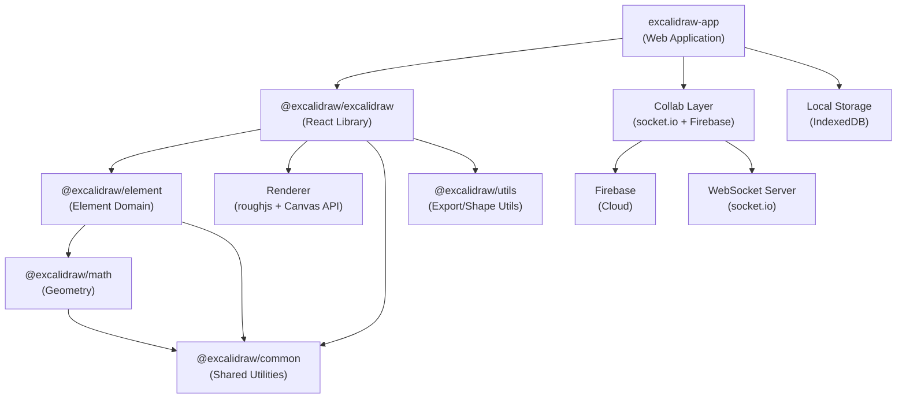
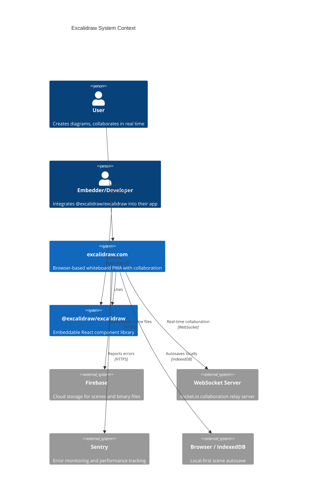

# Excalidraw — Project Overview

## Table of Contents

1. [Project Summary](#1-project-summary)
2. [Tech Stack](#2-tech-stack)
3. [Architecture Overview](#3-architecture-overview)
4. [Directory Structure](#4-directory-structure)
5. [Development Setup](#5-development-setup)
6. [Key Conventions](#6-key-conventions)
7. [System Context Diagram](#7-system-context-diagram)
8. [Component Inventory](#8-component-inventory)
9. [Detailed Specifications](#9-detailed-specifications)

---

## 1. Project Summary

Excalidraw is an open-source virtual whiteboard tool that enables users to create hand-drawn style diagrams, wireframes, and sketches directly in the browser. Its infinite canvas, intuitive shape tools, and hand-drawn aesthetic make it suitable for software architects, designers, educators, and anyone who needs lightweight visual communication. The editor is available both as a standalone web application at excalidraw.com and as a reusable React component library published to npm as `@excalidraw/excalidraw`.

The project is structured as a monorepo separating the embeddable library from the hosted application. The library exposes a rich API for rendering, interacting with, and exporting canvas elements, while the full application adds real-time collaboration (via WebSockets), end-to-end encryption, Firebase cloud storage, and PWA offline support. This separation lets third-party developers embed the editor in their own products while excalidraw.com serves as a first-class reference implementation.

Core value propositions include: zero-install browser experience, local-first autosave with IndexedDB, end-to-end encrypted sharing links, real-time multi-user collaboration, and a clean npm package that can be dropped into any React project in minutes.

---

## 2. Tech Stack

| Category | Technology | Version | Role |
| --- | --- | --- | --- |
| Language | TypeScript | 5.9.3 | Strict static typing throughout all packages |
| Framework | React | 19.0.0 | UI rendering for both the library and the web app |
| State Management | Jotai | 2.11.0 | Atomic state management for editor and app state |
| Build (app) | Vite | 5.0.12 | Dev server and production bundler for `excalidraw-app` |
| Build (packages) | esbuild | 0.19.10 | Fast ESM builds for each library package |
| Package Manager | Yarn workspaces | 1.22.22 | Monorepo dependency management |
| Testing Framework | Vitest | 3.0.6 | Unit and integration tests with jsdom environment |
| Test Utilities | @testing-library/react | 16.2.0 | Component testing helpers |
| Test Environment | jsdom | 22.1.0 | Simulated browser DOM for tests |
| Canvas Rendering | roughjs | 4.6.4 | Hand-drawn style primitive rendering |
| Freehand Drawing | perfect-freehand | 1.2.0 | Pressure-sensitive freehand stroke generation |
| Image Processing | pica | 7.1.1 | High-quality client-side image resizing |
| Compression | pako | 2.0.3 | zlib/gzip compression for scene data |
| Code Editor | CodeMirror 6 | ^6.0.0 | Embedded code editing (DiagramToCode feature) |
| UI Primitives | Radix UI | 1.4.3 | Accessible headless UI components |
| Real-time Collab | socket.io-client | 4.7.2 | WebSocket transport for multi-user collaboration |
| Cloud Storage | Firebase | 11.3.1 | Scene and image file persistence in the cloud |
| Error Monitoring | Sentry | 9.0.1 | Runtime error tracking in production |
| Font Subsetting | harfbuzzjs | 0.3.6 | WASM-based font subsetting for SVG/PDF export |
| Client Storage | IndexedDB (idb-keyval) | 6.0.3 | Local-first browser persistence |
| PWA | vite-plugin-pwa | 0.21.1 | Service worker and offline caching for the app |
| Linting | ESLint | (config-react-app) | Code quality enforcement |
| Formatting | Prettier | 2.6.2 | Consistent code style |

---

## 3. Architecture Overview

The system is layered: foundational math and utility packages feed up through element domain logic into the main editor library, which is consumed by the hosted web application.



---

## 4. Directory Structure

```
/
├── packages/
│   ├── excalidraw/          # @excalidraw/excalidraw — main React editor component (413 files)
│   │   ├── components/      # All React UI components (toolbar, menus, dialogs, canvas)
│   │   ├── renderer/        # Canvas 2D rendering pipeline (static, interactive, SVG)
│   │   ├── scene/           # Scene model: scroll, zoom, viewport, export utilities
│   │   ├── actions/         # Action system (undo/redo, element mutations, tool actions)
│   │   ├── data/            # Serialization, restore, reconcile, encryption, blob handling
│   │   ├── hooks/           # React hooks (useAppStateValue, useExcalidrawAPI, etc.)
│   │   ├── fonts/           # Bundled font files and font metadata
│   │   ├── locales/         # i18n locale JSON files (60+ languages)
│   │   ├── css/             # SCSS stylesheets for the editor
│   │   ├── lasso/           # Lasso/freeform selection tool logic
│   │   ├── eraser/          # Eraser tool logic
│   │   ├── wysiwyg/         # In-canvas text editing (WYSIWYG)
│   │   ├── subset/          # Font subsetting pipeline (WASM)
│   │   ├── workers.ts       # Web Worker setup
│   │   ├── index.tsx        # Public entry point / exported API
│   │   └── types.ts         # Core TypeScript type definitions
│   ├── element/             # @excalidraw/element — element domain logic (73 files)
│   │   └── src/             # Binding, bounds, rendering helpers, linearElement, shapes, etc.
│   ├── math/                # @excalidraw/math — 2D geometry primitives (23 files)
│   │   └── src/             # Points, vectors, curves, polygons, ellipses, segments
│   ├── common/              # @excalidraw/common — shared constants, utils, types (26 files)
│   │   └── src/             # Colors, keys, constants, emitter, event bus, utility types
│   └── utils/               # @excalidraw/utils — export/shape/file utilities (11 files)
│       └── src/             # Export helpers, shape utilities, file format support
├── excalidraw-app/          # Full web application — excalidraw.com (41 files)
│   ├── collab/              # Real-time collaboration: Collab.tsx, Portal.tsx, firebase.ts
│   ├── data/                # App-level data: LocalData, FileManager, TTDStorage, tabSync
│   ├── components/          # App-specific UI components
│   ├── share/               # Shareable link generation and rendering
│   ├── tests/               # App-level integration tests
│   ├── App.tsx              # Root application component
│   ├── app-jotai.ts         # App-level Jotai store and atoms
│   ├── index.tsx            # Application entry point
│   ├── sentry.ts            # Sentry error monitoring initialization
│   └── vite.config.mts      # Vite config with PWA, aliases, chunking strategy
├── examples/                # Integration examples
│   ├── with-nextjs/         # Next.js embedding example
│   └── with-script-in-browser/ # Vanilla browser script embedding example
├── scripts/                 # Build utilities (11 files)
│   ├── buildPackage.js      # esbuild pipeline for @excalidraw/excalidraw
│   ├── buildBase.js         # esbuild pipeline for element/math/common
│   ├── buildUtils.js        # esbuild pipeline for @excalidraw/utils
│   ├── release.js           # npm publish automation
│   ├── woff2/               # WOFF2 font compression scripts
│   └── wasm/                # WASM build helpers
├── .github/workflows/       # 11 CI/CD workflows (test, lint, docker, release, coverage)
├── public/                  # Static assets served by the app
├── vitest.config.mts        # Root Vitest configuration with package path aliases
├── tsconfig.json            # Root TypeScript configuration
├── package.json             # Monorepo root: scripts, workspaces, devDependencies
├── vercel.json              # Vercel deployment configuration
├── Dockerfile               # Docker image definition
└── docker-compose.yml       # Docker Compose for local containerized runs
```

---

## 5. Development Setup

### Prerequisites

- Node.js >= 18.0.0
- Yarn 1.22.22

### Install Dependencies

```bash
yarn install
```

### Run the Web Application (Development)

```bash
yarn start
# Starts excalidraw-app dev server on http://localhost:3000 (default)
```

### Build

```bash
# Build the web application
yarn build

# Build all library packages (common → math → element → excalidraw)
yarn build:packages

# Build individual packages
yarn build:common
yarn build:math
yarn build:element
yarn build:excalidraw

# Docker build
yarn build:app:docker
```

### Test

```bash
# Run all Vitest tests (watch mode)
yarn test

# Run all tests once with snapshot updates (required before committing)
yarn test:update

# TypeScript type checking
yarn test:typecheck

# ESLint code quality checks
yarn test:code

# Prettier format check
yarn test:other

# Full test suite (types + lint + format + tests)
yarn test:all

# Test coverage report
yarn test:coverage
```

### Lint and Format

```bash
# Auto-fix formatting and linting issues
yarn fix

# Fix formatting only
yarn fix:other

# Fix linting only
yarn fix:code
```

### Other Utilities

```bash
# Run the browser script example
yarn start:example

# Clean build artifacts
yarn rm:build

# Clean node_modules
yarn rm:node_modules

# Full clean reinstall
yarn clean-install

# Release to npm
yarn release:latest   # stable
yarn release:next     # pre-release
yarn release:test     # test tag
```

---

## 6. Key Conventions

From `CLAUDE.md` and observed codebase patterns:

### Repository Structure

- **Library work** belongs in `packages/*`. All features of the editor core, rendering, element logic, and shared utilities live here.
- **Application work** belongs in `excalidraw-app/`. App-specific features such as collaboration, Firebase storage, Sentry, and PWA configuration are kept out of the library.
- **Integration examples** live in `examples/` and must remain lightweight demonstrations.

### Development Workflow

1. Run `yarn test:update` before every commit to update test snapshots and verify correctness.
2. Run `yarn test:typecheck` to validate TypeScript — the project uses strict mode throughout.
3. Run `yarn fix` to auto-correct formatting and linting issues before raising a PR.

### Package System

- Yarn workspaces manages the monorepo; packages reference each other as workspace siblings.
- In development (Vite and Vitest), internal `@excalidraw/*` imports resolve to TypeScript source via path aliases defined in `vitest.config.mts` and `excalidraw-app/vite.config.mts`. Published artifacts use compiled ESM output from `dist/`.
- esbuild is used for library packages; Vite is used only for the app.
- All packages are strictly typed; no `any` escapes without explicit justification.

### State Management

- Editor state uses Jotai atoms; the editor store (`editor-jotai.ts`) is scoped independently from the app store (`app-jotai.ts`).
- App state is the source of truth for active elements, tool selection, viewport, and user settings.

### Testing

- Tests are co-located with source files (`.test.ts` / `.test.tsx` siblings).
- Coverage thresholds enforced by Vitest: 60% lines, 70% branches, 63% functions, 60% statements.
- jsdom is the test environment; canvas is mocked via `vitest-canvas-mock`.

### Code Style

- Prettier config from `@excalidraw/prettier-config`.
- ESLint config from `@excalidraw/eslint-config` extended per-package.
- Husky + lint-staged run checks on pre-commit.

---

## 7. System Context Diagram



---

## 8. Component Inventory

| Name | Path | Responsibility | Dependencies | Public Surface Area |
| --- | --- | --- | --- | --- |
| `@excalidraw/excalidraw` | `packages/excalidraw/` | Main React editor component; canvas tools, UI, rendering pipeline, actions, data serialization, i18n | `@excalidraw/element`, `@excalidraw/math`, `@excalidraw/common`, `@excalidraw/utils`, roughjs, perfect-freehand, jotai, pako, pica, radix-ui, CodeMirror 6 | `<Excalidraw>` component, `ExcalidrawAPIProvider`, `useExcalidrawAPI`, `exportToBlob`, `exportToSvg`, `loadFromBlob`, `reconcileElements`, `serializeAsJSON`, TypeScript types |
| `@excalidraw/element` | `packages/element/` | All element domain logic: creation, mutation, binding, bounds, layout, rendering helpers, text wrapping, elbow arrows, fractional indexing | `@excalidraw/common`, `@excalidraw/math` | Element factory functions (`newElement`, `newTextElement`), mutation (`mutateElement`), bounds, binding, shape helpers, type guards, `ExcalidrawElement` types |
| `@excalidraw/math` | `packages/math/` | 2D geometry primitives used by element and rendering logic | `@excalidraw/common` | Point, vector, line, segment, curve, ellipse, polygon, rectangle, triangle operations; typed geometry constructors |
| `@excalidraw/common` | `packages/common/` | Shared constants, utility functions, color helpers, event emitter, key bindings, type utilities | `tinycolor2` | Constants, color utilities, `AppEventBus`, key definitions, `VersionedSnapshotStore`, utility types |
| `@excalidraw/utils` | `packages/utils/` | Standalone export utilities and shape helpers usable without the full editor | roughjs, perfect-freehand, pako, browser-fs-access, `@excalidraw/laser-pointer` | `exportToCanvas`, `exportToBlob`, `exportToSvg`, `exportToClipboard`, shape export helpers |
| `excalidraw-app` | `excalidraw-app/` | Full hosted web application (excalidraw.com): collaboration, Firebase persistence, Sentry, PWA, shareable links | `@excalidraw/excalidraw`, firebase, socket.io-client, jotai, idb-keyval, Sentry | Not published; serves as reference application |
| `Collab` | `excalidraw-app/collab/Collab.tsx` | Real-time collaboration controller: WebSocket session management, element reconciliation, cursor sync, E2E encryption | `@excalidraw/excalidraw`, socket.io-client, Firebase, `@excalidraw/common` | Internal to `excalidraw-app`; integrates via `ExcalidrawImperativeAPI` |
| `Portal` | `excalidraw-app/collab/Portal.tsx` | Low-level socket.io connection and room management | socket.io-client | Internal to Collab |
| `LocalData` | `excalidraw-app/data/LocalData.ts` | IndexedDB-backed local scene and file persistence; autosave scheduler | idb-keyval | Internal to `excalidraw-app` |
| `FileManager` | `excalidraw-app/data/FileManager.ts` | Binary file (image) upload/download coordination between local cache and Firebase | Firebase Storage | Internal to `excalidraw-app` |
| `Renderer` | `packages/excalidraw/renderer/` | Canvas 2D rendering pipeline: static scene, interactive overlay, SVG export, animation | roughjs, Canvas API, `@excalidraw/element` | Consumed internally by the editor; not part of npm exports |
| `Scene` | `packages/element/src/Scene.ts` | In-memory element store: element map, version tracking, scene graph management | `@excalidraw/common` | Used internally by the editor's action and rendering systems |

---

## 9. Detailed Specifications

For in-depth coverage of specific domains, see the companion specification documents:

| Document | Description |
| --- | --- |
| [Architecture](architecture.md) | System architecture, components, data flow, dependency graph, architectural decisions |
| [Data Model](data-model.md) | Entity types, relationships, enums, state machines, data integrity rules |
| [Endpoints](endpoints.md) | WebSocket events, Firebase operations, HTTP endpoints, public npm API surface |
| [Workflows](workflows.md) | CI/CD workflows, build scripts, infrastructure, deployment pipeline |
| [Features](features.md) | Feature catalog, user journeys, state machines, business rules |
| [Testing](testing.md) | Test architecture, patterns, coverage, commands |
