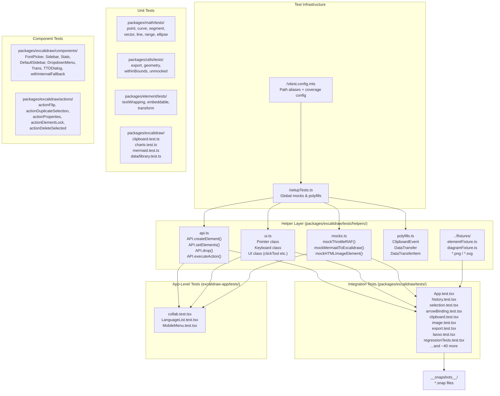

# Testing Specification — Excalidraw

## Table of Contents

1. [Testing Overview](#1-testing-overview)
2. [Test Architecture](#2-test-architecture)
3. [Test Catalog](#3-test-catalog)
4. [Testing Patterns](#4-testing-patterns)
5. [Coverage](#5-coverage)
6. [Test Commands](#6-test-commands)

---

## 1. Testing Overview

### Framework and Runner

Excalidraw uses **Vitest 3.0.6** as the test runner and framework across the entire monorepo. Tests run in a **jsdom** environment that simulates a browser DOM, making it possible to render React components and simulate pointer/keyboard interactions without a real browser.

### Key Libraries

| Library | Version | Role |
|---|---|---|
| vitest | 3.0.6 | Test runner, assertions, mocking |
| @testing-library/react | 16.2.0 | React component rendering and queries |
| @testing-library/jest-dom | 6.6.3 | Extended DOM matchers (`toBeInTheDocument`, etc.) |
| chai | 4.3.6 | Additional assertion library |
| vitest-canvas-mock | 0.3.3 | Mocks HTMLCanvasElement / 2D context for jsdom |
| @vitest/coverage-v8 | 3.0.7 | V8-based code coverage instrumentation |
| fake-indexeddb | (auto) | In-memory IndexedDB for persistence tests |

### Configuration

The root configuration lives at `/vitest.config.mts`. It defines:

- **Path aliases** for all internal packages (`@excalidraw/common`, `@excalidraw/element`, `@excalidraw/math`, `@excalidraw/utils`, `@excalidraw/excalidraw`) so tests import directly from TypeScript source without a build step.
- **Setup file**: `/setupTests.ts` is executed once before each test file.
- **Hook execution**: `sequence.hooks: "parallel"` to run `beforeEach`/`afterEach` hooks in parallel across suites.
- **Globals enabled**: `globals: true` — no need to import `describe`, `it`, `expect` in test files.

### Global Test Setup (`/setupTests.ts`)

Before any test file runs, the following is bootstrapped globally:

- `vitest-canvas-mock` — installs a canvas mock so canvas API calls do not throw.
- `@testing-library/jest-dom` — registers extended matchers on `expect`.
- `throttleRAF` is globally replaced with a synchronous mock (`mockThrottleRAF`) via `vi.mock("@excalidraw/common", ...)`.
- `HTMLElement.prototype.setPointerCapture` is stubbed with `vi.fn()` (pepjs limitation in jsdom).
- `fake-indexeddb/auto` — replaces IndexedDB with an in-memory implementation.
- Browser globals mocked: `window.matchMedia`, `window.FontFace`, `document.fonts`, `window.EXCALIDRAW_ASSET_PATH`.
- `ExcalidrawFontFace.fetchFont` is overridden to read font files from the local filesystem, enabling snapshot tests that include font subsetting without running a server.
- A `<div id="root">` is appended to `document.body` for ReactDOM rendering.
- `console.error` is patched to surface un-wrapped `act()` warnings with the current test name.

### How to Run Tests

```bash
# Run all tests in watch mode (default)
yarn test

# Run all tests once (CI mode)
yarn test:app --watch=false

# Run tests and update snapshots
yarn test:update

# Run with coverage
yarn test:coverage

# Run with interactive UI
yarn test:ui

# Full CI suite (typecheck + lint + formatting + tests)
yarn test:all
```

---

## 2. Test Architecture



---

## 3. Test Catalog

| Test Type | Directory / Pattern | Framework | Approx. Count | Purpose |
|---|---|---|---|---|
| Pure unit — math | `packages/math/tests/` | Vitest | ~7 files, ~60 cases | Geometric primitives: point rotation, curve intersection, segment, vector, range |
| Pure unit — utils | `packages/utils/tests/` | Vitest | ~4 files, ~30 cases | Public API utilities: `exportToCanvas`, `exportToBlob`, geometry helpers |
| Pure unit — element | `packages/element/tests/` | Vitest | ~3 files, ~25 cases | Element transforms, text wrapping, embeddable behavior |
| Pure unit — data/logic | `packages/excalidraw/*.test.ts` (co-located) | Vitest | ~5 files, ~40 cases | Clipboard serialization, chart parsing, mermaid parsing, library data |
| Component unit | `packages/excalidraw/components/**/*.test.tsx` | Vitest + RTL | ~10 files, ~50 cases | Individual React components in isolation: FontPicker, Sidebar, Stats, DropdownMenu, TTDDialog |
| Component unit — actions | `packages/excalidraw/actions/*.test.tsx` | Vitest + RTL | ~5 files, ~40 cases | Action handlers: flip, duplicate, delete, lock, properties |
| Integration — editor | `packages/excalidraw/tests/` | Vitest + RTL | ~53 files, ~500+ cases | Full editor lifecycle: drawing, selection, history, clipboard, images, lasso, regression |
| Integration — app | `excalidraw-app/tests/` | Vitest + RTL | ~3 files, ~20 cases | App-level features: collaboration store increments, language switching, mobile menu |
| Snapshot | `packages/excalidraw/tests/__snapshots__/` | Vitest snapshots | ~15 snap files | Stable rendering output for drag-create, context menus, charts, export, history |
| Scene/export | `packages/excalidraw/tests/scene/export.test.ts` | Vitest | ~1 file, ~10 cases | SVG/PNG export with element fixture data |

**Total approximate test files**: ~100 across the monorepo.

---

## 4. Testing Patterns

### 4.1 Test Structure

All tests follow the **`describe` / `it`** (or `describe` / `test`) hierarchy with Vitest globals enabled. Setup and teardown use `beforeEach` / `afterEach` / `afterAll`.

A standard integration test looks like:

```typescript
// packages/excalidraw/tests/selection.test.tsx
describe("box-selection", () => {
  beforeEach(async () => {
    await render(<Excalidraw />);
  });

  it("should allow adding to selection via box-select when holding shift", async () => {
    // ...
  });
});
```

Reference: `/packages/excalidraw/tests/selection.test.tsx`, `/packages/excalidraw/tests/regressionTests.test.tsx`

---

### 4.2 Element and Scene Setup — `API` Helper

The `API` class in `/packages/excalidraw/tests/helpers/api.ts` is the primary way to create test elements and manipulate scene state without going through the UI:

- `API.createElement({ type, x, y, width, height, ... })` — factory for all element types (rectangle, ellipse, text, arrow, image, frame, etc.)
- `API.setElements(elements)` — replace the entire element array, wrapped in `act()`
- `API.setAppState(partial)` — partially update app state
- `API.updateScene({ elements, appState })` — full scene replacement
- `API.clearSelection()` — deselects all elements and asserts 0 selected
- `API.getSelectedElements()` — read the currently selected elements
- `API.executeAction(action)` — programmatically trigger an action via `actionManager`
- `API.drop(items)` — simulate file/text drag-and-drop onto the interactive canvas
- `API.loadFile(filepath)` — read a binary fixture file from disk as a `File` object

Elements are accessed through `window.h` (the internal test hook exposed by `createTestHook()` in `App.tsx`):

```typescript
const { h } = window;
h.elements  // current scene elements
h.state     // current AppState
h.history   // undo/redo history
h.store     // store snapshot
```

Reference: `/packages/excalidraw/tests/helpers/api.ts`

---

### 4.3 Pointer and Keyboard Simulation — `Pointer`, `Keyboard`, `UI`

All user-interaction simulation is done via helpers in `/packages/excalidraw/tests/helpers/ui.ts`:

**`Pointer` class** — wraps `fireEvent.pointer*` calls on the interactive canvas:

```typescript
const mouse = new Pointer("mouse");
mouse.down(10, 10);   // pointerdown at (10, 10)
mouse.move(50, 0);    // pointerMove delta
mouse.up();           // pointerup
// touch pointers also supported:
const finger1 = new Pointer("touch", 1);
```

**`Keyboard` class** — fires keyboard events on `document`:

```typescript
Keyboard.keyPress(KEYS.ESCAPE);
Keyboard.withModifierKeys({ ctrl: true }, () => Keyboard.keyPress("z")); // undo
Keyboard.undo();
Keyboard.redo();
```

**`UI` class** — higher-level interactions:

```typescript
UI.clickTool("rectangle");          // click toolbar button by tool name
UI.clickLabeledElement("Stroke");   // click by aria-label
UI.clickOnTestId("myTestId");       // click by data-testid
UI.createElement("arrow", { x: 0, y: 0, width: 100, height: 100 });
```

Reference: `/packages/excalidraw/tests/helpers/ui.ts`, `/packages/excalidraw/tests/regressionTests.test.tsx`, `/packages/excalidraw/tests/arrowBinding.test.tsx`

---

### 4.4 Component Rendering

The custom `render` function from `/packages/excalidraw/tests/test-utils.ts` wraps `@testing-library/react`'s `render` with:

- Extended query set (standard queries + `getByToolName` toolbar-specific query from `toolQueries`)
- Automatic `Pointer.resetAll()` between renders
- Awaits canvas initialization (`canvas.static` and `canvas.interactive` both present, `isLoading === false`) before resolving

```typescript
import { render, waitFor, screen, fireEvent, act } from "./test-utils";

await render(<Excalidraw />);
// or
await render(<ExcalidrawApp />);
```

For unmounting/cleanup between tests, `unmountComponent` (alias for RTL's `cleanup`) is called in `beforeEach`:

```typescript
import { unmountComponent } from "./test-utils";
beforeEach(async () => {
  unmountComponent();
  localStorage.clear();
  ...
});
```

Reference: `/packages/excalidraw/tests/test-utils.ts`

---

### 4.5 Mocking and Stubbing

**Module-level mocks** use `vi.mock()` at the top of test files or inside helper functions:

```typescript
// Stub out external modules
vi.mock("socket.io-client", () => ({
  default: () => ({ close: vi.fn(), on: vi.fn(), emit: vi.fn() }),
}));
vi.mock("../../excalidraw-app/data/firebase.ts", () => ({
  loadFromFirebase: async () => null,
  saveToFirebase: () => {},
  // ...
}));
```

Reference: `/excalidraw-app/tests/collab.test.tsx`

**Spy-based mocks** intercept specific exports:

```typescript
const renderStaticScene = vi.spyOn(StaticScene, "renderStaticScene");
renderStaticScene.mockClear();        // reset call count between tests
renderStaticScene.mock.calls.length   // assert render count
```

Reference: `/packages/excalidraw/tests/App.test.tsx`, `/packages/excalidraw/tests/regressionTests.test.tsx`, `/packages/excalidraw/tests/selection.test.tsx`

**Global stubs** replace browser globals using `vi.stubGlobal()`:

```typescript
// mocks.ts
vi.stubGlobal("Image", class extends Image {
  constructor() {
    super();
    Object.defineProperty(this, "naturalWidth", { value: naturalWidth });
    // ...
    queueMicrotask(() => this.onload?.({} as Event));
  }
});
// cleanup after test:
vi.unstubAllGlobals();
```

Reference: `/packages/excalidraw/tests/helpers/mocks.ts`, `/packages/excalidraw/tests/image.test.tsx`

**`throttleRAF` is always mocked** globally via `setupTests.ts`:

```typescript
vi.mock("@excalidraw/common", async (importOriginal) => {
  const module = await importOriginal<typeof import("@excalidraw/common")>();
  return { ...module, throttleRAF: mockThrottleRAF };
});
```

`mockThrottleRAF` is a synchronous pass-through so RAF-throttled updates happen immediately in tests.

Reference: `/setupTests.ts`, `/packages/excalidraw/tests/helpers/mocks.ts`

**CodeMirror** dynamic imports are mocked to empty objects to force `TTDDialogInput` to fall back to a plain `<textarea>`:

```typescript
vi.mock("@codemirror/view", () => ({}));
vi.mock("@codemirror/state", () => ({}));
```

Reference: `/packages/excalidraw/tests/MermaidToExcalidraw.test.tsx`

---

### 4.6 Test Data — Fixtures

Static fixture data lives in `/packages/excalidraw/tests/fixtures/`:

- `elementFixture.ts` — pre-built `ExcalidrawElement` objects (`rectangleFixture`, `ellipseFixture`, `diamondFixture`, `textFixture`, `rectangleWithLinkFixture`, etc.) derived from a shared `elementBase`
- `diagramFixture.ts` — factory `diagramFactory({ elementOverrides })` for generating diagram state objects used in export tests
- `constants.ts` — image dimension constants (`DEER_IMAGE_DIMENSIONS`, `SMILEY_IMAGE_DIMENSIONS`)
- `*.png`, `*.svg` — real binary assets loaded via `API.loadFile("./fixtures/smiley.png")` to test image import/export pipelines

Reference: `/packages/excalidraw/tests/fixtures/elementFixture.ts`, `/packages/excalidraw/tests/fixtures/diagramFixture.ts`

---

### 4.7 Snapshot Testing

Snapshot tests capture stable outputs and fail on unexpected regressions. Two strategies are used:

**Named inline snapshots** (appState, element count, render count):

```typescript
const checkpoint = (name: string) => {
  expect(renderStaticScene.mock.calls.length).toMatchSnapshot(`[${name}] number of renders`);
  expect(h.state).toMatchSnapshot(`[${name}] appState`);
  expect(h.elements.length).toMatchSnapshot(`[${name}] number of elements`);
};
afterEach(() => {
  checkpoint("end of test");
});
```

**DOM / SVG snapshots**:

```typescript
expect(document.querySelector(".excalidraw-modal-container")).toMatchSnapshot();
```

Snapshots are stored in `__snapshots__/` directories co-located with the test files and updated via `yarn test:update`.

Reference: `/packages/excalidraw/tests/regressionTests.test.tsx`, `/packages/excalidraw/tests/App.test.tsx`

---

### 4.8 Async Testing

Tests involving React state updates must use `act()` from `@testing-library/react`. The `render` helper and all `API` methods already wrap mutations in `act()`. For async assertions, tests use `waitFor`:

```typescript
await waitFor(() => {
  expect(h.elements).toEqual([
    expect.objectContaining({ type: "image", status: "saved" }),
  ]);
});
```

The global `console.error` patch in `setupTests.ts` surfaces un-wrapped `act()` warnings with the test name to ease debugging.

Reference: `/packages/excalidraw/tests/image.test.tsx`, `/setupTests.ts`

---

### 4.9 Polyfills in Tests

jsdom lacks several browser APIs needed by the codebase. `/packages/excalidraw/tests/helpers/polyfills.ts` provides test-only implementations registered via `Object.assign(globalThis, testPolyfills)` in `setupTests.ts`:

- `ClipboardEvent` — custom implementation with `clipboardData` support
- `DataTransfer` / `DataTransferItem` / `DataTransferItemList` — full implementation for clipboard and drag-and-drop
- `URL` — uses Node's built-in `URL` to patch a vitest v2 regression

Additional per-test polyfills are added inline, e.g. `TextDecoder.decode` in `/packages/excalidraw/tests/export.test.tsx`.

Reference: `/packages/excalidraw/tests/helpers/polyfills.ts`, `/packages/excalidraw/tests/export.test.tsx`

---

### 4.10 Database Handling

There is no real database. Persistence via **IndexedDB** is provided by `fake-indexeddb/auto`, loaded unconditionally in `setupTests.ts`:

```typescript
require("fake-indexeddb/auto");
```

This replaces the global `indexedDB`, `IDBKeyRange`, etc. with an in-memory implementation that resets between test processes. Each test that calls `localStorage.clear()` in `beforeEach` ensures clean local storage state.

Reference: `/setupTests.ts`

---

### 4.11 Authentication in Tests

Excalidraw is an open collaboration tool without traditional user authentication. The collaboration-related test in `/excalidraw-app/tests/collab.test.tsx` mocks the Firebase persistence layer and the socket.io connection:

```typescript
vi.mock("../../excalidraw-app/data/firebase.ts", () => ({
  loadFromFirebase: async () => null,
  isSavedToFirebase: () => true,
  saveFilesToFirebase: async () => ({ savedFiles: new Map(), erroredFiles: new Map() }),
}));
vi.mock("socket.io-client", () => ({
  default: () => ({ close: vi.fn(), on: vi.fn(), once: vi.fn(), off: vi.fn(), emit: vi.fn() }),
}));
```

The `window.crypto` object is also stubbed to produce deterministic keys.

Reference: `/excalidraw-app/tests/collab.test.tsx`

---

## 5. Coverage

### Configuration

Coverage is configured inside `/vitest.config.mts` under `test.coverage`:

```typescript
coverage: {
  reporter: ["text", "json-summary", "json", "html", "lcovonly"],
  ignoreEmptyLines: false,  // counts empty lines toward coverage (v2 compatibility)
  thresholds: {
    lines:      60,
    branches:   70,
    functions:  63,
    statements: 60,
  },
},
```

### Coverage Provider

**@vitest/coverage-v8** (version 3.0.7) uses V8's built-in code coverage, which is faster than Istanbul and requires no instrumentation step.

### Report Formats

| Format | File Location | Use Case |
|---|---|---|
| `text` | stdout (terminal table) | Quick CI feedback |
| `json-summary` | `coverage/coverage-summary.json` | Badge / threshold automation |
| `json` | `coverage/coverage-final.json` | Tooling integration |
| `html` | `coverage/index.html` | Human browsing |
| `lcovonly` | `coverage/lcov.info` | Codecov / external services |

### Thresholds

| Metric | Threshold |
|---|---|
| Lines | 60% |
| Branches | 70% |
| Functions | 63% |
| Statements | 60% |

If any threshold is not met, `vitest --coverage` exits with a non-zero code, failing CI.

### Generating Reports

```bash
# One-shot coverage report
yarn test:coverage

# Coverage in watch mode
yarn test:coverage:watch

# Coverage with interactive UI
yarn test:ui
```

---

## 6. Test Commands

| Command | Description |
|---|---|
| `yarn test` | Run Vitest in interactive watch mode (default) |
| `yarn test:app` | Alias for `vitest` — run all tests in watch mode |
| `yarn test:app --watch=false` | Run all tests once and exit (CI mode) |
| `yarn test:update` | Run all tests once and update failing snapshots |
| `yarn test:coverage` | Run all tests and generate V8 coverage report |
| `yarn test:coverage:watch` | Run tests with coverage in watch mode |
| `yarn test:ui` | Launch Vitest's browser-based interactive UI with coverage |
| `yarn test:typecheck` | Run TypeScript type checking across the monorepo (`tsc`) |
| `yarn test:code` | Run ESLint with zero-warning tolerance across all `.js/.ts/.tsx` files |
| `yarn test:other` | Run Prettier in check mode (list-different) |
| `yarn test:all` | Full CI suite: typecheck + lint + formatting + tests (no watch) |
| `yarn fix` | Auto-fix ESLint issues (`fix:code`) + reformat files (`fix:other`) |
| `yarn fix:code` | Auto-fix ESLint issues only |
| `yarn fix:other` | Run Prettier `--write` to reformat all files |
