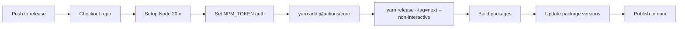
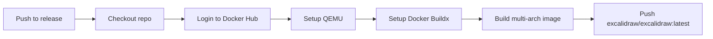
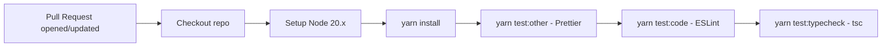
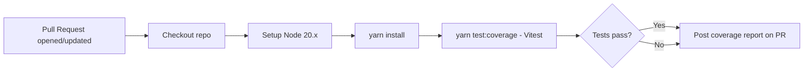
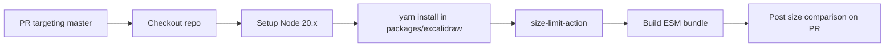
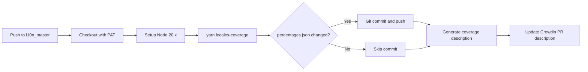
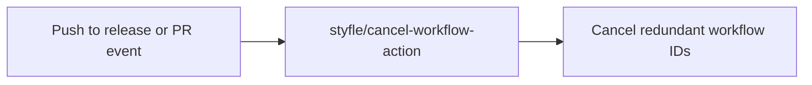
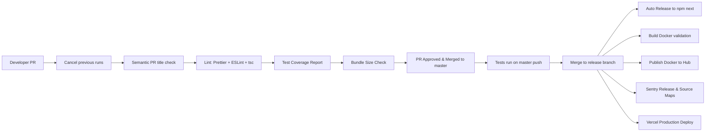
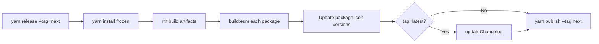

# Excalidraw Workflows & Automation Specification

## Table of Contents

1. [Automation Overview](#1-automation-overview)
2. [Workflow Catalog](#2-workflow-catalog)
   - 2.1 [Auto Release Excalidraw Next](#21-auto-release-excalidraw-next)
   - 2.2 [Build Docker Image](#22-build-docker-image)
   - 2.3 [Cancel Previous Runs](#23-cancel-previous-runs)
   - 2.4 [Lint](#24-lint)
   - 2.5 [Tests](#25-tests)
   - 2.6 [Test Coverage PR](#26-test-coverage-pr)
   - 2.7 [Bundle Size Check](#27-bundle-size-check)
   - 2.8 [New Sentry Production Release](#28-new-sentry-production-release)
   - 2.9 [Semantic PR Title](#29-semantic-pr-title)
   - 2.10 [Publish Docker](#210-publish-docker)
   - 2.11 [Build Locales Coverage](#211-build-locales-coverage)
3. [Workflow Diagrams](#3-workflow-diagrams)
4. [Scripts & Commands](#4-scripts--commands)
   - 4.1 [Root package.json Scripts](#41-root-packagejson-scripts)
   - 4.2 [excalidraw-app package.json Scripts](#42-excalidraw-app-packagejson-scripts)
   - 4.3 [Utility Scripts (scripts/)](#43-utility-scripts-scripts)
5. [Infrastructure](#5-infrastructure)
6. [Deployment Pipeline](#6-deployment-pipeline)
7. [Environment Configuration](#7-environment-configuration)

---

## 1. Automation Overview

**CI/CD Platform:** GitHub Actions (all workflows are defined under `.github/workflows/`)

**Deployment Strategy:**

- The primary production web application (excalidraw.com) is deployed via **Vercel**, driven by pushes to the `release` branch. Vercel is configured via `vercel.json`.
- The **Docker image** (`excalidraw/excalidraw:latest`) is built and published to Docker Hub on every push to the `release` branch via a dedicated publish workflow.
- The **npm packages** (`@excalidraw/common`, `@excalidraw/math`, `@excalidraw/element`, `@excalidraw/excalidraw`) are released to the npm registry via the `autorelease-excalidraw.yml` workflow, which runs the `yarn release --tag=next` script on pushes to `release`.
- **Sentry** source map upload and release creation are handled on every `release` branch push.

**Infrastructure Tools:**

- **GitHub Actions** — CI/CD orchestration
- **Vercel** — Frontend hosting and CDN for the production web application
- **Docker / Docker Hub** — Container image build and registry for self-hosted deployments
- **Sentry** — Error tracking and source map management for production
- **Crowdin** — Translation management; coverage is tracked via the `l10n_master` branch
- **Yarn Workspaces** — Monorepo dependency management
- **esbuild** — Package bundling (`packages/*`)
- **Vite** — Application build tool (`excalidraw-app/`)
- **Vitest** — Test runner
- **Husky** — Git hook management (pre-commit lint-staged)
- **size-limit** — Bundle size enforcement on PRs

---

## 2. Workflow Catalog

### 2.1 Auto Release Excalidraw Next

| Field | Value |
| --- | --- |
| **Source File** | `.github/workflows/autorelease-excalidraw.yml` |
| **Trigger** | `push` to branch `release` |
| **Purpose** | Automatically publishes all `@excalidraw/*` packages to npm under the `next` dist-tag whenever code lands on the `release` branch. |
| **Runs On** | `ubuntu-latest` |

**Steps Summary:**

1. Checkout repository (depth 2 to allow changelog diffing).
2. Set up Node.js 20.x.
3. Configure npm authentication by writing `NPM_TOKEN` to the npm registry config.
4. Install `@actions/core` workspace dependency.
5. Execute `yarn release --tag=next --non-interactive`, which builds all packages, updates package versions with the commit hash, and publishes to npm.

**Key Secrets:**

- `NPM_TOKEN` — npm publish authentication token.

---

### 2.2 Build Docker Image

| Field | Value |
| --- | --- |
| **Source File** | `.github/workflows/build-docker.yml` |
| **Trigger** | `push` to branch `release` |
| **Purpose** | Validates that the Docker image builds successfully from the `Dockerfile`. Does **not** push the image; use the `publish-docker.yml` workflow for publishing. |
| **Runs On** | `ubuntu-latest` |

**Steps Summary:**

1. Checkout repository.
2. Run `docker build -t excalidraw .` to build the image using the root `Dockerfile`.

**Key Secrets:** None.

---

### 2.3 Cancel Previous Runs

| Field | Value |
| --- | --- |
| **Source File** | `.github/workflows/cancel.yml` |
| **Trigger** | `push` to branch `release`; all `pull_request` events |
| **Purpose** | Cancels any redundant in-progress workflow runs for the same branch/PR to conserve GitHub Actions minutes and keep the queue clean. |
| **Runs On** | `ubuntu-latest` |

**Steps Summary:**

1. Use `styfle/cancel-workflow-action@ce177499` to cancel runs for workflow IDs: `400555`, `400556`, `905313`, `1451724`, `1710116`, `3185001`, `3438604` (corresponds to: autorelease, build-docker, sentry, test, lint, size-limit, test-coverage-pr).

**Key Secrets:**

- `GITHUB_TOKEN` — Standard GitHub Actions token for cancelling runs.

---

### 2.4 Lint

| Field | Value |
| --- | --- |
| **Source File** | `.github/workflows/lint.yml` |
| **Trigger** | All `pull_request` events |
| **Purpose** | Enforces code style, formatting, and TypeScript correctness on every PR. Blocks merge if lint or type errors are found. |
| **Runs On** | `ubuntu-latest` |

**Steps Summary:**

1. Checkout repository.
2. Set up Node.js 20.x.
3. Run `yarn install`.
4. Run `yarn test:other` — Prettier formatting check on CSS, SCSS, JSON, Markdown, HTML, YAML files.
5. Run `yarn test:code` — ESLint with `--max-warnings=0` across all `.js`, `.ts`, `.tsx` files.
6. Run `yarn test:typecheck` — TypeScript type checking via `tsc`.

**Key Secrets:** None.

---

### 2.5 Tests

| Field | Value |
| --- | --- |
| **Source File** | `.github/workflows/test.yml` |
| **Trigger** | `push` to branch `master` |
| **Purpose** | Runs the full Vitest test suite against the application on every push to `master` to gate the main branch. |
| **Runs On** | `ubuntu-latest` |

**Steps Summary:**

1. Checkout repository.
2. Set up Node.js 20.x.
3. Run `yarn install`.
4. Run `yarn test:app` — executes all Vitest tests.

**Key Secrets:** None.

---

### 2.6 Test Coverage PR

| Field | Value |
| --- | --- |
| **Source File** | `.github/workflows/test-coverage-pr.yml` |
| **Trigger** | All `pull_request` events |
| **Purpose** | Generates a Vitest code coverage report and posts it as a comment on the PR, giving reviewers visibility into coverage changes introduced by the PR. |
| **Runs On** | `ubuntu-latest` |
| **Permissions** | `contents: read`, `pull-requests: write` |

**Steps Summary:**

1. Checkout repository.
2. Set up Node.js 20.x.
3. Run `yarn install`.
4. Run `yarn test:coverage` — Vitest with coverage instrumentation.
5. Use `davelosert/vitest-coverage-report-action@2500daf` to post the coverage report as a PR comment (runs even if tests fail via `if: always()`).

**Key Secrets:**

- `GITHUB_TOKEN` — Required to write PR comments.

---

### 2.7 Bundle Size Check

| Field | Value |
| --- | --- |
| **Source File** | `.github/workflows/size-limit.yml` |
| **Trigger** | `pull_request` targeting branch `master` |
| **Purpose** | Measures the ESM bundle size of `@excalidraw/excalidraw` and posts a size comparison comment on the PR, ensuring no unexpected size regressions are introduced. |
| **Runs On** | `ubuntu-latest` |

**Steps Summary:**

1. Checkout repository.
2. Set up Node.js 20.x.
3. Run `yarn` inside `packages/excalidraw` only (scoped install).
4. Use `andresz1/size-limit-action@e7493a72` with `build_script: build:esm` to measure and report bundle size.

**Key Secrets:**

- `GITHUB_TOKEN` — Required to post the PR size comment.

---

### 2.8 New Sentry Production Release

| Field | Value |
| --- | --- |
| **Source File** | `.github/workflows/sentry-production.yml` |
| **Trigger** | `push` to branch `release` |
| **Purpose** | Creates a new Sentry release, associates commits, uploads JavaScript source maps from the production build, and marks the release as deployed to the `production` environment. |
| **Runs On** | `ubuntu-latest` |

**Steps Summary:**

1. Checkout repository.
2. Set up Node.js 20.x.
3. Run `yarn --frozen-lockfile && yarn build:app` to produce the production build artifacts.
4. Install the Sentry CLI via the official install script.
5. Run `sentry-cli releases propose-version` to compute the release version.
6. Create the release: `sentry-cli releases new $SENTRY_RELEASE --project $SENTRY_PROJECT`.
7. Associate commits: `sentry-cli releases set-commits --auto`.
8. Upload source maps from `./build/static/js/` with URL prefix `~/static/js`.
9. Finalize the release and mark it as deployed to `production`.

**Key Secrets:**

- `SENTRY_AUTH_TOKEN` — Authentication token for Sentry CLI.
- `SENTRY_ORG` — Sentry organization slug.
- `SENTRY_PROJECT` — Sentry project slug.

---

### 2.9 Semantic PR Title

| Field | Value |
| --- | --- |
| **Source File** | `.github/workflows/semantic-pr-title.yml` |
| **Trigger** | `pull_request` events: `opened`, `edited`, `synchronize` |
| **Purpose** | Enforces that PR titles follow the Conventional Commits / semantic format (e.g., `feat:`, `fix:`, `chore:`). Blocks merge on non-conforming titles. |
| **Runs On** | `ubuntu-latest` |

**Steps Summary:**

1. Use `amannn/action-semantic-pull-request@e32d7e60` to validate the PR title against semantic commit conventions.

**Key Secrets:**

- `GITHUB_TOKEN` — Required for PR API access.

---

### 2.10 Publish Docker

| Field | Value |
| --- | --- |
| **Source File** | `.github/workflows/publish-docker.yml` |
| **Trigger** | `push` to branch `release` |
| **Purpose** | Builds and publishes the official `excalidraw/excalidraw:latest` Docker image to Docker Hub for all supported architectures (amd64, arm64, arm/v7). |
| **Runs On** | `ubuntu-latest` |

**Steps Summary:**

1. Checkout repository.
2. Log in to Docker Hub using `docker/login-action@465a0781`.
3. Set up QEMU with `docker/setup-qemu-action@c7c53464` for cross-platform builds.
4. Set up Docker Buildx with `docker/setup-buildx-action@8d2750c6`.
5. Build and push with `docker/build-push-action@ca052bb5`:
   - Context: repository root.
   - Tag: `excalidraw/excalidraw:latest`.
   - Platforms: `linux/amd64`, `linux/arm64`, `linux/arm/v7`.

**Key Secrets:**

- `DOCKER_USERNAME` — Docker Hub account username.
- `DOCKER_PASSWORD` — Docker Hub account password or access token.

---

### 2.11 Build Locales Coverage

| Field | Value |
| --- | --- |
| **Source File** | `.github/workflows/locales-coverage.yml` |
| **Trigger** | `push` to branch `l10n_master` (Crowdin integration branch) |
| **Purpose** | Recalculates translation coverage percentages for all supported locales and auto-commits the updated `percentages.json` file. Also updates the "Update translations from Crowdin" PR description with a formatted coverage table. |
| **Runs On** | `ubuntu-latest` |

**Steps Summary:**

1. Checkout repository using `PUSH_TRANSLATIONS_COVERAGE_PAT` for write access.
2. Set up Node.js 20.x.
3. Run `yarn locales-coverage` to execute `scripts/build-locales-coverage.js`, writing updated `packages/excalidraw/locales/percentages.json`.
4. If `percentages.json` changed, configure the bot identity (`Excalidraw Bot`) and commit/push the update.
5. Run `npm run locales-coverage:description` to generate a markdown coverage table.
6. Use `kt3k/update-pr-description@1b35a6dc` to update the Crowdin PR description with the table.

**Key Secrets:**

- `PUSH_TRANSLATIONS_COVERAGE_PAT` — Personal Access Token with repo write access (for push and PR description update).

---

## 3. Workflow Diagrams

### Auto Release Excalidraw Next



### Build & Publish Docker



### Sentry Production Release

```mermaid
graph LR
    A[Push to release] --> B[Checkout repo]
    B --> C[Setup Node 20.x]
    C --> D[yarn install frozen]
    D --> E[yarn build:app]
    E --> F[Install Sentry CLI]
    F --> G[Propose version]
    G --> H[Create Sentry release]
    H --> I[Set commits auto]
    I --> J[Upload source maps]
    J --> K[Finalize & deploy to production]
```



### Lint Workflow (Pull Request)



### Test Coverage PR



### Bundle Size Check



### Build Locales Coverage



### Cancel Previous Runs



---

## 4. Scripts & Commands

### 4.1 Root package.json Scripts

| Script | Command | Purpose |
| --- | --- | --- |
| `start` | `yarn --cwd ./excalidraw-app start` | Start the Vite dev server for the web app |
| `start:production` | `yarn --cwd ./excalidraw-app start:production` | Build and serve the app locally in production mode |
| `start:example` | `yarn build:packages && yarn --cwd ./examples/with-script-in-browser start` | Build packages then start the browser script example |
| `build` | `yarn --cwd ./excalidraw-app build` | Build the production web app (app + version stamp) |
| `build:app` | `yarn --cwd ./excalidraw-app build:app` | Build only the Vite app bundle |
| `build:app:docker` | `yarn --cwd ./excalidraw-app build:app:docker` | Build Vite app bundle with Sentry disabled (for Docker) |
| `build:common` | `yarn --cwd ./packages/common build:esm` | Build `@excalidraw/common` ESM package |
| `build:element` | `yarn --cwd ./packages/element build:esm` | Build `@excalidraw/element` ESM package |
| `build:excalidraw` | `yarn --cwd ./packages/excalidraw build:esm` | Build `@excalidraw/excalidraw` ESM package |
| `build:math` | `yarn --cwd ./packages/math build:esm` | Build `@excalidraw/math` ESM package |
| `build:packages` | Chains common, math, element, excalidraw builds | Build all `@excalidraw/*` packages in dependency order |
| `build:version` | `yarn --cwd ./excalidraw-app build:version` | Stamp `build/version.json` and `index.html` with git commit hash and date |
| `build:preview` | `yarn --cwd ./excalidraw-app build:preview` | Build and preview locally via Vite preview server |
| `build-node` | `node ./scripts/build-node.js` | Build a Node.js-targeted bundle for server-side rendering |
| `test` | `yarn test:app` | Alias for running Vitest |
| `test:app` | `vitest` | Run all Vitest tests (watch mode in dev) |
| `test:all` | Chains typecheck, code, other, app | Run the full test suite (non-watch) |
| `test:code` | `eslint --max-warnings=0 --ext .js,.ts,.tsx .` | ESLint check across all JS/TS files |
| `test:other` | `yarn prettier --list-different` | Prettier format check |
| `test:typecheck` | `tsc` | Full TypeScript type check |
| `test:update` | `yarn test:app --update --watch=false` | Run tests and update Vitest snapshots |
| `test:coverage` | `vitest --coverage` | Run tests with coverage report |
| `test:coverage:watch` | `vitest --coverage --watch` | Run tests with coverage in watch mode |
| `test:ui` | `yarn test --ui --coverage.enabled=true` | Open Vitest UI browser interface |
| `fix` | `yarn fix:other && yarn fix:code` | Auto-fix all formatting and linting issues |
| `fix:code` | `yarn test:code --fix` | Auto-fix ESLint issues |
| `fix:other` | `yarn prettier --write` | Auto-format with Prettier |
| `locales-coverage` | `node scripts/build-locales-coverage.js` | Recalculate and write locale translation percentages |
| `locales-coverage:description` | `node scripts/locales-coverage-description.js` | Print a markdown table of locale coverage to stdout |
| `release` | `node scripts/release.js` | Interactive release: build, version, and optionally publish packages |
| `release:test` | `node scripts/release.js --tag=test` | Publish packages under the `test` dist-tag |
| `release:next` | `node scripts/release.js --tag=next` | Publish packages under the `next` dist-tag |
| `release:latest` | `node scripts/release.js --tag=latest` | Stable release: build, update changelog, publish under `latest` |
| `rm:build` | `rimraf --glob ...` | Delete all build and dist output directories across the monorepo |
| `rm:node_modules` | `rimraf --glob ...` | Delete all `node_modules` directories across the monorepo |
| `clean-install` | `yarn rm:node_modules && yarn install` | Full clean reinstall of all dependencies |
| `prepare` | `husky install` | Install Husky git hooks (runs automatically on `yarn install`) |

### 4.2 excalidraw-app package.json Scripts

| Script | Command | Purpose |
| --- | --- | --- |
| `build:app` | `cross-env VITE_APP_GIT_SHA=... vite build` | Production Vite build with git SHA and tracking enabled |
| `build:app:docker` | `cross-env VITE_APP_DISABLE_SENTRY=true vite build` | Production build with Sentry integration disabled (for Docker images) |
| `build:version` | `node ../scripts/build-version.js` | Writes `version.json` and patches `index.html` with the build version |
| `build` | `yarn build:app && yarn build:version` | Full production app build with version stamping |
| `start` | `yarn && vite` | Install deps and start Vite dev server |
| `start:production` | `yarn build && yarn serve` | Build and serve locally (port 5001) |
| `serve` | `npx http-server build -a localhost -p 5001 -o` | Serve the static build directory |
| `build:preview` | `yarn build && vite preview --port 5000` | Build and open Vite's preview server on port 5000 |
| `build-node` | `node ./scripts/build-node.js` | Build Node.js-targeted bundle using webpack rewire |

### 4.3 Utility Scripts (scripts/)

#### `scripts/release.js`

The main release orchestration script. Handles all release scenarios:

- Parses CLI flags: `--tag=<test|next|latest>`, `--version=<semver>`, `--non-interactive`.
- In non-interactive mode (used by CI): runs install, builds all packages, updates `package.json` versions across all `@excalidraw/*` packages (using commit hash suffix for `next`/`test`, explicit version for `latest`), then publishes.
- In interactive mode: prompts to commit version bump (for `latest` releases) and to publish.
- For `latest` releases only: calls `updateChangelog` before publishing.
- Packages released in order: `common`, `math`, `element`, `excalidraw`.

#### `scripts/updateChangelog.js`

- Finds the git commit hash of the last release by searching for commits matching `"release @excalidraw/excalidraw"`.
- Collects all commits since that hash matching conventional types: `feat`, `fix`, `style`, `refactor`, `perf`, `build`.
- Converts PR references to markdown hyperlinks.
- Prepends a new version section to `packages/excalidraw/CHANGELOG.md`.

#### `scripts/buildPackage.js`

- esbuild configuration for `@excalidraw/excalidraw` package.
- Produces two ESM builds: `dist/dev/` (with source maps, unminified) and `dist/prod/` (minified, no source maps).
- Externals: `@excalidraw/common`, `@excalidraw/element`, `@excalidraw/math`.
- Handles SCSS via `esbuild-sass-plugin` with a custom `precompile` function that resolves relative `@use`/`@forward` paths to absolute `file://` URLs for the Sass compiler.
- Supports splitting (code-splitting for chunk files matching `**/*.chunk.ts`).

#### `scripts/buildBase.js`

- esbuild configuration for base packages (e.g., `@excalidraw/common`).
- All dependencies bundled inside (no `packages: "external"`).
- Entry point: `src/index.ts`; output format: ESM.
- Two builds: dev (source maps) and prod (minified).

#### `scripts/buildUtils.js`

- esbuild configuration for utility packages (e.g., `@excalidraw/utils`).
- Bundles all internal package dependencies using path aliasing.
- Includes `esbuild-sass-plugin` and a custom `woff2ServerPlugin` for font asset handling.
- Two builds: dev and prod.

#### `scripts/buildWasm.js`

- Converts WebAssembly modules from `node_modules` into TypeScript source files with base64-encoded binaries.
- Processes two WASM modules:
  - `fonteditor-core` → `woff2.wasm` → `packages/excalidraw/fonts/wasm/woff2-wasm.ts`
  - `harfbuzzjs` → `hb-subset.wasm` → `packages/excalidraw/fonts/wasm/hb-subset-wasm.ts`
- Includes license metadata from each package in the generated file header.

#### `scripts/build-version.js`

- Reads `git rev-parse --short HEAD` for the commit hash.
- Reads `git show -s --format=%ct <hash>` for the commit timestamp.
- Writes `build/version.json` with the full version string (`<ISO-date>-<hash>`).
- Patches `build/index.html`, replacing all `{version}` template placeholders with the version string.

#### `scripts/build-node.js`

- Rewires the CRA webpack config to produce a Node.js-targeted bundle.
- Disables code splitting, sets a deterministic output filename `static/js/build-node.js`.
- Entry point: `packages/excalidraw/index-node`.
- Required for server-side rendering or CLI usage of the Excalidraw component (requires `canvas` native module).

#### `scripts/buildDocs.js`

- Inspects the diff between the previous commit and `HEAD` (`git diff --name-only HEAD^ HEAD`).
- Exits with code 0 (skip docs build) if no files under `docs/` were changed.
- Exits with code 1 (trigger docs build) if doc files were modified.

#### `scripts/build-locales-coverage.js`

- Reads all locale JSON files from `packages/excalidraw/locales/`.
- Flattens each locale's nested key structure and counts translated (non-empty) keys.
- Computes a percentage per locale and writes the results to `packages/excalidraw/locales/percentages.json`.

#### `scripts/locales-coverage-description.js`

- Reads `packages/excalidraw/locales/percentages.json`.
- Prints a formatted markdown table (stdout) with flag, language name, Crowdin link, and coverage percentage.
- Languages at or above 85% threshold are bolded.

---

## 5. Infrastructure

### Dockerfile

**Location:** `/Dockerfile`

The Dockerfile uses a **multi-stage build**:

| Stage | Base Image | Purpose |
| --- | --- | --- |
| `build` | `node:18` (pinned to `--platform=${BUILDPLATFORM}`) | Install dependencies and build the Vite app |
| Final | `nginx:1.27-alpine` (pinned to `--platform=${TARGETPLATFORM}`) | Serve the static build with Nginx |

**Build Stage Details:**

- Working directory: `/opt/node_app`
- Mounts a Yarn cache (`/root/.cache/yarn`) to accelerate repeated builds.
- Passes `npm_config_target_arch=${TARGETARCH}` to handle native module compilation for cross-platform builds.
- Runs `yarn build:app:docker` which sets `VITE_APP_DISABLE_SENTRY=true` (prevents Sentry SDK from being bundled).
- `NODE_ENV` defaults to `production` via `ARG NODE_ENV=production`.

**Final Stage Details:**

- Copies `excalidraw-app/build` to `/usr/share/nginx/html`.
- Health check: `wget -q -O /dev/null http://localhost || exit 1`.

### docker-compose.yml

**Location:** `/docker-compose.yml`

Used for local development with Docker:

| Setting        | Value                      |
| -------------- | -------------------------- |
| Service name   | `excalidraw`               |
| Build args     | `NODE_ENV=development`     |
| Port mapping   | `3000:80` (host:container) |
| Restart policy | `on-failure`               |
| Healthcheck    | Disabled in dev            |
| `NODE_ENV` env | `development`              |

**Volume mounts (delegated):**

- `./` → `/opt/node_app/app` — live source code
- `./package.json` → `/opt/node_app/package.json`
- `./yarn.lock` → `/opt/node_app/yarn.lock`
- `notused` (named volume) → `/opt/node_app/app/node_modules` — isolates container `node_modules` from host

### Vercel Configuration

**Location:** `/vercel.json`

| Setting          | Value                  |
| ---------------- | ---------------------- |
| Output directory | `excalidraw-app/build` |
| Install command  | `yarn install`         |
| Visibility       | `public: true`         |

**HTTP Headers applied to all routes (`/(.*)`)**:

- `Access-Control-Allow-Origin: https://excalidraw.com`
- `X-Content-Type-Options: nosniff`
- `Feature-Policy: *`
- `Referrer-Policy: origin`

**Font caching headers (`/:file*.woff2`):**

- `Cache-Control: public, max-age=31536000` (1 year)
- `Access-Control-Allow-Origin: https://excalidraw.com`

**Wildcard font origins (`/(Virgil|Cascadia|Assistant-Regular).woff2`):**

- `Access-Control-Allow-Origin: *` (public fonts, open access)

**Redirects:**

- `/webex/*` → `https://for-webex.excalidraw.com`
- `vscode.excalidraw.com/*` → VS Code Marketplace extension page

### Husky Git Hooks

**Location:** `.husky/pre-commit`

```sh
# yarn lint-staged
```

The pre-commit hook runs `yarn lint-staged` (currently commented out). When active, it would run lint and formatting checks against staged files before allowing a commit.

---

## 6. Deployment Pipeline

### End-to-End: Commit to Production



### Package Release Flow (scripts/release.js)



---

## 7. Environment Configuration

### Environment Files

| File | Scope | Purpose |
| --- | --- | --- |
| `.env.development` | Local dev / CI | Vite environment variables for development mode |
| `.env.production` | Production builds | Vite environment variables for production mode |
| `.env.local` (gitignored) | Developer override | Local overrides, should not be committed |

### Environment Variables

#### Application (VITE*APP*\* — exposed to browser via Vite)

| Variable | Dev Value | Prod Value | Purpose |
| --- | --- | --- | --- |
| `VITE_APP_BACKEND_V2_GET_URL` | `https://json-dev.excalidraw.com/api/v2/` | `https://json.excalidraw.com/api/v2/` | URL for fetching saved scenes |
| `VITE_APP_BACKEND_V2_POST_URL` | `https://json-dev.excalidraw.com/api/v2/post/` | `https://json.excalidraw.com/api/v2/post/` | URL for saving scenes |
| `VITE_APP_LIBRARY_URL` | `https://libraries.excalidraw.com` | `https://libraries.excalidraw.com` | Public library browsing URL |
| `VITE_APP_LIBRARY_BACKEND` | Cloud Functions URL | Cloud Functions URL | Library management backend |
| `VITE_APP_WS_SERVER_URL` | `http://localhost:3002` | `https://oss-collab.excalidraw.com` | WebSocket collaboration server |
| `VITE_APP_PLUS_LP` | `https://plus.excalidraw.com` | `https://plus.excalidraw.com` | Excalidraw Plus landing page |
| `VITE_APP_PLUS_APP` | `http://localhost:3000` | `https://app.excalidraw.com` | Excalidraw Plus app URL |
| `VITE_APP_AI_BACKEND` | `http://localhost:3016` | `https://oss-ai.excalidraw.com` | AI features backend |
| `VITE_APP_FIREBASE_CONFIG` | Dev Firebase project config (JSON) | Prod Firebase project config (JSON) | Firebase real-time collaboration config |
| `VITE_APP_ENABLE_TRACKING` | `true` | `false` | Enable/disable analytics tracking |
| `VITE_APP_PLUS_EXPORT_PUBLIC_KEY` | Dev RSA public key | Prod RSA public key | Public key for Plus export validation |
| `VITE_APP_PORT` | `3001` | N/A | Dev server port |
| `VITE_APP_ENABLE_PWA` | `false` | N/A | Enable PWA in dev server |
| `VITE_APP_ENABLE_ESLINT` | `true` | `false` | Enable ESLint in Vite dev overlay |
| `VITE_APP_COLLAPSE_OVERLAY` | `true` | `false` | Default state of debug overlay |
| `VITE_APP_DEBUG_ENABLE_TEXT_CONTAINER_BOUNDING_BOX` | (unset) | `false` | Debug: show bounding boxes |
| `VITE_APP_DEV_DISABLE_LIVE_RELOAD` | (unset) | N/A | Disable HMR (useful for SW debugging) |
| `VITE_APP_DISABLE_PREVENT_UNLOAD` | (unset) | N/A | Disable unload dialog in dev |
| `VITE_APP_DISABLE_SENTRY` | N/A | `true` (Docker only) | Disable Sentry SDK in Docker builds |
| `VITE_APP_GIT_SHA` | N/A | `$VERCEL_GIT_COMMIT_SHA` | Injected by Vercel at build time |
| `FAST_REFRESH` | `false` | N/A | Disable React Fast Refresh in dev |

#### GitHub Actions Secrets

| Secret | Used By Workflow | Purpose |
| --- | --- | --- |
| `NPM_TOKEN` | `autorelease-excalidraw.yml` | Authenticate `yarn publish` to npmjs.org |
| `GITHUB_TOKEN` | `cancel.yml`, `test-coverage-pr.yml`, `size-limit.yml`, `semantic-pr-title.yml` | Standard GitHub Actions token (auto-provisioned) |
| `SENTRY_AUTH_TOKEN` | `sentry-production.yml` | Authenticate Sentry CLI for release and source map operations |
| `SENTRY_ORG` | `sentry-production.yml` | Sentry organization identifier |
| `SENTRY_PROJECT` | `sentry-production.yml` | Sentry project identifier |
| `DOCKER_USERNAME` | `publish-docker.yml` | Docker Hub login username |
| `DOCKER_PASSWORD` | `publish-docker.yml` | Docker Hub login password or access token |
| `PUSH_TRANSLATIONS_COVERAGE_PAT` | `locales-coverage.yml` | Personal Access Token to push commits and update PR descriptions from bot |

#### Build-Time / CI Variables

| Variable | Set By | Purpose |
| --- | --- | --- |
| `CI` | GitHub Actions (auto) | Signals CI environment; affects Vite and some build scripts |
| `CI_JOB_NUMBER` | `size-limit.yml` (hardcoded `1`) | Required by size-limit action for parallelism tracking |
| `NODE_ENV` | `Dockerfile` (`ARG`) | Controls build optimizations; defaults to `production` in Docker |
| `VERCEL_GIT_COMMIT_SHA` | Vercel (auto-injected) | Current commit SHA, injected as `VITE_APP_GIT_SHA` during Vercel builds |
| `npm_config_target_arch` | `Dockerfile` | Native module target architecture for cross-platform builds |
